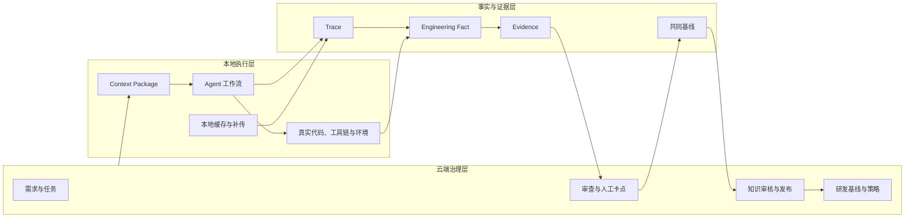

# Harness 智能研发云边协同平台整合方案

- **版本**：1.0
- **日期**：2026-07-10
- **状态**：平台级整合方案
- **适用对象**：产品、技术、质量、交付与项目管理人员

---

## 1. 方案定位

### 1.1 一句话定义

Harness 智能研发云边协同平台，是一套面向智能编码过程的研发治理与本地执行协同平台。

云端辅助管理人员完成需求分析、任务规划、规则配置、人工审查和知识沉淀；本地在真实代码、工具链与运行环境中执行项目配置的 Agent 工作流；全过程通过受控 Trace、工程事实和 Evidence 连接，形成可执行、可验证、可追溯、可演进的研发闭环。

### 1.2 平台解决的问题

平台不以增加一个 AI 对话入口为目标，而是解决以下团队级问题：

- 管理侧的需求、任务、规范和人工决策无法稳定传递到本地智能编码过程。
- 本地 Agent 的上下文、工具调用、文件修改和验证结果不可见或不可审查。
- Agent 的“已完成”陈述缺少代码、测试、门禁和人工确认的支撑。
- 代码、测试、工程文档、镜像和部署资源随变更分散演化，难以维持版本一致。
- 测试失败后容易错误归因，或通过删除测试、降低断言等方式获得表面成功。
- 经验沉淀在会话和人员记忆中，无法成为后续任务可复用的项目知识。

### 1.3 建设边界

平台应集成而非替代 Git、CI/CD、制品库、测试框架、缺陷系统和部署平台。首期不建设全自动生产发布、无人值守风险接受、复杂跨项目自主调度、完整 Kubernetes 管理平台或自研完整测试引擎。

---

## 2. 总体架构与责任边界

### 2.1 三层协同架构



### 2.2 云端职责

云端掌握项目权威状态和跨阶段治理信息，主要负责：

- 维护项目研发基线、角色、权限、门禁、工作流和知识。
- 辅助需求结构化、验收项确认、任务拆分、依赖分析和风险识别。
- 生成并发布 Task Package 与 Context Package。
- 汇聚本地上报的 Trace、Artifact、工程事实和 Evidence。
- 形成审查摘要、风险提示、结构化整改意见和人工卡点工作单。
- 管理软件、文档、交付物与证据的共同基线。
- 从审查结果和已验证经验中生成知识候选，经过人工审核后发布。

云端不直接修改开发者本地工作区，不替代本地编译、内网验证或工程技术决策。

### 2.3 本地职责

本地掌握真实工程环境，主要负责：

- 获取并校验 Context Package、Task Package 及其适用版本。
- 在项目授权的 Agent、Skill、工具和目录范围内执行研发工作流。
- 完成分析、编码、测试、构建、扫描、本地审阅和修复。
- 采集关键交互、工具调用、命令、文件变化、Git 变化和验证结果。
- 在网络中断时可靠缓存并恢复补传。
- 处理工程问题，或将目标、标准、授权、风险和阶段推进事项升级至云端。

本地不得自行修改已确认需求、绕过硬门禁、批准高风险例外、发布未经审核的知识或改变云端权威状态。

### 2.4 人工责任

| 角色 | 必须承担的责任 |
| --- | --- |
| 需求/业务负责人 | 需求目标、范围、业务规则、验收标准和风险接受。 |
| 技术负责人/代码 Owner | 架构、公共契约、数据与安全影响、合并技术结论。 |
| 研发人员 | 本地工程判断、补丁选择、本地验证与可提交结论。 |
| 质量负责人 | 测试重点、质量风险、豁免意见和测试结论审查。 |
| 交付批准人 | 可交付版本、回滚条件和对外交付结论。 |
| 平台管理员 | 项目接入、策略、权限、集成、脱敏和审计配置。 |

Agent 可以整理事实、提出建议、执行已授权工作和生成候选产物，但不能代替人员作出正式批准、风险接受或业务裁决。

---

## 3. 统一领域对象、状态与证据模型

### 3.1 核心对象

| 对象 | 定义 | 生命周期责任 |
| --- | --- | --- |
| Requirement | 已结构化的业务目标、范围、规则和验收项。 | 需求负责人确认与变更。 |
| Task | 可执行、可审查的研发管理单元。 | 管理与审查流程。 |
| Task Package | 针对单个 Task 下发的目标、边界、依赖、授权和完成定义。 | 云端生成，本地消费。 |
| Context Package | 需求、设计、规则、知识、工具权限和验证要求的版本化上下文。 | 云端发布，本地校验。 |
| Harness Run | 某一 Task 在本地一次实际 Agent 工作流执行。 | 本地执行生命周期。 |
| Artifact | 代码、Patch、测试、文档、报告、制品等可管理产物。 | 版本与来源管理。 |
| Engineering Fact | 从工程系统、Trace 或 Artifact 提取的客观状态。 | 可验证事实。 |
| Evidence | 支撑某项结论的工程事实引用及其有效性信息。 | 审查与结论依据。 |
| Review Task | 云端人工卡点工作单，保存问题、依据、意见和结论。 | 审查生命周期。 |
| Baseline | 经过确认的代码、文档、制品、部署资源、证据与审批集合。 | 发布、归档与失效管理。 |
| Knowledge Entry | 经审核后可用于后续任务的术语、决策、规则或经验。 | 审核、发布、替代与失效。 |

### 3.2 状态归属原则

- `Task` 管理业务与审查阶段：待规划、待确认、待下发、待执行、待审查、整改中、待复审、已通过、已接受风险、已暂停、已终止、已归档。
- `Harness Run` 仅管理一次本地执行：已创建、上下文同步中、就绪、运行中、等待用户确认、暂停、上报中、已完成、已失败、已取消、已被后续 Run 替代。
- `Review Task` 管理审查：待预审、待人工审查、待补充、已退回、已通过、已接受风险、已关闭。
- `Artifact` 和 `Baseline` 管理版本状态，不以 Agent 自述作为完成依据。

### 3.3 Trace 到 Evidence 的转换

```text
Trace：记录发生了什么
  → Engineering Fact：提取可核对的真实状态
  → Evidence：将事实与结论、版本、有效期关联
  → Review Decision：由规则或人员形成正式结论
```

Trace 典型内容包括交互摘要、上下文引用、工具调用、命令、文件变化、Git Diff、测试构建结果、人工干预、异常与重试。Trace 本身不是证据，也不自动成为知识。

Evidence 至少记录：支撑的结论、来源、对象版本、Task、Harness Run、有效性状态、确认方式和失效条件。

### 3.4 Baseline 组成

每个正式 Baseline 至少包含：

- 需求与 Task 版本；
- 源码 commit 或不可变代码引用；
- 构建产物和镜像 digest；
- 部署资源、配置模板或离线包摘要；
- Document Package 版本；
- Evidence 集合与门禁结果；
- 策略、Context Package 与工作流版本；
- 审批、风险接受和回滚信息。

---

## 4. 公共控制机制

### 4.1 任务包与上下文包

Task Package 必须说明做什么、为什么做、允许修改什么、禁止修改什么、依赖什么、如何验证、何时暂停升级、谁审查和如何完成。Context Package 必须指明其来源、版本、适用范围、失效条件与本地实际使用记录。

重大范围、公共契约、数据模型、安全规则或验收标准变化后，相关 Task Package 必须重新评估；已启动 Run 保留原版本关联，不被静默污染。

### 4.2 分级门禁与自动化授权

| 控制等级 | 适用条件 | Agent 可执行范围 | 人工要求 |
| --- | --- | --- | --- |
| 辅助模式 | 需求不清、风险未知、新领域或跨系统变更。 | 分析、建议、生成候选计划和补丁。 | 人员确认计划、归因、补丁和结论。 |
| 受控自动模式 | 低风险、预授权目录、正确性明确、可回归、无公共契约变化。 | 自动测试、限定次数的最小修复、最小验证集重跑。 | 预先授权；超出轮次、范围或失败归因漂移即暂停。 |
| 严格审查模式 | 权限、数据、接口、核心流程、跨模块、高风险或交付任务。 | 采集事实和生成候选产物。 | 人员确认计划、技术归因、补丁、门禁豁免和放行。 |

自动修复不得删除失败测试、降低断言、绕过权限和业务规则、修改任务外文件或改变已确认的正确性标准。达到重试上限后必须转人工接管或终止。

### 4.3 数据上报与安全

| 上报级别 | 云端内容 | 适用原则 |
| --- | --- | --- |
| 基础级 | 状态、工具类型、文件摘要、测试构建门禁结果、Artifact 元数据。 | 默认级别。 |
| 审查级 | 关键交互、Git Diff、关键命令输出、必要代码和文档片段、审查 Evidence。 | 审查需要且策略允许。 |
| 全量级 | 完整交互、工具参数和结果、文件变化及详细日志。 | 明确允许的项目，非默认。 |

敏感字段应在本地识别并脱敏。大文件、完整仓库和构建制品优先使用引用、哈希或制品地址。网络中断不应阻止本地执行，云端必须支持顺序补传、幂等接收、重复去重和数据完整性提示。

---

## 5. 场景一：快速生成与云就绪交付

### 5.1 场景定位与核心矛盾

该场景解决“应用如何更快形成，并以可运行、可验证、可回滚的方式交出去”。它不是单纯脚手架生成，也不是只把应用打成 Docker 镜像。真正要形成的是从需求到交付基线的连续闭环：生成结果必须能够运行，交付结果必须能够部署，失败结果必须能够诊断和处理。

智能体能够压缩代码、配置和部署资源的形成时间，但也会放大两个风险：一是生成深度与真实使用场景不匹配，例如把验证原型误作生产系统；二是代码、镜像、配置、部署资源和运行说明版本漂移。平台通过工程等级、风险等级和交付方式三个正交维度控制这一矛盾。

| 维度 | 决定的问题 | 典型取值 |
| --- | --- | --- |
| 工作类型 | 使用新建、变更还是修复路径。 | 新建应用、存量变更、缺陷修复。 |
| 需求成熟度 | 是否先以原型澄清需求。 | 探索中、基本明确、已确认。 |
| 工程等级 | 生成成果应达到什么完整度。 | 验证原型、轻量可用、生产级。 |
| 风险等级 | 门禁、审批和证据应有多严格。 | 低风险、标准风险、高风险。 |
| 交付方式 | 最终交付给谁、在哪里运行。 | 本地、单机、容器、Kubernetes、离线包。 |

工程等级决定生成成果深度：验证原型可使用 Mock 数据、临时接口和简化权限，但必须列出非生产项；轻量可用必须具备可启动、核心流程、基础错误处理和恢复说明；生产级必须具备需求追溯、测试、配置、安全、部署资源和交付证据。

### 5.2 建设目标、角色与边界

本场景的建设目标是：将自然语言需求转为受控实施计划，在项目规范和真实上下文约束下生成代码与交付资源，通过自动验证和有限修复提高成功率，并以不可变版本形成交付基线。

| 角色 | 关键责任 |
| --- | --- |
| 需求负责人 | 确认业务目标、范围、验收标准和不做范围。 |
| 技术负责人 | 确认工程等级、技术方案、架构影响和回滚策略。 |
| 质量负责人 | 确认测试范围、门禁结果和剩余质量风险。 |
| 交付批准人 | 确认可交付版本、目标环境条件和对外交付结论。 |
| 本地研发人员 | 确认生成计划的可执行性，处理工程异常和本地验证。 |
| Agent | 生成候选实现、测试、配置、部署资源和诊断材料。 |

以下条件触发风险强制升级，不得仅因用户少或交付紧急而降低约束：敏感或个人数据、认证授权审批、对外服务、生产长期运行、不可逆数据变更、公共接口兼容性、多系统联动、强可靠性要求、离线交付和强审计要求。

### 5.3 详细业务流程

| 阶段 | 输入与处理 | 输出与升级条件 |
| --- | --- | --- |
| 需求进入 | 输入自然语言、文档、页面草图、数据样例、已有代码和交付约束；识别目标、范围、待澄清规则。 | 结构化需求摘要、初步验收项、待确认问题、执行策略建议。 |
| 策略判定 | 判断工作类型、需求成熟度、工程等级、风险等级和交付方式。 | 执行策略及推荐依据；命中强制升级规则时进入正式确认。 |
| 上下文准备 | 装配技术栈、工程结构、组件、依赖、模板、基础镜像、构建部署规范和访问权限。 | 绑定项目规范版本的 Context Package。 |
| 计划确认 | 识别影响模块、接口、数据、配置、测试和部署资源，形成阶段与交付物计划。 | 执行计划；生产级、标准风险以上、存量变更、数据库或公共接口变更必须人工确认。 |
| 受控生成 | 在隔离工作区生成代码、测试、配置、构建文件、健康检查和部署资源。 | 代码与交付 Artifact，关联 Task、Run 和版本。 |
| 构建验证 | 依工程等级执行构建、启动、冒烟、单元、集成或回归测试，并检查静态问题和敏感配置。 | 构建与测试 Evidence；失败进入诊断。 |
| 反馈修复 | 分类失败，向对应 Agent 回传日志和上下文，执行最小修复与最小验证集重跑。 | 修复候选或人工接管；达到轮次上限、修改越权或归因不清时必须停止。 |
| 交付形成 | 生成 Dockerfile、镜像、配置模板、部署资源、运行说明和回滚信息。 | 镜像 digest、部署资源摘要、交付清单。 |
| 环境验证 | 在目标或受控模拟环境执行环境预检、部署、健康检查、冒烟与必要回滚验证。 | 部署结果、风险与回滚结果；硬门禁失败不得标记可交付。 |
| 基线归档 | 锁定 commit、镜像 digest、资源版本、文档和 Evidence。 | 可交付 Baseline、批准记录和离线交付索引。 |

### 5.4 功能能力、关键规则与主要产物

**快速生成能力**

- 需求理解、验收线索提取、缺失信息与低置信推断显式标注。
- 执行策略和计划生成，支持人工修改、驳回、失效和重新规划。
- 新建应用、存量变更和缺陷修复三条生成路径。
- 代码、测试、接口契约、数据库迁移、配置模板和运行说明协同生成。

**云就绪交付能力**

- Dockerfile、多阶段构建、忽略规则、基础镜像、构建参数、镜像标签和健康检查配置。
- 镜像构建、digest 记录、依赖来源、构建日志索引和扫描结果关联。
- 容器部署资源、配置模板、环境预检、部署验证、回滚与恢复方案。
- 离线依赖分析、交付目录清单、校验和、部署验证和回滚脚本生成。

**可信控制能力**

- 轻量、标准、严格门禁，以及硬门禁、软门禁和建议项区分。
- 内容变化后使相关确认重新评估，风险接受必须记录范围、责任人、批准人和有效期。
- 镜像、部署资源和配置必须绑定不可变版本；生产级和高风险场景不得只依赖可变 tag。

主要产物包括应用源码、测试、构建配置、镜像信息、部署资源、环境配置模板、运行说明、回滚方案、离线交付清单、交付 Baseline 和 Evidence 索引。

### 5.5 人工卡点、异常处理与差异化约束

计划确认、生产级生成、标准风险以上变更、公共接口与数据库变更、对外交付、离线交付、软门禁豁免和最终交付均需人工卡点。自动修复只能在预授权的低风险范围内执行，且必须限制轮次、保留失败原因并回到真实验证。

任何阶段失败后，不得直接标记为成功或可交付。系统应支持失败分类、关键日志定位、重新执行指定阶段、人工修改后继续验证、回退到上一有效产物或计划版本、取消 Run 和重新规划策略。轻量应用在用户范围扩大、处理敏感数据、需要长期运行或对外交付时必须重新评估工程等级。

### 5.6 验收重点、主要风险与首期范围

验收时应确认：需求能够形成可确认计划；生成结果可真实构建和启动；失败可进入有限修复或人工接管；镜像、运行说明和部署资源绑定同一版本；部署通过有健康与冒烟 Evidence；交付 Baseline 可还原。

建议使用以下基准场景验证闭环：一是明确低风险需求生成轻量应用，在容器中完成启动、核心流程冒烟和运行说明；二是构建或测试失败后，在两轮以内完成最小修复并保留失败原因；三是涉及敏感数据、权限或公共接口的轻量需求被自动提升至标准或严格门禁；四是在不实际承诺客户现场部署的前提下，输出离线依赖分析和交付目录清单。

| 主要风险 | 控制措施 |
| --- | --- |
| 生成结果偏离项目结构或既有契约 | 生成前绑定项目规范、真实代码上下文和可执行门禁。 |
| 修复循环掩盖问题或消耗资源 | 限制轮次、记录失败、保存回退点并转人工接管。 |
| 镜像与部署资源版本漂移 | 以 commit、镜像 digest 和资源摘要共同锁定交付 Baseline。 |
| 轻量应用演变为影子系统 | 记录负责人、数据等级、部署位置与升级触发条件。 |

交付 Baseline 的最小检查项如下：

- 需求范围、Task、commit、构建产物和镜像 digest 可以相互定位；
- 部署资源引用的镜像、配置模板和运行说明属于同一版本集合；
- 测试、部署、健康检查和回滚验证结果具有时间、环境和执行来源；
- 软门禁豁免具有责任人、补偿措施和有效期，硬门禁不存在静默绕过；
- 离线包分析明确列出缺失依赖和未验证条件，不将分析结论误写为交付完成。

建议持续观察以下指标：

| 观察项 | 首期关注点 |
| --- | --- |
| 生成成功率 | 首轮生成后能够完成构建和核心流程验证的比例。 |
| 反馈修复有效率 | 有限修复后真正通过原验证和最小回归的比例。 |
| 交付一致性 | commit、镜像 digest、资源摘要和运行说明可关联的比例。 |
| 人工接管原因 | 需求不清、环境阻塞、工程问题和授权不足的分布。 |

这些指标用于判断流程是否稳定，而不是单独评价模型能力。试点期间应同时记录人工投入时间和未覆盖风险，避免只追求生成速度。

指标出现异常时，应优先检查需求成熟度、项目规范完整性、环境可用性和交付约束是否发生变化。生成成功率下降不应直接归因为模型问题，也不应通过降低验证标准维持表面指标。

首期复盘应聚焦失败发生在哪个交付阶段，以及该阶段是否具备足够的输入、验证和回退条件。

首期只支持一个受控技术栈下的轻量应用或存量变更、容器构建和简单容器环境验证。暂不承诺完整 Kubernetes 生产发布、复杂多集群管理、真实客户现场离线部署、完整供应链证明或无人值守发布批准。

---

## 6. 场景二：团队规范化智能开发

### 6.1 场景定位与核心矛盾

团队规范化智能开发是平台的横向治理底座。它解决团队如何在统一约束下可靠使用智能体完成软件研发，而不是为每个开发人员配置一个独立编码工具。

智能体提高局部产出速度后，单位时间内的代码、测试、文档和方案变更都会增加。若任务边界、工程规范、上下文、审查和人工责任没有同步结构化，重复建设、架构漂移、越权修改和评审拥塞反而会增加。场景的目标是让规范可执行、任务可控制、过程可追溯、经验可演进。

规范化对象不只包括代码格式，还包括需求、任务、上下文、执行、产物、审查和知识。团队应能回答：谁基于哪个需求、使用哪个版本的规则和 Agent，在什么范围内修改了什么，经过了哪些验证和谁的决策。

### 6.2 建设目标、角色与责任边界

| 目标 | 具体含义 |
| --- | --- |
| 规范可执行 | 将架构边界、代码约定、测试、安全、分支和提交要求转为可下发、可检查的研发基线。 |
| 任务可控制 | 将原始诉求转为目标、边界、依赖、验收、责任和卡点明确的 Task。 |
| 过程可审查 | 将本地执行与人工干预组织为可检索的 Trace、Fact 和 Evidence。 |
| 经验可演进 | 将已验证经验审核后发布为项目知识、开发契约、任务模板和检查规则。 |

管理人员负责目标、优先级、阶段结论和知识发布；技术负责人负责架构、公共契约和高风险变更；研发人员负责本地工程判断和提交内容；质量人员负责质量审查；平台管理员负责策略、权限和集成。云端 Agent 辅助规划与审查，本地 Agent 辅助执行，两者均不承担独立正式决策权。

### 6.3 详细业务流程

| 阶段 | 输入与处理 | 输出与控制 |
| --- | --- | --- |
| 建立研发基线 | 导入项目说明、架构、仓库、规范、历史问题、Owner 和可用 Agent 能力；区分项目级、模块级、文件级、任务级约束。 | 版本化研发基线、工作流、门禁、评审路由和发布记录；未经确认不得作为执行依据。 |
| 需求与任务规划 | 提炼目标、范围、规则和验收项，识别缺失、冲突、影响模块、公共契约、数据和安全风险。 | Requirement、Task 图、依赖、并行建议、互斥范围、责任人和卡点。 |
| 计划确认 | 对任务拆分、共享资产、并行边界、风险等级和完成定义进行人工调整。 | 已确认 Task；缺少目标、范围或验收的任务不得直接编码。 |
| 执行包下发 | 按任务类型选择工作流，装配相关代码、接口、文档、历史案例、权限和验证命令。 | Task Package、Context Package、Agent 配置和本地可执行性检查。 |
| 本地受控研发 | 创建分支、工作区或隔离会话；Agent 制定实现计划，执行编码、测试、自审和修复。 | 代码、测试、文档、构建扫描结果、风险与待审查成果。 |
| 过程采集 | 关联交互、工具、命令、文件变化、Git Diff、验证与人工操作；脱敏并缓存补传。 | Trace、工程事实、阶段 Evidence 和完整性状态。 |
| 云端预审与人工审查 | 检查过程合规、范围越界、验收完成、架构与测试质量、文档一致性和剩余风险。 | Review Task、问题清单、通过、退回或有条件通过建议。 |
| 整改与阶段推进 | 将问题关联到任务、文件或验证项，本地修订后形成新的 Run 和复审材料。 | 问题关闭 Evidence、合并或交付结论、阶段流转记录。 |
| 知识演进 | 从评审意见、门禁失败、优秀实践和复发问题提取候选，人工判断通用性。 | Knowledge Entry、基线更新、效果跟踪、替代或失效记录。 |

### 6.4 功能能力、关键规则与主要产物

**研发基线与能力管理**：维护项目目标、技术栈、模块职责、依赖边界、编码测试安全规范、Agent、Skill、MCP、工具权限、质量门禁、代码 Owner 和评审路由，并支持审批、发布、版本和回退。

**需求与任务总控**：支持原始需求解析、验收项、缺失和冲突识别、影响分析、任务依赖图、共享资产冲突、责任人推荐、风险分级和人工卡点配置。

**本地执行与过程采集**：支持项目同步、分支或工作区创建、Agent 工作流启动、范围控制、高风险暂停、人机交互与工具事件采集、脱敏、离线缓存和补传。

**审查与知识演进**：支持任务摘要、关键路径、Evidence 索引、越界检测、整改闭环、阶段推进、知识候选审核、发布、适用范围和效果反馈。

主要产物为研发基线、需求基线、Task、Task Package、Context Package、Harness Run、Trace、Artifact、Evidence、Review Task、整改记录和 Knowledge Entry。

### 6.5 人工卡点、异常处理与差异化约束

需求确认、任务规划、高风险方案、阶段成果、合并或交付、知识发布必须保留明确的人工责任。涉及公共契约、数据模型、安全权限、核心架构和共享资产的变更，必须先确认方案；范围或契约发生重大变化时，原执行包失效并重新规划。

本地 Agent 只能在批准范围内运行；不允许通过静默重试掩盖失败原因；Trace 缺失不自动判定任务失败，但过程合规要求较高的任务不得在证据不完整时直接通过。简单低风险任务应允许轻量流程，避免过重治理促使用户绕开平台。

### 6.6 验收重点、主要风险与首期范围

验收时应确认：每次执行绑定唯一基线和上下文版本；任务具备目标、边界和验证方式；高风险变更能被识别并暂停确认；审查可下钻到关键事实与 Evidence；整改能关联原问题和后续 Run；知识未经审核不能成为强制约束。

建议以一次真实需求变更验证以下能力：管理人员能够将原始诉求转成有验收标准的 Task；本地用户无需反复描述项目背景即可执行受控工作流；云端审查能够定位关键 Diff、测试结果和人工干预；退回问题能够形成结构化整改并被后续 Run 关闭。

| 主要风险 | 控制措施 |
| --- | --- |
| 任务拆分错误导致并行返工 | 对公共契约和共享资产建立依赖、互斥范围和前置方案确认。 |
| 规范过重导致平台外使用 Agent | 按任务风险提供轻量、标准和严格流程，不对简单任务套重流程。 |
| Trace 过量造成存储和审查噪声 | 分离原始事件、关键 Trace、Engineering Fact 和 Evidence，并支持保留策略。 |
| 未审核经验污染基线 | 知识候选必须标明来源、范围与效果，审核后才可成为规则。 |

场景级验收应重点检查：

- 同一 Task 的需求、执行包、Harness Run、Trace、Artifact 和 Review Task 是否可按版本关联；
- 本地是否可以识别上下文过期、权限不足、允许范围冲突和验证命令缺失；
- 审查人是否无需浏览全部日志，即可获取任务目标、关键变化、Evidence、风险和待决项；
- 整改项是否有责任人、处理状态、关闭依据，并在复审后更新阶段状态；
- 知识发布后是否能反馈其被哪个 Context Package 使用，以及是否需要替代或停用。

建议持续观察以下指标：

| 观察项 | 首期关注点 |
| --- | --- |
| 任务可执行率 | 下发后无需补充目标、边界或验证命令即可启动的 Task 比例。 |
| 越界拦截率 | 范围外文件、未授权工具和强制卡点被及时识别的比例。 |
| 审查定位效率 | 审查人从摘要定位到关键 Diff、Evidence 和责任人的耗时。 |
| 整改闭环率 | 已退回问题在后续 Run 中具备关闭 Evidence 的比例。 |

这些指标应与团队实际基线对比，不宜在没有历史样本时设置虚假的绝对目标。首期更关注是否形成可重复执行的受控流程。

当审查定位效率没有改善时，应检查 Trace 是否只堆积日志而未提炼关键事实；当整改闭环率偏低时，应检查问题描述、责任分配和本地可执行任务是否足够具体。

首期复盘应将返工问题追溯到需求、任务拆分、上下文、执行或审查阶段，而不只统计最终是否通过。

首期围绕一个真实需求变更跑通基线、任务、执行包、本地工作流、基础 Trace、云端审查和整改闭环。复杂多任务协作、全面 CI/PR 集成、组织级知识图谱和自动阶段推进在后续阶段建设。

---

## 7. 场景三：与智能编码一致的软件工程文档

### 7.1 场景定位与核心矛盾

该场景解决工程文档与软件真实演进不同步的问题。它不是“编码结束后补写文档”，而是让文档同时承担四种角色：编码前的输入约束、编码中的伴生产物、云端审查的结构化载体、经批准后可复用的正式基线。

如果文档主要依赖 Agent 推断或代码反向生成，错误实现可能被包装为正式设计；如果文档只在项目结束时补写，需求、设计、接口和测试之间已经失去追溯关系。因此场景强调工程事实优先、增量更新、人工内容保护和双向一致性校核。

| 一致性维度 | 核对问题 |
| --- | --- |
| 需求一致性 | 每项需求和验收项是否有实现与验证 Evidence。 |
| 设计一致性 | 代码结构和关键机制是否符合已批准设计。 |
| 接口与数据一致性 | 参数、返回、错误码、实体、表结构和迁移是否一致。 |
| 测试一致性 | 测试结论是否来自真实执行和回归 Evidence。 |
| 状态与过程一致性 | “已完成、已通过”等状态是否经过门禁或人工确认。 |
| 版本一致性 | 文档、代码、构建产物、审查与交付物是否绑定同一 Baseline。 |

### 7.2 建设目标、角色与责任边界

场景目标是让已确认的需求、设计、接口和规则能够被本地 Agent 使用；让代码、测试、构建和审查变化驱动受影响文档章节更新；让文档关键结论能追溯到事实与 Evidence；让软件、文档和交付物共同归档。

管理人员和技术负责人确认需求、方案、文档适用范围和正式批准；本地研发人员确认工程事实和本地产物；云端审查 Agent 识别差异、冲突和缺失 Evidence；文档生成 Agent 只生成候选更新和校核结果；档案或配置管理人员维护模板、归档规则和保留策略。

云端不应以全量源代码集中存储为前提，本地不得将未经人工确认的内容直接升格为正式文档。人工编写、已审核或已归档章节必须受保护，任何自动更新只能生成差异建议。

### 7.3 详细业务流程

| 阶段 | 输入与处理 | 输出与控制 |
| --- | --- | --- |
| 文档适用性确定 | 基于项目类型、阶段、需求与交付约束选择文档包、模板和章节范围。 | Document Package、模板版本、责任人与审核路径。 |
| 编码前约束下发 | 将确认的需求、设计、接口、数据和规范裁剪为 Context Package。 | 可供 Agent 消费的权威上下文及版本记录。 |
| 本地研发与采集 | 本地执行编码、测试、构建和审阅，持续采集代码、接口、数据、测试与人工事实。 | Trace、Artifact、Engineering Fact。 |
| 事实与证据提取 | 将 Git Diff、测试报告、构建记录、接口和人工确认关联到结论。 | Evidence 候选、来源与有效性状态。 |
| 文档影响分析 | 识别变更影响的需求、设计、接口、数据、测试与版本章节。 | 受影响章节清单、未受影响章节保护清单。 |
| 增量生成 | 基于事实和 Evidence 生成章节级更新建议，标记来源、AI 推断、冲突与缺失。 | 文档差异、追溯矩阵、待确认项。 |
| 双向校核 | 检查文档约束是否被代码遵守，也检查代码变化是否使文档失效。 | 一致性报告、冲突清单和处理建议。 |
| 审核与共同基线 | 人工审核文档、软件、测试和交付物，批准后锁定关联版本。 | 已批准 Document Package、Baseline、归档记录。 |
| 偏离检测与知识沉淀 | 后续变更监测基线失效，从决策和问题处置提取知识候选。 | 失效提示、Knowledge Entry 候选和更新计划。 |

### 7.4 功能能力、关键规则与主要产物

**文档包与内容管理**：维护适用文档清单、模板版本、章节状态、人工内容锁定、差异合并、审核、批准、归档和失效状态。

**影响分析与增量生成**：将需求、接口、数据模型、代码 Diff、测试与构建变化映射到章节；仅更新受影响章节；对 AI 推断、冲突、缺失 Evidence 和无法生成内容显式标记。

**追溯与一致性校核**：生成需求到任务、代码、测试、文档和交付物的追溯矩阵；检查接口、数据、测试、状态和版本一致性；将规则型检查和 AI 语义建议分开呈现。

**共同基线与偏离检测**：将文档、源码 commit、构建制品、镜像、部署资源、Evidence 和审批记录绑定；当关联代码、测试或需求实质变化时提示文档和证据失效。

主要产物包括详细设计或变更设计说明、接口说明、数据说明、测试及版本说明、追溯矩阵、一致性报告、Evidence 索引、Document Package 和共同 Baseline。

### 7.5 人工卡点、异常处理与差异化约束

需求与验收确认、任务与方案确认、高风险变更、本地提交、云端阶段审查、文档审核、基线批准和知识发布均需人工卡点。代码与已批准需求或设计冲突时，必须由责任人决定修改代码、修改文档或发起变更，系统不得自动选择其中任一方向。

Trace 不是 Evidence，工程事实也不自动等于正式结论。文档生成失败、来源缺失、事实冲突、人工内容锁定或 Baseline 已失效时，系统应保留现有已批准内容，输出待处理项而非覆盖正文。

### 7.6 验收重点、主要风险与首期范围

验收时应确认：每次 Harness Run 关联唯一上下文版本；关键文档结论可定位 Evidence；未受影响章节不被无故重新生成；人工内容不会静默覆盖；软件、文档、构建产物和审查状态可以按 Baseline 还原；后续变化可触发偏离提示。

文档在不同阶段承担不同职责：编码前优先形成需求、设计、接口和约束文档；编码中同步记录实现计划、变更说明和待确认项；编码后形成测试、构建、审查、版本和交付 Evidence。这样既避免等待编码完成才补写，也避免在事实不足时过早形成正式结论。

| 主要风险 | 控制措施 |
| --- | --- |
| 将错误代码反向写成正式设计 | 对代码与已批准设计的冲突输出待决项，由责任人裁决。 |
| AI 重新生成覆盖人工内容 | 使用章节来源、锁定、差异合并与审核状态，不允许静默覆盖。 |
| Trace 被误当成可批准 Evidence | Evidence 必须关联具体结论、版本、来源、有效性和确认方式。 |
| 文档与软件基线逐步漂移 | 对代码、接口、测试和制品的实质变化触发影响分析与失效提示。 |

场景级验收应重点检查：

- 每个正式章节能够区分人工确认内容、工程事实、AI 推断和待确认内容；
- 需求、接口、测试和版本说明中关键结论都具有可访问的 Evidence 索引；
- 代码或接口发生实质变化后，系统能够定位受影响章节并保留未受影响章节；
- 文档审核、软件版本、构建制品和交付批准能被还原为同一时点的 Baseline；
- 发现矛盾时系统输出明确的待决事项，不以自动文本覆盖替代人工判断。

建议持续观察以下指标：

| 观察项 | 首期关注点 |
| --- | --- |
| 章节影响定位率 | 实质代码或接口变化能否定位到应更新章节。 |
| Evidence 关联率 | 关键文档结论具有有效 Evidence 的比例。 |
| 人工内容保护率 | 已审核章节被错误覆盖或无故重写的次数。 |
| 基线偏离发现时效 | 软件变化至文档失效提示产生的时间。 |

这些指标服务于文档可信度，而非以生成字数作为成果。若 Evidence 不足，应优先保留待确认状态，而不是补写看似完整的结论。

当影响定位率偏低时，应补充代码、接口和文档之间的可追溯关系；当人工内容保护出现问题时，应优先修复来源与锁定规则，而不是提高自动生成频率。

首期复盘应检查每个待确认内容最终由谁确认、依据何在，以及是否已写回适用的文档或知识条目。

首期优先支持详细设计或变更设计说明、接口说明、测试及版本说明三类文档，验证章节级增量更新、追溯矩阵和共同 Baseline。完整 GJB 文档包、复杂多级会签和档案系统替代不在首期范围。

---

## 8. 场景四：智能化软件功能测试与修复

### 8.1 场景定位与核心矛盾

该场景解决“应该测什么、失败属于什么、是否允许修复、如何证明修复未破坏相关功能”。它不以生成更多测试用例或让失败测试变绿为目标，而是建立从功能正确性依据到真实执行、失败归因、受控修复和影响回归的质量闭环。

智能编码提高了变更速度，却不会自动提高功能正确性。若测试仅从代码结构或模型猜测生成，可能验证了错误假设；若失败归因不清，Agent 可能修改业务代码、降低断言或绕过校验来获得表面通过。因此本场景要求管理决策与工程执行分离：不改变目标、标准、边界和风险承担方式的工程问题由本地处理，改变这些事项的问题必须升级云端裁决。

### 8.2 建设目标、正确性依据与角色边界

功能正确性应综合以下事实源：需求项和用户故事、验收标准、业务规则、接口契约、页面行为、代码 Diff、测试资产、历史缺陷、服务配置和运行环境版本。缺少明确正确性依据时，系统可以提出测试假设，但不得把假设作为正式通过标准。

| 角色 | 责任边界 |
| --- | --- |
| 管理人员/业务负责人 | 发起任务，确认测试目标、验收标准、必测项、风险与阶段结论。 |
| 研发人员 | 确认本地测试方案、技术归因、补丁选择、回归范围和可提交状态。 |
| 本地测试/修复 Agent | 生成场景、用例、数据、断言、候选归因和受控补丁。 |
| 云端审查 Agent | 汇总事实、识别覆盖缺口、越权行为和剩余风险，生成决策材料。 |
| 质量人员 | 审查测试范围、质量风险、豁免与放行材料。 |

### 8.3 详细业务流程

| 阶段 | 输入与处理 | 输出与升级条件 |
| --- | --- | --- |
| 任务发起与目标确认 | 输入需求、代码变更、缺陷、历史问题或发布计划；汇总验收标准和业务规则。 | 已确认测试修复 Task、范围、代码基线、责任人与完成条件。 |
| 测试修复包下发 | 整理必测项、修复授权边界、禁止修改范围、Trace 与 Evidence 要求。 | 测试修复 Task Package；缺少正确性依据时先补充或升级。 |
| 本地环境准备 | 检查分支、commit、依赖、服务、数据库、中间件、测试数据与执行命令。 | 本地上下文快照、环境检查结果；环境不满足时不得误判代码缺陷。 |
| 测试设计 | 按需求、变更和历史风险组合正常、异常、权限、状态、边界、接口和页面场景。 | 测试场景、用例、数据、断言来源和执行计划。 |
| 真实测试执行 | 接入既有接口、UI、端到端或人工辅助测试工具，采集日志、截图、请求响应与状态变化。 | 测试结果、执行 Trace 和测试 Evidence。 |
| 失败归因 | 比对断言、代码、接口、数据、环境和历史问题，区分需求、用例、数据、环境、契约、代码和非确定性失败。 | 候选根因、证据、可信度和处理建议。 |
| 本地处理或升级 | 研发人员确认归因；涉及需求、标准、范围、跳过必测项、公共契约或风险接受时上报云端。 | 本地处理方案或管理决策材料。 |
| 受控修复 | 在授权文件和模块内生成最小补丁、补充测试并保留修改说明。 | 修复候选、影响分析；越权、归因漂移或连续失败时自动停止。 |
| 原问题验证与影响回归 | 重跑原失败用例，并依据 Diff、依赖、数据模型、状态机和路由选择回归集。 | 原问题验证、影响回归结果和未覆盖风险。 |
| 云端审查与知识沉淀 | 汇总覆盖、归因、修复、回归和人工证据，决定放行、退回、豁免或终止。 | Review Task 结论、证据包和知识候选。 |

### 8.4 功能能力、关键规则与主要产物

**测试依据与设计**：管理需求、验收项、业务规则与测试场景的覆盖关系；生成正常、异常、权限、状态、边界、历史缺陷和变更影响场景；标注断言来源和不确定性。

**多方式真实执行**：接入现有接口、UI、端到端、状态和人工辅助测试工具；检查环境健康、数据前置和依赖版本；采集日志、截图、请求响应、错误堆栈和耗时。

**失败归因与受控修复**：生成候选根因、证据、可信度和影响范围；支持建议级、候选级和受控执行级补丁；检测删除测试、降低断言、规则绕过和超范围修改。

**影响回归与审查**：基于 Diff、接口依赖、数据模型、状态机、页面路由和历史缺陷推荐回归；输出未覆盖风险；生成管理侧可审查的覆盖矩阵和证据包。

主要产物包括测试修复 Task、测试场景、测试用例、数据与断言、测试执行记录、失败归因、修复补丁、影响分析、回归结果、Evidence 包和知识候选。

### 8.5 人工卡点、异常处理与差异化约束

研发人员必须确认技术归因和候选补丁。云端必须裁决需求或验收冲突、范围扩大、跳过必测项、公共接口变更、无法完成回归、剩余风险和阶段放行。高风险功能由人员确认测试计划、归因、补丁和放行；仅在低风险、预授权、可回归范围内允许 Agent 自动执行测试和有限修复。

修复不得删除失败测试、降低断言强度、绕过权限、校验和业务规则、擅自改变已确认接口和数据口径。环境问题、测试数据问题和非确定性失败必须与代码缺陷分开处理；任何未执行或阻塞项不得统计为通过。

### 8.6 验收重点、主要风险与首期范围

验收时应确认：测试目标具有需求或规则依据；核心场景执行完成；失败均已归因或升级；原问题与影响回归完成；未覆盖风险显式记录；超出本地授权事项具有管理决定；测试、修复、回归和人工意见均可回查 Evidence。

测试范围应按触发方式动态组合：新功能验收以需求和验收标准为主；代码变更以 Diff 和依赖关系为主；缺陷修复以稳定复现和历史回归为主；版本发布以必测项、关键路径和剩余风险为主。接口、UI、端到端、权限、状态和人工探索并非互斥，平台应根据依据、影响范围和环境条件选择组合。

| 主要风险 | 控制措施 |
| --- | --- |
| 测试依据不足，断言只是模型猜测 | 标注断言来源与不确定性，关键验收由需求侧确认。 |
| 失败归因错误，修改了不该修改的对象 | 比对需求、测试、数据、环境、契约和代码，并要求研发人员确认。 |
| 修复后只重跑原失败用例 | 根据 Diff 和依赖选择影响回归集，未覆盖项必须显式说明或豁免。 |
| 管理侧过度介入本地工程细节 | 云端管理目标、标准和风险，本地决定测试实现和修复方式。 |

场景级验收应重点检查：

- 关键验收项至少有一个可执行场景或被明确标为暂不可测；
- 每个失败项均有归因分类、证据、处理对象和责任边界；
- 环境阻塞、测试数据错误和代码缺陷在审查视图中可被清楚区分；
- 修复补丁关联原失败用例、修改说明、影响分析和回归结果；
- 已识别影响项完成回归或具备经批准的豁免记录，阻塞项不被统计为通过。

建议持续观察以下指标：

| 观察项 | 首期关注点 |
| --- | --- |
| 关键验收项覆盖率 | 已确认必测项具有用例或明确豁免依据的比例。 |
| 归因复核一致率 | 研发人员复核后认可候选归因的比例。 |
| 修复回归成功率 | 补丁同时通过原问题验证和影响回归的比例。 |
| 环境问题识别率 | 被正确归类为环境、数据或依赖问题的失败比例。 |

这些指标应按任务类型分别统计。新功能验收、代码变更和缺陷修复的测试依据不同，不能用单一通过率比较质量。

当归因复核一致率偏低时，应回看正确性依据和环境信息是否完整；当修复回归成功率偏低时，应收紧自动修复授权范围，而不是增加自动重试次数。

首期复盘应保留被拒绝的补丁与归因案例，用于校准测试策略和后续 Agent 工作流，而不是直接沉淀为强制规则。

首期接入一个既有 Web 项目的接口和 UI 测试工具，覆盖新功能、代码变更和缺陷修复三种模式，验证环境检查、候选补丁、双重回归和云端审查。自研完整测试引擎、性能安全兼容性全覆盖、复杂跨系统自动修复和无人监督高风险修改不在首期范围。

---

## 9. 统一功能地图

| 模块 | 平台能力 | 主要服务场景 |
| --- | --- | --- |
| 项目治理与研发基线 | 规则、角色、门禁、工作流、项目知识与版本发布。 | 全部场景。 |
| 需求与任务总控 | 需求、验收、任务、依赖、风险、人工卡点与状态。 | 全部场景。 |
| 上下文与执行供给 | Context Package、Task Package、Agent、Skill、工具权限与验证命令。 | 全部场景。 |
| 本地智能研发运行时 | 工作区、Run、Agent 工作流、工具执行、本地确认与缓存补传。 | 全部场景。 |
| Trace、事实与 Evidence | 采集、脱敏、关联、事实提取、证据索引与有效性管理。 | 全部场景。 |
| 云端预审与人工卡点 | 任务摘要、差异、风险、整改、豁免、放行和审查记录。 | 全部场景。 |
| 工程文档与共同基线 | 文档包、追溯、校核、审批、归档与偏离检测。 | 文档、交付、测试。 |
| 生成与交付编排 | 生成、构建、镜像、部署资源、环境验证、回滚和离线分析。 | 生成与交付。 |
| 智能测试与修复 | 测试设计、真实执行、归因、补丁、回归与质量结论。 | 测试与修复。 |
| 知识演进 | 候选提取、审核、适用范围、发布、替代、失效和使用反馈。 | 全部场景。 |

---

## 10. 建设路线与首期验收

### 10.1 第一阶段：存量项目需求变更闭环

选择一个已有代码仓库中的中等复杂度需求变更，验证：

```text
云端需求分析与人工确认
→ 任务拆分与 Context Package 下发
→ 本地 Agent 修改代码、测试和审阅
→ Trace、Diff、构建和测试结果上报
→ 云端预审与人工退回整改
→ 文档增量更新和一致性校核
→ 软件、文档与 Evidence 共同 Baseline
→ 知识候选进入审核
```

首期必备能力包括项目任务管理、上下文供给、基础 Agent 工作流、关键 Trace 上报、人工审查与整改、三类工程文档增量更新、Evidence 索引和知识候选审核。

### 10.2 后续阶段

1. **测试修复强化**：接入现有接口与 UI 测试工具，完善正确性依据、失败归因、受控补丁和影响回归。
2. **文档与工程质量强化**：扩展文档类型、追溯校核、CI/PR 集成、越界检测和风险分级门禁。
3. **快速生成与云就绪交付**：在受控技术栈上验证新建轻量应用、自动验证、容器化交付和离线依赖分析。
4. **知识驱动演进**：形成跨任务的效果评估、工作流优化和组织级可复用资产。

### 10.3 首期验收标准

- 每次 Harness Run 能定位唯一 Task、Context Package、策略版本和本地环境信息。
- 任务“已通过”必须关联实现、验证、门禁和人工审查 Evidence。
- 云端可将问题结构化反馈给本地，并关联后续整改 Run。
- 文档更新按章节进行，不静默覆盖人工已审核内容。
- Trace 上报符合项目级数据策略，断网后可补传且不重复入库。
- 未审核知识不能成为强制约束或自动注入后续任务。

---

## 11. 结论

四个场景共同构成一条从需求治理到研发执行、质量验证、工程文档、交付与知识沉淀的智能研发主线。平台的核心价值不在于让 Agent 生成更多内容，而在于让智能研发在正确的上下文、授权、验证与人工责任之下持续运行，并将每一次可信执行转化为可复用的项目资产。
