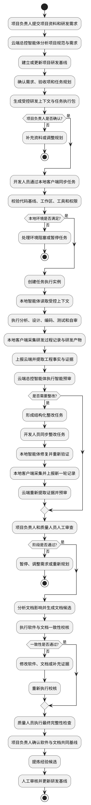
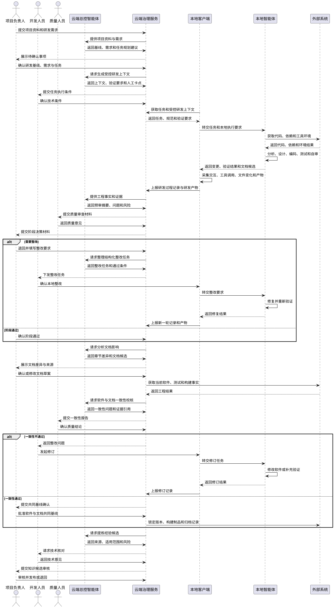
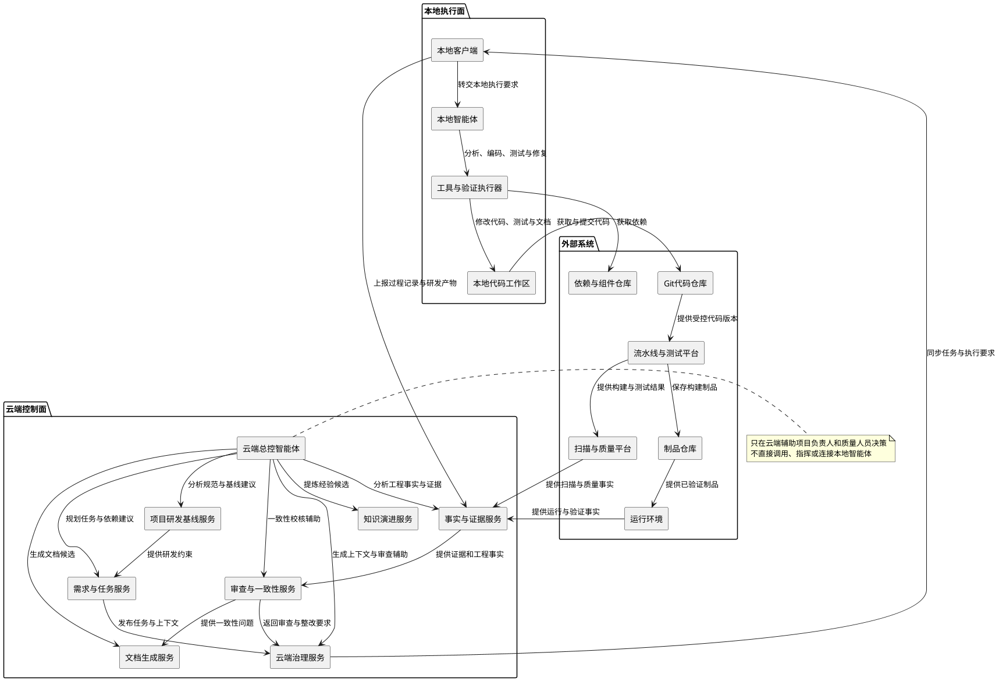

# 实现团队规范化智能开发 用例与 UML

> 文档版本：0.2
> 编制日期：2026-07-13
> 关联场景：《实现团队规范化智能开发场景分析》
> 适用范围：智能研发平台

---

## 1. 场景说明

本文围绕“实现团队规范化智能开发”场景，将场景分析转化为可评审、可设计、可实现的业务用例与统一建模语言图，重点体现以下研发闭环：

```text
项目研发基线
  → 需求与任务规划
  → 受控研发上下文与执行包
  → 本地智能编码
  → 客户端采集研发过程记录与研发产物
  → 云端事实提取与智能预审
  → 人工审查与整改
  → 文档一致性校核
  → 软件与文档共同基线
  → 经验审核与研发基线演进
```

本场景解决的不是单个开发人员如何更快编写局部代码，而是团队如何在统一约束下，可靠地使用智能体完成需求、任务、代码、测试、文档和审查协同。

### 场景边界

- 云端总控智能体负责需求分析、任务规划、上下文装配、事实汇总和审查辅助，只在云端辅助项目负责人和质量人员作出判断。
- 本地客户端负责同步任务、驱动本地智能体执行，并采集研发过程记录、研发产物和验证结果后上报云端。
- 云端总控智能体不直接调用、指挥或与本地智能体交互；云端与本地通过云端服务和本地客户端衔接。
- 正式需求、任务、软件、测试、工程文档和知识均应具备版本、来源和人工确认记录。
- 项目初始化、组织级知识管理、复杂多智能体协商和自动审批不作为本场景主线。

### 研发控制强度

| 任务等级 | 典型任务 | 主要控制要求 |
| --- | --- | --- |
| 轻量任务 | 文档修正、简单缺陷、测试补充 | 简化任务包、本地自检、基础审查 |
| 标准任务 | 普通功能、接口扩展、服务逻辑 | 明确验收标准、受控上下文、测试和人工评审 |
| 高风险任务 | 架构、公共接口、数据模型、安全权限、核心流程 | 方案审查、责任人确认、严格门禁和集成验证 |
| 探索任务 | 技术预研、方案比较、复杂问题定位 | 先形成分析和实验成果，不直接进入正式基线 |

---

## 2. 系统参与者

本文只保留以下六类参与者。

| 参与者 | 职责定位 | 主要操作 |
| --- | --- | --- |
| 项目负责人 | 对项目目标、需求范围、任务优先级、阶段结论和共同基线负责 | 确认需求、任务、风险、审查结论和正式版本 |
| 开发人员 | 对本地工程执行、技术处理、变更确认和提交内容负责 | 获取任务、监督本地智能体、处理异常、审阅和提交变更 |
| 云端总控智能体 | 在云端辅助分析、规划、汇总、审查和经验提炼 | 生成建议、装配上下文、识别风险、汇总事实、形成审查意见 |
| 本地智能体 | 在本地受控环境中执行分析、设计、编码、测试、自审和修复 | 读取任务上下文、修改代码、执行工具、生成测试和文档候选 |
| 质量人员 | 对测试充分性、证据有效性、质量问题和放行条件负责 | 审查测试、证据、一致性问题、门禁结果和阶段质量结论 |
| 外部系统 | 提供代码、依赖、构建、制品、流水线和运行环境事实 | Git、制品仓库、流水线、测试平台、扫描平台和运行环境 |

### 2.1 责任边界

```text
项目负责人：确认目标、范围、关键风险、阶段结论和共同基线。
开发人员：负责本地执行控制、技术处理、变更审阅和提交确认。
云端总控智能体：负责云端分析、规划、汇总和决策辅助。
本地智能体：负责真实工程环境中的生成、验证、修复和文档候选生成。
质量人员：负责独立质量审查、证据核验和放行检查。
外部系统：提供代码、构建、测试、制品和运行事实。
```

本地客户端是本地执行面的能力组件，不单独作为参与者。它负责任务同步、受控上下文缓存、本地智能体转交、研发过程记录采集、敏感信息处理、断网缓存和云端上报。

---

## 3. 用例总览

本文只保留直接支撑“规范—任务—执行—事实—审查—文档—基线”闭环的用例。

| 编号 | 用例 | 主要参与者 | 关键输出 |
| --- | --- | --- | --- |
| UC-01 | 建立项目研发基线 | 项目负责人、开发人员、云端总控智能体 | 项目研发基线、工作流、质量门禁 |
| UC-02 | 确认需求与验收项 | 项目负责人、云端总控智能体 | 需求版本、验收项、确认记录 |
| UC-03 | 规划编码任务与文档影响 | 项目负责人、开发人员、云端总控智能体 | 任务、依赖关系、文档影响范围 |
| UC-04 | 生成并确认受控研发上下文 | 项目负责人、云端总控智能体 | 受控研发上下文、验证要求、人工卡点 |
| UC-05 | 同步任务与校验本地环境 | 开发人员、本地智能体、外部系统 | 任务执行实例、环境校验结果 |
| UC-06 | 执行受控智能编码工作流 | 开发人员、本地智能体、外部系统 | 代码、测试、文档候选和验证结果 |
| UC-07 | 采集研发过程记录与研发产物 | 开发人员、本地智能体、外部系统 | 研发过程记录、产物元数据、上报状态 |
| UC-08 | 提取工程事实与证据 | 云端总控智能体、外部系统 | 工程事实、实现证据、验证证据 |
| UC-09 | 执行云端智能预审 | 云端总控智能体、质量人员 | 预审摘要、问题和风险清单 |
| UC-10 | 人工审查与阶段决策 | 项目负责人、质量人员 | 审查结论、整改决定、阶段状态 |
| UC-11 | 整改反馈与重新执行 | 开发人员、云端总控智能体、本地智能体 | 整改任务、新任务执行实例、复审结果 |
| UC-12 | 分析文档影响并生成文档候选 | 项目负责人、云端总控智能体 | 文档影响范围、章节差异、文档草案 |
| UC-13 | 校核软件与文档一致性 | 质量人员、云端总控智能体、外部系统 | 一致性报告、问题清单、证据引用 |
| UC-14 | 形成软件与文档共同基线 | 项目负责人、质量人员、外部系统 | 软件版本、文档版本、证据索引 |
| UC-15 | 提炼经验并更新研发基线 | 项目负责人、开发人员、云端总控智能体 | 知识候选、审核记录、研发基线更新 |

---

## 4. 详细用例

## UC-01 建立项目研发基线

| 项目 | 内容 |
| --- | --- |
| 用例目标 | 将项目目标、架构边界、开发规范、智能体能力、工作流、门禁和历史实践组织为可执行的版本化研发基线。 |
| 主要参与者 | 项目负责人、开发人员、云端总控智能体 |
| 前置条件 | 项目已有基本说明、代码仓库或工程资料；项目负责人具有基线确认权限。 |
| 基本流程 | 1. 项目负责人提交项目目标、技术栈、架构资料和已有规范。<br>2. 云端总控智能体辅助识别模块职责、依赖边界、编码测试规范和历史问题。<br>3. 开发人员补充本地工具、工作流、验证命令和执行约束。<br>4. 系统组织项目级、模块级、文件级和任务级规则。<br>5. 配置任务等级、质量门禁、人工卡点和评审路由。<br>6. 项目负责人确认基线内容并发布版本。 |
| 强制升级 | 关键架构边界、公共契约、安全权限或高风险规则未确认时不得发布；基线更新不得静默覆盖已启动任务绑定的历史版本。 |
| 输出 | 项目研发基线、模块边界、任务模板、工作流、质量门禁、人工卡点、基线版本和发布记录。 |

## UC-02 确认需求与验收项

| 项目 | 内容 |
| --- | --- |
| 用例目标 | 将原始需求转化为可开发、可验证、可追溯的正式需求和验收项。 |
| 主要参与者 | 项目负责人、云端总控智能体 |
| 前置条件 | 项目研发基线已发布；项目背景、现有软件和文档资料可访问。 |
| 基本流程 | 1. 项目负责人提交原始业务需求、缺陷或技术改造说明。<br>2. 云端总控智能体读取项目背景、现有软件、文档和研发基线。<br>3. 提炼目标、使用对象、核心流程、业务规则和范围。<br>4. 生成验收项、影响范围和待确认问题。<br>5. 项目负责人修正并确认需求和验收项。<br>6. 系统固化需求版本和人工确认记录。 |
| 强制升级 | 核心目标、范围或业务规则无法确定时保持待澄清状态；验收项不可验证时不得进入任务规划；不得把未确认推断写入正式需求。 |
| 输出 | 需求版本、验收项、范围边界、影响范围、待确认项和确认记录。 |

## UC-03 规划编码任务与文档影响

| 项目 | 内容 |
| --- | --- |
| 用例目标 | 将已确认需求拆分为可执行任务，建立需求、代码、测试和工程文档之间的追溯关系。 |
| 主要参与者 | 项目负责人、开发人员、云端总控智能体 |
| 前置条件 | 需求和验收项已确认；项目研发基线和任务工作流可用。 |
| 基本流程 | 1. 云端总控智能体分析需求、代码现状、架构和文档结构。<br>2. 生成任务拆分、目标、边界、输入、输出和完成条件。<br>3. 识别任务依赖、并行关系、共享资产和公共契约。<br>4. 建立需求—任务—代码模块—测试—文档章节追溯关系。<br>5. 标记需要新增、修改或复核的文档章节。<br>6. 开发人员确认技术可行性和本地执行条件。<br>7. 项目负责人确认任务范围、责任分工和人工卡点。 |
| 强制升级 | 任务粒度过大、依赖形成循环、缺少验收条件或涉及公共契约时不得直接发布；任务必须明确允许修改范围和禁止修改范围。 |
| 输出 | 任务清单、依赖关系、追溯关系、文档影响范围、责任分工、验证要求和人工卡点。 |

## UC-04 生成并确认受控研发上下文

| 项目 | 内容 |
| --- | --- |
| 用例目标 | 将任务执行所需的需求、规则、代码、文档和验证要求裁剪为可下发、可校验、可追溯的受控研发上下文。 |
| 主要参与者 | 项目负责人、云端总控智能体 |
| 前置条件 | 任务及其依赖已确认；需求、设计、规范和当前软件/文档基线可访问。 |
| 基本流程 | 1. 云端总控智能体读取任务、需求、设计、规则和当前基线。<br>2. 识别本任务实际需要的代码、接口、数据、文档和历史资料。<br>3. 加入工作流、工具权限、验证命令和研发产物提交要求。<br>4. 检查引用内容的来源、版本、冲突和有效期。<br>5. 对高风险约束形成待确认项。<br>6. 项目负责人确认关键范围和约束。<br>7. 系统生成受控研发上下文版本并进入可下发状态。 |
| 强制升级 | 引用内容无效、过期或冲突时不得下发；高风险约束未经项目负责人确认不得执行；本地执行不得静默修改已批准约束。 |
| 输出 | 受控研发上下文版本、任务边界、工具权限、验证命令、人工卡点和产物提交要求。 |

## UC-05 同步任务与校验本地环境

| 项目 | 内容 |
| --- | --- |
| 用例目标 | 将已确认任务和受控研发上下文安全同步至本地，建立一次可追溯的任务执行实例。 |
| 主要参与者 | 开发人员、本地智能体、外部系统 |
| 前置条件 | 任务和受控研发上下文已发布；本地客户端可访问代码仓库和必要研发工具。 |
| 基本流程 | 1. 开发人员选择待执行任务。<br>2. 本地客户端获取任务、上下文和验证要求。<br>3. 校验上下文版本、完整性和有效性。<br>4. 校验代码仓库、分支、提交基线、工作区和工具权限。<br>5. 开发人员确认本地执行条件。<br>6. 系统创建任务执行实例。<br>7. 本地智能体读取上下文并形成执行计划。<br>8. 开发人员确认计划后开始执行。 |
| 强制升级 | 上下文过期、代码基线不一致、环境缺失、权限不足或存在高风险未提交修改时，必须重新同步、建立隔离工作区或暂停执行。 |
| 输出 | 任务执行实例、本地上下文缓存、环境校验结果、执行计划和执行开始记录。 |

## UC-06 执行受控智能编码工作流

| 项目 | 内容 |
| --- | --- |
| 用例目标 | 在真实工程环境中完成分析、设计、编码、测试、自审、文档候选生成和问题修复。 |
| 主要参与者 | 开发人员、本地智能体、外部系统 |
| 前置条件 | 任务执行实例已创建；本地智能体已读取任务、验收项、受控上下文和执行计划。 |
| 基本流程 | 1. 本地智能体完成影响分析和实现设计。<br>2. 按任务边界修改代码、配置和测试。<br>3. 执行构建、测试、扫描和验证命令。<br>4. 生成变更说明、文档候选、风险和未解决问题。<br>5. 检查实际修改是否超出允许范围。<br>6. 开发人员审阅变更差异和阶段成果。<br>7. 开发人员确认提交，任务执行实例进入待审查状态。 |
| 强制升级 | 高风险工具调用、公共契约修改、范围外变更和不确定方案必须人工确认；重试不得掩盖失败原因；验证结果必须绑定当前代码版本。 |
| 输出 | 代码、测试、配置、文档候选、构建和验证结果、风险清单、变更说明。 |

## UC-07 采集研发过程记录与研发产物

| 项目 | 内容 |
| --- | --- |
| 用例目标 | 由本地客户端记录智能编码过程及其产物，为云端事实提取、审查和文档生成提供可靠来源。 |
| 主要参与者 | 开发人员、本地智能体、外部系统 |
| 前置条件 | 本地客户端已连接任务执行实例，并已启用研发过程记录和数据安全策略。 |
| 基本流程 | 1. 本地客户端采集开发人员、本地智能体、工具和外部系统产生的关键事件。<br>2. 关联项目、需求、任务、任务执行实例、上下文版本和软件版本。<br>3. 记录交互摘要、工具调用、命令结果、文件变化、代码差异、测试和构建结果。<br>4. 按安全策略执行过滤、脱敏、摘要和引用化。<br>5. 将记录和产物写入本地可靠缓存。<br>6. 网络可用时批量上报云端并接收确认。<br>7. 对失败事件按策略重试和补传。 |
| 强制升级 | 网络中断时必须缓存并补传；敏感内容命中禁止规则时停止上报并告警；上报失败不得静默丢失；原始记录与正式证据必须区分。 |
| 输出 | 研发过程记录、研发产物元数据、事件来源、版本关联、上报状态和失败重试记录。 |

## UC-08 提取工程事实与证据

| 项目 | 内容 |
| --- | --- |
| 用例目标 | 将研发过程记录、研发产物和外部系统结果转化为可审查、可校核的工程事实与证据。 |
| 主要参与者 | 云端总控智能体、外部系统 |
| 前置条件 | 本地客户端已上报研发过程记录和研发产物；云端服务可以检索相关版本。 |
| 基本流程 | 1. 云端服务解析研发过程记录、研发产物和外部系统结果。<br>2. 识别代码、接口、数据、配置、测试、构建、文档和人工确认事实。<br>3. 将事实关联需求、任务、任务执行实例和软件版本。<br>4. 对比计划范围与实际修改范围。<br>5. 生成实现证据、验证证据和人工决策证据候选。<br>6. 云端总控智能体辅助识别缺失、冲突和低可信内容。<br>7. 确认来源和版本有效性后形成正式证据索引。 |
| 强制升级 | 研发过程记录不得直接等同于正式证据；证据必须支撑具体结论并绑定软件版本；来源或关联关系不完整时不得形成正式证据。 |
| 输出 | 工程事实、实现证据、验证证据、人工决策证据、证据索引和问题清单。 |

## UC-09 执行云端智能预审

| 项目 | 内容 |
| --- | --- |
| 用例目标 | 在人工审查前汇总任务完成情况、过程规范性、关键证据、质量问题和风险。 |
| 主要参与者 | 云端总控智能体、质量人员 |
| 前置条件 | 任务、验收项、任务执行实例、研发过程记录、研发产物和证据可访问。 |
| 基本流程 | 1. 云端总控智能体读取任务要求、研发基线和人工卡点。<br>2. 汇总任务执行路径、实际修改范围和主要产物。<br>3. 对比验收项与实现证据、验证证据。<br>4. 检查工作流完整性、异常重试、越界修改和缺失证据。<br>5. 初步分析代码、测试、文档和变更说明的一致性。<br>6. 生成问题清单、严重级别、影响范围和预审建议。<br>7. 质量人员查看预审依据并补充质量关注项。 |
| 强制升级 | 预审建议必须展示依据；规则问题与智能分析建议必须区分；存在高风险问题、越界修改或关键证据缺失时必须进入人工审查；云端总控智能体不得直接批准。 |
| 输出 | 任务执行摘要、验收覆盖表、证据索引、问题与风险清单、预审建议。 |

## UC-10 人工审查与阶段决策

| 项目 | 内容 |
| --- | --- |
| 用例目标 | 由项目负责人和质量人员基于需求、变更、验证结果和证据作出正式阶段决策。 |
| 主要参与者 | 项目负责人、质量人员 |
| 前置条件 | 云端智能预审已完成；代码、测试、文档差异和证据可审查。 |
| 基本流程 | 1. 项目负责人或质量人员打开审查任务。<br>2. 查看任务要求、实际变化、预审摘要、代码差异、测试结果、文档差异和证据。<br>3. 判断需求完成度、过程合规性、质量风险和证据有效性。<br>4. 选择通过、退回修改、补充测试或证据、调整需求或设计、接受风险、暂停或终止。<br>5. 填写审查意见、责任人、期限和下一阶段条件。<br>6. 系统记录人工决策并推进阶段或创建整改任务。 |
| 强制升级 | 正式通过必须有人工决策记录；风险接受必须记录影响、责任人和期限；未关闭高风险问题不得直接通过；智能体建议不能替代人工批准。 |
| 输出 | 审查结论、审查意见、风险接受记录、整改任务、责任人和阶段状态。 |

## UC-11 整改反馈与重新执行

| 项目 | 内容 |
| --- | --- |
| 用例目标 | 将审查问题转化为可执行整改任务，并保留多轮修订、验证和复审关系。 |
| 主要参与者 | 开发人员、云端总控智能体、本地智能体 |
| 前置条件 | 审查问题已创建，并包含问题依据、影响范围、责任人和通过条件。 |
| 基本流程 | 1. 云端总控智能体整理审查问题、证据位置和影响范围。<br>2. 形成结构化整改任务或更新原任务。<br>3. 必要时生成受控研发上下文新版本。<br>4. 开发人员通过本地客户端同步整改任务。<br>5. 本地客户端创建新的任务执行实例并关联原执行实例。<br>6. 本地智能体修改代码、测试、文档或补充证据。<br>7. 本地重新验证并采集研发过程记录和研发产物。<br>8. 云端重新提取证据、执行预审并关闭或保留问题。 |
| 强制升级 | 整改意见不得只有自然语言；新任务执行实例必须关联原问题和原执行实例；云端总控智能体不得直接调用本地智能体；问题关闭必须具有规则或人工复核结论。 |
| 输出 | 结构化审查问题、整改任务、上下文新版本、新任务执行实例、修复记录和复审结论。 |

## UC-12 分析文档影响并生成文档候选

| 项目 | 内容 |
| --- | --- |
| 用例目标 | 根据已确认工程事实和追溯关系，识别受影响文档章节并生成可审查的增量修改建议。 |
| 主要参与者 | 项目负责人、云端总控智能体 |
| 前置条件 | 工程事实、证据、需求/任务追溯关系和当前文档基线可访问。 |
| 基本流程 | 1. 识别需求、设计、代码、接口、数据、测试和版本变化。<br>2. 根据追溯关系定位受影响文档和内容单元。<br>3. 标记必须更新、建议更新、待确认和可能失效的内容。<br>4. 云端总控智能体基于工程事实、证据和文档模板生成修改建议。<br>5. 标记工程事实、规则生成、智能归纳、智能推断和人工编写等来源。<br>6. 展示生成前后差异并检测人工锁定内容冲突。<br>7. 项目负责人确认、编辑或驳回，形成文档草案新版本。 |
| 强制升级 | 未受影响章节不得无故重新生成；人工内容不得被静默覆盖；智能推断必须显式标记；关键结论没有有效证据时不得写入正式文档。 |
| 输出 | 文档影响范围、章节级差异、内容来源标记、文档草案新版本和待确认问题。 |

## UC-13 校核软件与文档一致性

| 项目 | 内容 |
| --- | --- |
| 用例目标 | 同时验证软件是否符合已确认文档，以及文档是否真实反映当前软件和验证事实。 |
| 主要参与者 | 质量人员、云端总控智能体、外部系统 |
| 前置条件 | 当前软件、测试、文档、追溯关系和证据已准备完成。 |
| 基本流程 | 1. 外部系统提供代码、测试、构建和质量检查结果。<br>2. 系统执行需求、设计、接口、数据、测试、过程和版本一致性规则。<br>3. 云端总控智能体执行语义辅助校核并引用相关证据。<br>4. 生成问题、严重级别、影响范围和处理建议。<br>5. 将问题归类为修改软件、修改文档、发起变更、补充证据、接受风险或驳回建议。<br>6. 质量人员审查校核结果并将阻断问题纳入整改闭环。 |
| 强制升级 | 规则问题和智能分析建议必须区分；每个问题必须有来源、影响范围和处理状态；未处理高风险问题不得进入共同基线批准。 |
| 输出 | 双向一致性报告、问题清单、严重级别、影响范围、证据引用和整改状态。 |

## UC-14 形成软件与文档共同基线

| 项目 | 内容 |
| --- | --- |
| 用例目标 | 将已通过审查的软件版本、构建制品、工程文档和证据统一固化，形成可复现的共同基线。 |
| 主要参与者 | 项目负责人、质量人员、外部系统 |
| 前置条件 | 一致性校核已完成；高风险问题已关闭或形成有效风险接受记录。 |
| 基本流程 | 1. 锁定代码提交范围、软件版本和构建制品。<br>2. 锁定文档包、文档版本和章节差异。<br>3. 关联需求、任务、追溯矩阵、证据索引、校核报告和人工决策。<br>4. 质量人员执行最终完整性检查。<br>5. 项目负责人确认软件与文档共同基线。<br>6. 系统锁定并归档基线，更新当前有效版本。 |
| 强制升级 | 正式文档必须绑定唯一软件版本和构建制品；证据链不完整或高风险问题未处理时不得批准；已归档基线只能形成新版本，不得被覆盖。 |
| 输出 | 软件基线、文档包、文档版本、构建制品摘要、证据索引、校核报告和批准记录。 |

## UC-15 提炼经验并更新研发基线

| 项目 | 内容 |
| --- | --- |
| 用例目标 | 将经过审查的有效经验转化为可复用的项目知识、开发契约、任务模板或检查规则。 |
| 主要参与者 | 项目负责人、开发人员、云端总控智能体 |
| 前置条件 | 任务审查、整改或共同基线已完成；相关研发过程记录、证据和审查结论可访问。 |
| 基本流程 | 1. 云端总控智能体从失败原因、审查意见、人工修正、优秀实践和重复问题中识别经验。<br>2. 生成知识候选，说明来源、适用范围、预期作用和风险。<br>3. 开发人员核对技术可行性和实际复用条件。<br>4. 项目负责人审核正确性、适用范围和是否纳入项目研发基线。<br>5. 将通过审核的候选发布为开发契约、任务模板、上下文资料或检查规则。<br>6. 记录版本、发布范围、使用效果和回退条件。 |
| 强制升级 | 单次意见或未经核实的推断不得直接成为正式知识；知识必须经过人工审核、版本发布和效果跟踪；发现错误时必须支持停用、修订和回退。 |
| 输出 | 经验候选、知识候选、审核记录、正式项目知识、研发基线更新和效果记录。 |

---

## 5. 关键业务规则

1. 每个任务必须绑定需求版本、项目研发基线版本和受控研发上下文版本。
2. 每个任务执行实例必须绑定唯一任务、执行人员、执行环境和软件版本。
3. 云端总控智能体只在云端辅助项目负责人和质量人员作出判断，不直接调用、指挥或与本地智能体交互。
4. 本地客户端负责研发过程记录、研发产物和验证结果的采集、缓存、脱敏和上报。
5. 本地智能体只能在批准的任务范围、上下文、工作流和工具权限内执行。
6. 智能体的自然语言“已完成”声明不能直接成为正式完成事实。
7. 研发过程记录只有经过事实提取、任务关联和有效性确认后，才能作为正式证据。
8. 必要验收项必须同时具备实现证据和验证证据。
9. 超出任务边界、修改公共契约或触碰高风险配置必须经过人工确认。
10. 退回整改必须形成结构化审查问题，并关联新的任务执行实例或明确续接关系。
11. 工程文档关键结论必须关联有效工程事实和证据；智能推断必须显式标记。
12. 人工确认、已审核和已归档内容不得被静默覆盖。
13. 正式软件与文档共同基线必须绑定软件版本、构建制品、文档版本和证据索引。
14. 未经人工审核的经验候选不得自动回流为正式研发规范。

---

## 6. UML 端到端活动图



---

## 7. UML 核心时序图



---

## 8. UML 组件图



---

## 9. 用例与功能映射

| 功能域 | 对应用例 | 主要成果 |
| --- | --- | --- |
| 项目研发基线管理 | UC-01 | 研发基线、工作流、门禁和任务模板 |
| 需求理解与任务规划 | UC-02、UC-03 | 需求版本、验收项、任务图和追溯关系 |
| 受控上下文与本地下发 | UC-04、UC-05 | 研发上下文、任务执行实例和环境校验结果 |
| 本地智能研发与过程采集 | UC-06、UC-07 | 代码、测试、文档候选、研发过程记录和产物 |
| 工程事实与云端审查 | UC-08、UC-09、UC-10、UC-11 | 证据、预审报告、审查结论和整改闭环 |
| 文档一致性与共同基线 | UC-12、UC-13、UC-14 | 文档草案、一致性报告、软件与文档共同基线 |
| 经验提炼与研发基线演进 | UC-15 | 知识候选、正式知识和基线更新 |

---

## 10. 第一阶段建议实现范围

第一阶段优先打通一个真实研发任务的最小闭环：

```text
UC-01 建立项目研发基线
  → UC-02 确认需求与验收项
  → UC-03 规划编码任务与文档影响
  → UC-04 生成并确认受控研发上下文
  → UC-05 同步任务与校验本地环境
  → UC-06 执行受控智能编码工作流
  → UC-07 采集研发过程记录与研发产物
  → UC-08 提取工程事实与证据
  → UC-09 执行云端智能预审
  → UC-10 人工审查与阶段决策
  → UC-11 整改反馈与重新执行
  → UC-12 文档影响分析与增量生成
  → UC-13 软件与文档一致性校核
  → UC-14 形成软件与文档共同基线
```

第一阶段建议限定：

- 支持一种典型技术栈和一种本地智能体工作流。
- 支持单人单任务的本地执行和客户端过程采集。
- 支持需求、任务、代码、测试、文档和证据的基本关联。
- 支持基础云端预审、人工卡点、整改和共同基线归档。
- 经验候选可以生成，但正式知识必须保留人工审核和发布环节。
- 暂不承诺复杂多人并行、复杂多智能体协商和组织级知识复用。

---

## 11. 第一阶段验收主线

第一阶段验收应证明以下闭环可执行、可查看、可追溯：

```text
项目负责人建立研发基线并提交需求
  → 云端总控智能体形成需求、任务和受控上下文建议
  → 项目负责人和开发人员确认任务执行条件
  → 本地客户端同步任务并校验本地环境
  → 本地智能体完成编码、测试、自审和修复
  → 本地客户端采集研发过程记录和研发产物并上报
  → 云端提取工程事实、形成证据并执行智能预审
  → 质量人员和项目负责人完成人工审查与阶段决策
  → 整改任务可回到本地重新执行并形成复审记录
  → 文档候选可根据工程事实生成并完成来源标记
  → 软件与文档一致性通过后形成共同基线
```

验收重点：

1. 任务绑定明确的需求、研发基线和受控研发上下文版本。
2. 云端总控智能体只辅助云端决策，不直接调用或指挥本地智能体。
3. 本地客户端负责研发过程记录、研发产物和验证结果采集，并支持失败补传。
4. 本地智能体的代码修改、命令执行、测试结果和文档候选可查看、可追踪。
5. 研发过程记录与正式工程证据区分，关键证据具备来源和版本关联。
6. 生成失败、验证失败和审查退回均具有明确原因、整改任务和人工接管路径。
7. 文档生成能够展示章节差异、内容来源和相关工程证据。
8. 软件与文档共同基线绑定唯一软件版本、文档版本、构建制品和证据索引。
9. 未经人工审核的经验候选不会自动成为正式研发规范。
