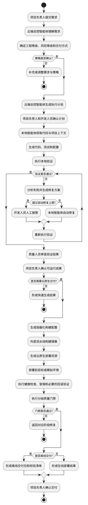
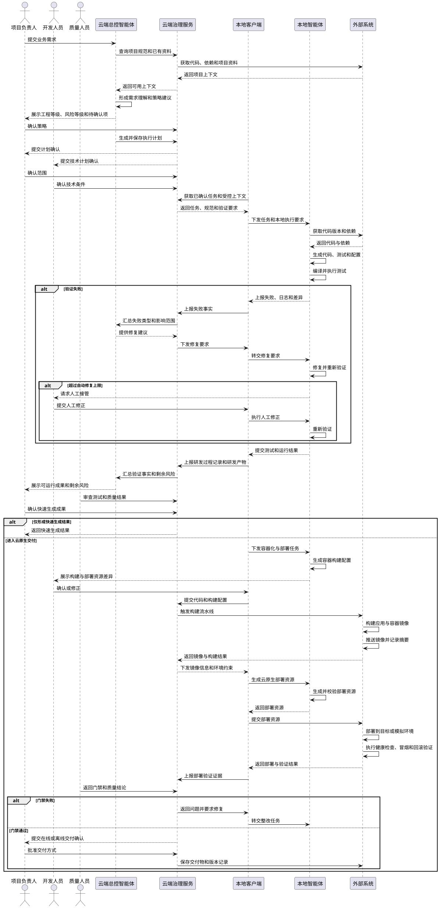
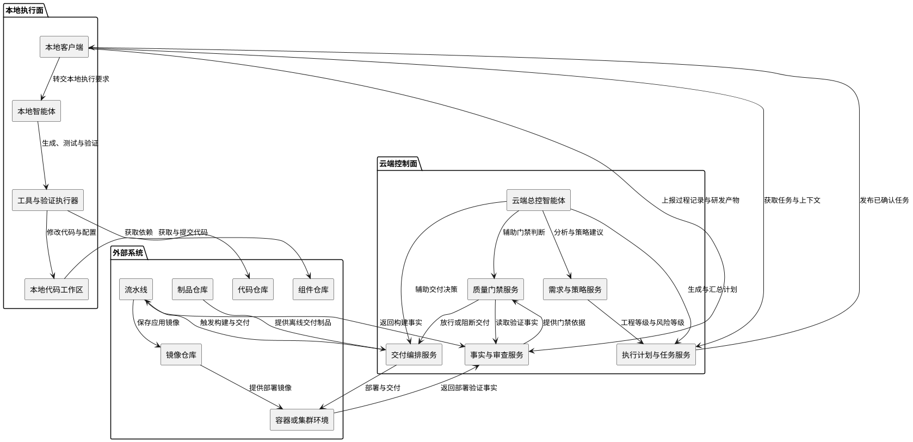

# 快速生成及云原生交付 用例与 UML

> 文档版本：2.0
> 编制日期：2026-07-13
> 关联需求：《快速生成与云原生交付需求文档 v2.0》
> 适用范围：智能研发平台

---

## 1. 场景说明

本文围绕“快速生成及云原生交付”场景，将需求转化为可评审、可设计、可实现的业务用例与统一建模语言图，重点回答以下问题：

1. 项目负责人、开发人员、质量人员与智能体如何协作。
2. 用户需求如何快速转化为可运行应用。
3. 可运行应用如何进一步形成镜像、部署资源和云原生交付结果。
4. 工程等级如何决定生成深度。
5. 风险等级如何决定验证、门禁和人工确认强度。
6. 生成失败、验证失败或交付失败时，如何修复、回退或人工接管。

本文不展开通用智能体平台、复杂多智能体编排、组织级审计平台、模板市场和多技术栈全面适配等扩展内容。

---

### 场景主线

本场景由两条连续主线构成：

```text
快速生成
解决“如何从业务需求快速形成可运行应用”

云原生交付
解决“如何将可运行应用形成可构建、可部署、可验证、可回滚的交付物”
```

总体关系如下：

```text
业务需求
  → 需求理解与方案规划
  → 代码、测试和配置生成
  → 本地验证与反馈修复
  → 形成可运行应用
  → 容器化构建
  → 部署资源生成
  → 云环境部署验证
  → 在线交付或离线交付
```

### 工程等级与风险等级

工程等级决定生成阶段的深度：

| 工程等级 | 生成目标 | 典型结果 |
| --- | --- | --- |
| 验证原型 | 快速验证页面、流程和需求方向 | 可运行原型、模拟数据、非生产项清单 |
| 轻量可用 | 快速形成个人或小团队可用应用 | 可运行应用、基础测试、运行说明 |
| 生产级 | 形成符合项目规范和验收要求的应用 | 正式代码、完整测试、构建与部署资源 |

风险等级决定验证与交付阶段的控制强度：

| 风险等级 | 控制重点 |
| --- | --- |
| 低风险 | 启动验证、核心流程冒烟、敏感配置检查 |
| 标准风险 | 需求覆盖、自动化测试、代码检查、镜像构建、部署验证 |
| 高风险 | 安全检查、资源校核、回滚验证、人工审批、完整证据 |

工程等级与风险等级相互独立。例如，轻量应用如果涉及敏感数据，仍必须采用高风险控制流程。

---

## 2. 系统参与者

本文只保留以下六类参与者。

| 参与者 | 职责定位 | 主要操作 |
| --- | --- | --- |
| 项目负责人 | 对需求范围、工程等级、交付目标和关键决策负责 | 提交或确认需求、确认执行计划、批准阶段推进、确认交付结果 |
| 开发人员 | 对代码实现、本地环境和人工修正负责 | 补充技术上下文、查看生成结果、人工修改代码、接管失败任务 |
| 云端总控智能体 | 对云端分析、规划、流程控制和决策辅助负责，不替代人员作最终业务决策 | 理解需求、推荐工程与风险等级、生成执行计划、调度流程、汇总结果、提示风险 |
| 本地智能体 | 在本地受控环境中完成代码、测试、配置和部署资源生成，并执行验证与修复 | 获取项目上下文、修改代码、运行命令、生成测试、分析失败、实施修复 |
| 质量人员 | 对测试充分性、门禁结果和质量结论负责 | 审查测试策略、确认门禁结果、提出质量问题、确认风险处理 |
| 外部系统 | 提供代码、依赖、构建、制品、镜像和运行环境能力 | 代码仓库、组件仓库、流水线、镜像仓库、制品仓库、容器或集群环境 |

### 2.1 责任边界

```text
项目负责人：决定做什么、做到什么程度、是否进入下一阶段。
开发人员：负责人工技术处理和本地执行兜底。
云端总控智能体：负责分析、规划、调度、汇总和辅助判断。
本地智能体：负责在本地实际生成、验证和修复。
质量人员：负责独立审查质量结果，不由生成智能体自证通过。
外部系统：提供真实的代码、构建、制品和部署事实。
```

云端总控智能体没有最终批准权。生产级生成、高风险变更、门禁例外和正式交付均须由相应人员确认。

---

## 3. 用例总览

| 编号 | 用例 | 主要参与者 | 关键输出 |
| --- | --- | --- | --- |
| UC-01 | 提交并理解需求 | 项目负责人、云端总控智能体 | 结构化需求、验收线索、约束清单 |
| UC-02 | 确定生成与交付策略 | 项目负责人、云端总控智能体、质量人员 | 工程等级、风险等级、交付方式 |
| UC-03 | 生成并确认执行计划 | 项目负责人、云端总控智能体、开发人员 | 执行计划、阶段任务、验证命令 |
| UC-04 | 获取本地项目上下文 | 本地智能体、开发人员、外部系统 | 工作区、上下文摘要、环境检查结果 |
| UC-05 | 生成应用代码与配置 | 本地智能体、开发人员 | 代码变更、配置变更、变更说明 |
| UC-06 | 生成并执行测试 | 本地智能体、质量人员 | 测试用例、测试报告、失败清单 |
| UC-07 | 反馈修复生成问题 | 云端总控智能体、本地智能体、开发人员 | 修复记录、重新验证结果 |
| UC-08 | 确认可运行应用成果 | 项目负责人、质量人员、开发人员 | 可运行应用、确认记录、下一阶段决定 |
| UC-09 | 生成容器化构建配置 | 本地智能体、开发人员 | 容器构建文件、环境配置模板 |
| UC-10 | 构建并保存应用镜像 | 外部系统、云端总控智能体 | 应用镜像、镜像摘要、构建记录 |
| UC-11 | 生成云原生部署资源 | 本地智能体、开发人员 | 部署资源、配置模板、部署说明 |
| UC-12 | 执行云环境部署验证 | 外部系统、本地智能体、质量人员 | 部署结果、健康检查、回滚结果 |
| UC-13 | 执行分级质量门禁 | 质量人员、云端总控智能体、外部系统 | 门禁结果、质量意见、风险接受记录 |
| UC-14 | 形成在线或离线交付结果 | 项目负责人、云端总控智能体、外部系统 | 在线结果或离线交付包、版本证据 |

---

## 4. 详细用例

## UC-01 提交并理解需求

| 项目 | 内容 |
| --- | --- |
| 用例目标 | 将项目负责人的业务描述转化为结构化需求、验收线索和约束条件。 |
| 主要参与者 | 项目负责人、云端总控智能体 |
| 前置条件 | 已创建项目，项目负责人具有需求提交权限，并发起新应用生成、存量功能变更或缺陷修复任务。 |
| 基本流程 | 1. 项目负责人提交业务目标、使用对象、核心流程和期望交付方式。<br>2. 云端总控智能体读取项目规范及已有资料。<br>3. 云端总控智能体识别需求目标、业务对象、主流程、异常流程和验收线索。<br>4. 系统标注缺失项、冲突项和未确认推断。<br>5. 项目负责人补充或确认需求理解结果。 |
| 强制升级 | 项目资料无法获取或需求存在重大冲突时进入“待补充”状态，不得进入生成；不得自动编造关键业务规则，所有推断必须显式标注。 |
| 输出 | 结构化需求、验收线索、约束清单、待确认项。 |

## UC-02 确定生成与交付策略

| 项目 | 内容 |
| --- | --- |
| 用例目标 | 确定工程等级、风险等级、生成深度、验证强度和交付方式。 |
| 主要参与者 | 项目负责人、云端总控智能体、质量人员 |
| 前置条件 | 需求理解结果已确认。 |
| 基本流程 | 1. 云端总控智能体判断需求成熟度和工作类型。<br>2. 推荐验证原型、轻量可用或生产级工程等级。<br>3. 根据数据、权限、运行环境和交付对象识别风险。<br>4. 推荐低、标准或高风险等级。<br>5. 推荐本地运行、容器运行、云环境部署或离线交付。<br>6. 项目负责人确认策略。<br>7. 高风险任务由质量人员确认质量控制要求。 |
| 强制升级 | 涉及敏感数据、生产环境、数据库迁移、外部交付、强审计或离线部署时，不得采用低风险控制。 |
| 输出 | 工程等级、风险等级、交付方式、验证要求、人工确认点。 |

## UC-03 生成并确认执行计划

| 项目 | 内容 |
| --- | --- |
| 用例目标 | 在执行前明确任务范围、生成内容、验证方式、交付影响和风险。 |
| 主要参与者 | 项目负责人、云端总控智能体、开发人员 |
| 前置条件 | 生成与交付策略已确认。 |
| 基本流程 | 1. 云端总控智能体结合需求和项目规范生成执行计划。<br>2. 计划列出影响模块、生成文件、测试策略、构建方式和部署影响。<br>3. 开发人员确认技术可行性和本地执行条件。<br>4. 项目负责人确认范围和阶段目标。<br>5. 系统锁定计划版本。 |
| 强制升级 | 生产级任务和高风险任务未确认计划不得执行。 |
| 输出 | 已确认执行计划、阶段任务、验证命令、风险提示。 |

## UC-04 获取项目上下文

| 项目 | 内容 |
| --- | --- |
| 用例目标 | 为本地智能体提供完成生成任务所需的真实项目上下文。 |
| 主要参与者 | 本地智能体、开发人员、外部系统 |
| 前置条件 | 执行计划已确认，本地客户端已连接。 |
| 基本流程 | 1. 本地客户端获取任务、项目规范、门禁信息、执行计划、项目配置和上下文信息。<br>2. 从代码仓库获取指定代码版本。<br>3. 读取工程结构、依赖配置、接口、数据模型和测试现状。<br>4. 检查本地工具、运行环境和权限。<br>5. 形成上下文摘要并上报云端总控智能体。 |
| 强制升级 | 代码版本不一致、依赖不可用或权限不足时，停止执行并上报阻塞原因。 |
| 输出 | 可执行工作区、上下文摘要、环境检查结果。 |

## UC-05 生成应用代码与配置

| 项目 | 内容 |
| --- | --- |
| 用例目标 | 按执行计划和下发任务生成或修改应用代码、接口、数据结构及配置。 |
| 主要参与者 | 本地智能体、开发人员 |
| 前置条件 | 本地上下文和执行环境检查通过。 |
| 基本流程 | 1. 本地智能体按任务修改代码。<br>2. 生成或更新接口、数据模型、配置和迁移脚本。<br>3. 执行基础编译或语法检查。<br>4. 记录文件变化和生成说明。<br>5. 开发人员可查看差异并进行人工修正。 |
| 强制升级 | 敏感信息不得写入代码或配置；不得超出计划范围修改无关模块。 |
| 输出 | 代码变更、配置变更、变更说明、待验证产物。 |

## UC-06 生成并执行测试

| 项目 | 内容 |
| --- | --- |
| 用例目标 | 验证生成结果是否满足验收线索和核心业务流程。 |
| 主要参与者 | 本地智能体、质量人员 |
| 前置条件 | 代码和配置生成完成。 |
| 基本流程 | 1. 本地智能体根据验收线索生成或补充测试。<br>2. 执行编译、单元测试、接口测试或冒烟测试。<br>3. 收集测试结果和运行日志。<br>4. 将失败映射到需求、代码或环境原因。<br>5. 质量人员审查关键流程覆盖和测试充分性。 |
| 强制升级 | 验证原型至少验证启动和核心演示流程；轻量应用至少执行核心流程冒烟；生产级应用应覆盖关键验收标准并执行回归测试。 |
| 输出 | 测试用例、测试报告、失败清单、质量意见。 |

## UC-07 反馈修复生成问题

| 项目 | 内容 |
| --- | --- |
| 用例目标 | 对生成、编译或测试失败进行受控修复，形成验证闭环。 |
| 主要参与者 | 云端总控智能体、本地智能体、开发人员 |
| 前置条件 | 生成或验证过程中出现失败。 |
| 基本流程 | 1. 本地智能体收集失败日志和相关代码差异。<br>2. 云端总控智能体汇总失败类型和影响范围。<br>3. 本地智能体形成修复方案并修改代码或配置。<br>4. 重新执行相关验证。<br>5. 达到自动修复次数上限仍失败时，转开发人员人工接管。<br>6. 人工处理后重新进入验证。 |
| 强制升级 | 自动修复次数必须可配置；不得通过删除测试、降低门禁或隐藏错误获得通过。 |
| 输出 | 修复记录、新代码版本、重新验证结果、人工接管记录。 |

## UC-08 确认可运行应用成果

| 项目 | 内容 |
| --- | --- |
| 用例目标 | 确认快速生成阶段已经形成符合当前工程等级要求的可运行成果。 |
| 主要参与者 | 项目负责人、质量人员、开发人员 |
| 前置条件 | 核心测试和运行验证通过。 |
| 基本流程 | 1. 系统展示应用运行结果、测试结果、文件变化和剩余风险。<br>2. 开发人员确认技术结果。<br>3. 质量人员确认验证充分性。<br>4. 项目负责人确认业务结果。<br>5. 对验证原型记录非生产项；对轻量或生产级成果决定是否进入云原生交付。 |
| 强制升级 | 技术结果、质量结果或业务结果任一未确认时，不得进入云原生交付或形成正式成果；验证原型必须明确非生产项。 |
| 输出 | 已确认可运行应用、确认记录、风险清单、下一阶段决定。 |

## UC-09 生成容器化构建配置

| 项目 | 内容 |
| --- | --- |
| 用例目标 | 将可运行应用转化为可重复构建的容器化应用单元。 |
| 主要参与者 | 本地智能体、开发人员 |
| 前置条件 | 可运行应用成果已确认，并选择容器或云环境交付。 |
| 基本流程 | 1. 本地智能体识别运行时、端口、依赖和启动命令。<br>2. 生成或更新容器构建文件。<br>3. 生成环境变量样例和忽略清单。<br>4. 检查敏感信息和不必要文件。<br>5. 开发人员查看构建配置差异。 |
| 强制升级 | 发现敏感信息、未声明依赖或启动配置无法校验时不得提交构建；构建配置超出已确认交付范围时必须人工确认。 |
| 输出 | 容器构建文件、环境配置模板、构建说明。 |

## UC-10 构建并保存应用镜像

| 项目 | 内容 |
| --- | --- |
| 用例目标 | 通过外部系统形成可追溯的应用镜像。 |
| 主要参与者 | 外部系统、云端总控智能体 |
| 前置条件 | 容器化构建配置已提交到指定代码版本。 |
| 基本流程 | 1. 云端治理服务根据已确认计划触发流水线。<br>2. 流水线拉取受控依赖并构建应用。<br>3. 构建容器镜像。<br>4. 对镜像执行基础检查。<br>5. 镜像推送至镜像仓库。<br>6. 系统记录镜像名称、标签、摘要、代码版本和构建日志。 |
| 强制升级 | 构建或推送失败时，返回快速生成阶段进行修复。 |
| 输出 | 应用镜像、镜像摘要、构建记录、检查结果。 |

## UC-11 生成云原生部署资源

| 项目 | 内容 |
| --- | --- |
| 用例目标 | 生成与应用镜像和目标环境匹配的声明式部署资源。 |
| 主要参与者 | 本地智能体、开发人员 |
| 前置条件 | 应用镜像构建成功，目标环境信息可用。 |
| 基本流程 | 1. 本地智能体读取镜像信息和环境约束。<br>2. 生成部署、服务、配置、访问和健康检查资源。<br>3. 设置基础资源限制和环境变量占位。<br>4. 校验镜像引用、端口和配置一致性。<br>5. 开发人员确认环境相关参数。 |
| 强制升级 | 目标环境、镜像引用、端口或配置无法校验时不得下发；涉及生产资源或高风险参数时必须由开发人员和项目负责人确认。 |
| 输出 | 云原生部署资源、配置模板、部署说明、回滚说明。 |

## UC-12 执行云环境部署验证

| 项目 | 内容 |
| --- | --- |
| 用例目标 | 在目标环境或模拟环境中验证交付物能否部署、运行和回滚。 |
| 主要参与者 | 外部系统、本地智能体、质量人员 |
| 前置条件 | 镜像和部署资源已准备完成。 |
| 基本流程 | 1. 外部系统部署指定镜像和资源。<br>2. 检查工作负载、网络、配置和健康状态。<br>3. 本地智能体执行访问验证和核心流程冒烟。<br>4. 高风险任务执行回滚验证。<br>5. 质量人员审查部署结果。<br>6. 系统记录环境、版本、镜像摘要和验证证据。 |
| 强制升级 | 部署失败时必须识别镜像、配置、资源、权限、网络或应用问题，并返回对应环节修复。 |
| 输出 | 部署结果、健康检查结果、冒烟结果、回滚结果、问题清单。 |

## UC-13 执行分级质量门禁

| 项目 | 内容 |
| --- | --- |
| 用例目标 | 根据风险等级判定生成与交付结果是否可以继续流转。 |
| 主要参与者 | 质量人员、云端总控智能体、外部系统 |
| 前置条件 | 快速生成验证或云环境部署验证已完成。 |
| 基本流程 | 1. 云端总控智能体加载当前风险等级对应的门禁规则。<br>2. 外部系统提供测试、构建、镜像和部署事实。<br>3. 系统执行规则并形成通过、失败或需人工确认结果。<br>4. 质量人员审查关键质量结果。<br>5. 硬门禁失败时阻止交付。<br>6. 软门禁问题由质量人员和项目负责人决定是否接受。 |
| 强制升级 | 门禁例外必须记录原因、批准人、适用版本和有效范围。 |
| 输出 | 门禁结果、质量意见、阻断原因、风险接受记录。 |

## UC-14 形成在线或离线交付结果

| 项目 | 内容 |
| --- | --- |
| 用例目标 | 将通过验证和门禁的版本形成在线部署结果或离线交付单元。 |
| 主要参与者 | 项目负责人、云端总控智能体、外部系统 |
| 前置条件 | 质量门禁通过，项目负责人批准交付。 |
| 基本流程 | 1. 锁定代码版本、镜像摘要和部署资源版本。<br>2. 在线交付时部署到指定环境，记录部署结果和访问方式；离线交付时汇总镜像、部署资源、配置模板、脚本、说明和校验和。<br>3. 检查镜像和资源引用闭包。<br>4. 在线形成部署记录，离线保存至制品仓库并形成交付清单和部署说明。 |
| 强制升级 | 交付版本、镜像摘要、部署资源版本或交付清单不完整时不得交付；离线交付必须通过引用闭包和校验信息检查。 |
| 输出 | 在线部署结果，或离线交付包及清单；交付版本和证据索引。 |

---

## 5. 关键业务规则

1. 每次生成必须关联已确认需求和执行计划。
2. 云端总控智能体只提供分析、推荐和流程辅助，不替代项目负责人或质量人员作最终决定。
3. 本地客户端负责同步任务、转交本地智能体、采集研发过程记录和研发产物并上报云端。
4. 云端总控智能体不得直接调用、指挥或与本地智能体交互。
5. 本地智能体的代码修改、命令执行和测试结果必须可查看、可追踪。
6. 生产级生成、高风险变更、门禁例外和正式交付必须经过相应人员确认。
7. 生成失败和验证失败必须有明确原因、修复记录和人工接管路径。
8. 自动修复不得通过删除测试、降低门禁或隐藏错误获得通过。
9. 可运行应用必须通过与工程等级匹配的验证。
10. 云原生交付物必须关联明确的代码版本、镜像摘要和部署资源版本。
11. 部署验证失败或硬门禁失败时不得形成可交付状态。
12. 离线交付必须来自已验证版本，不得直接从未经验证的开发目录打包。

---

## 6. UML 端到端活动图



---

## 7. UML 核心时序图



---

## 8. UML 组件图



---

## 9. 用例与功能映射

| 功能域 | 对应用例 | 主要成果 |
| --- | --- | --- |
| 需求理解与策略确定 | UC-01、UC-02 | 结构化需求、工程等级、风险等级、交付方式 |
| 计划与本地上下文准备 | UC-03、UC-04 | 已确认执行计划、可执行工作区 |
| 应用快速生成 | UC-05 | 代码、配置、数据结构和变更说明 |
| 测试与反馈修复 | UC-06、UC-07 | 测试报告、修复记录、可运行应用 |
| 快速生成成果确认 | UC-08 | 已确认应用成果、剩余风险和下一阶段决定 |
| 容器化与镜像构建 | UC-09、UC-10 | 构建配置、应用镜像、镜像摘要 |
| 部署资源与环境验证 | UC-11、UC-12 | 部署资源、配置模板、部署验证结果 |
| 门禁与交付 | UC-13、UC-14 | 门禁结论、在线部署结果或离线交付单元 |

---

## 10. 第一阶段建议实现范围

第一阶段应优先打通以下最小闭环：

```text
UC-01 提交并理解需求
  → UC-02 确定生成与交付策略
  → UC-03 生成并确认执行计划
  → UC-04 获取本地项目上下文
  → UC-05 生成应用代码与配置
  → UC-06 生成并执行测试
  → UC-07 反馈修复生成问题
  → UC-08 确认可运行应用成果
  → UC-09 生成容器化构建配置
  → UC-10 构建并保存应用镜像
  → UC-12 执行容器环境部署验证
  → UC-13 执行基础质量门禁
  → UC-14 形成容器化交付结果
```

第一阶段建议限定：

- 支持一种典型技术栈。
- 支持新建轻量应用或范围明确的功能变更。
- 支持本地生成、测试和自动修复。
- 支持容器镜像构建和容器环境部署验证。
- 支持基础门禁和人工确认。
- 暂不承诺复杂集群发布、完整离线部署适配和多技术栈全面覆盖。

---

## 11. 第一阶段验收主线

第一阶段验收应打通以下最小闭环：

```text
项目负责人提交需求
  → 云端总控智能体形成需求理解和生成交付策略
  → 项目负责人、开发人员确认执行计划
  → 本地客户端同步任务和受控上下文
  → 本地智能体生成代码、配置和测试
  → 本地执行验证并反馈修复问题
  → 质量人员和项目负责人确认可运行成果
  → 生成容器构建配置并构建应用镜像
  → 生成云原生部署资源并执行部署验证
  → 执行分级质量门禁
  → 形成在线部署结果或离线交付包
```

验收时重点证明：

1. 每次生成都关联已确认需求和执行计划。
2. 云端总控智能体只提供分析、推荐和流程辅助，不替代项目负责人或质量人员作最终决定。
3. 本地客户端负责事实采集，云端总控智能体不直接调用本地智能体。
4. 本地智能体的代码修改、命令执行和测试结果可查看、可追踪。
5. 生成失败和验证失败具有明确原因、修复记录和人工接管路径。
6. 可运行应用通过与工程等级匹配的验证。
7. 云原生交付物绑定代码版本、镜像摘要和部署资源版本。
8. 部署验证失败或硬门禁失败时不形成可交付状态。
9. 离线交付来自已验证版本，并包含完整交付清单和校验信息。
