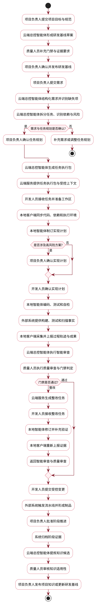
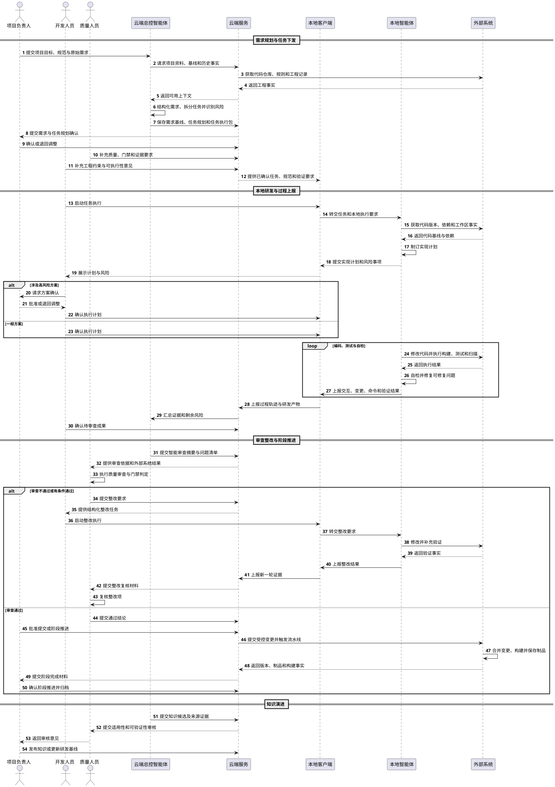
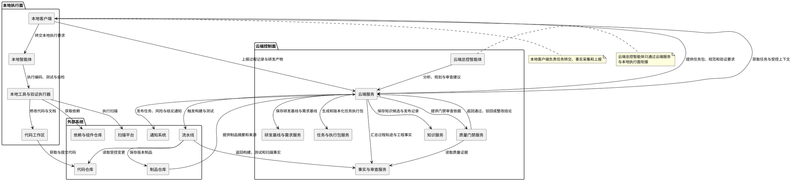

# 实现团队规范化智能开发——用例与UML设计

> 文档版本：1.0
> 编制日期：2026-07-13
> 建模主题：实现团队规范化智能开发
> 适用范围：智能研发平台的项目治理、本地受控研发、质量审查与知识演进

## 1. 场景说明

本文围绕“实现团队规范化智能开发”场景，将团队规范、任务边界、智能体工作流、质量门禁和人工卡点组织为可执行的业务用例与统一建模语言模型，重点回答以下问题：

1. 项目负责人如何建立研发基线、确认需求和决定阶段推进。
2. 云端总控智能体如何辅助需求分析、任务规划、审查和知识提炼。
3. 开发人员如何通过本地智能体在受控任务范围内完成研发。
4. 本地客户端如何采集研发过程记录、研发产物并上报云端。
5. 质量人员如何独立审查过程与结果，并对门禁和整改作出判断。
6. 代码仓库、流水线、扫描平台和制品仓库如何提供可追溯的工程事实。

### 场景主线

本场景形成一条“云端规划—本地执行—过程上报—智能审查—人工卡点—整改闭环—知识反哺”的完整链路：

```text
建立项目研发基线
  → 分析并确认需求
  → 规划任务、依赖与风险
  → 生成并下发任务执行包
  → 本地接收任务、准备环境并确认实现计划
  → 编码、测试、自检和成果上报
  → 云端智能审查与质量门禁判定
  → 整改复核或提交变更、形成制品
  → 阶段推进、归档和知识演进
```

本文不扩展通用智能体平台、复杂多智能体编排、组织级审计平台和多技术栈全面适配等其他场景。技术决策、阶段批准和知识发布职责归入项目负责人；独立质量判断和门禁职责归入质量人员；代码仓库、流水线、扫描平台和制品仓库统一归入外部系统。

## 2. 系统参与者

本文只保留以下六类参与者。

| 参与者 | 职责定位 | 主要操作 | 决策边界 |
| --- | --- | --- | --- |
| 项目负责人 | 维护研发基线，确认需求与任务规划，批准关键方案、阶段推进和知识发布。 | 提交或确认需求、确认任务规划、批准高风险方案、确认阶段结果。 | 对需求、任务规划、高风险方案、阶段推进和知识发布作最终管理决策。 |
| 开发人员 | 接收任务，控制本地智能体执行，确认代码与产物，处理异常和整改。 | 准备工作区、确认实现计划、查看差异、处理异常、确认提交结果。 | 对本地提交的代码、测试、文档和整改结果承担确认责任。 |
| 云端总控智能体 | 辅助需求分析、任务规划、任务包生成、过程审查、问题归纳和知识提炼。 | 形成分析建议、生成任务执行包、汇总证据、提出审查和知识建议。 | 只辅助项目负责人和质量人员进行云端决策，不替代人员作最终批准。 |
| 本地智能体 | 按任务执行包完成分析、编码、测试、自检、修复和成果整理。 | 读取受控上下文、修改代码、运行命令、执行验证、整理成果。 | 只能在任务执行包和权限范围内执行，不得自行扩大任务边界。 |
| 质量人员 | 制定质量要求，执行独立审查，判定门禁、整改关闭和交付条件。 | 审查测试、扫描和证据，提出整改要求，确认门禁和整改结论。 | 独立判断过程合规和结果质量，硬性门禁失败时不得放行。 |
| 外部系统 | 提供代码仓库、流水线、扫描、制品仓库和通知等工程能力。 | 提供代码、依赖、构建、测试、扫描、合并和制品结果。 | 提供工程事实和执行能力，不承担业务与质量决策。 |

### 2.1 责任边界

```text
项目负责人：决定做什么、做到什么程度、是否进入下一阶段。
开发人员：负责人工技术处理、本地环境确认和执行兜底。
云端总控智能体：负责云端分析、规划、汇总、审查辅助和知识提炼。
本地智能体：负责在本地实际执行、验证、修复和整理研发成果。
质量人员：负责独立审查质量结果，不由生成智能体自证通过。
外部系统：提供真实的仓库、流水线、扫描和制品事实。
```

## 3. 用例总览

| 编号 | 用例名称 | 主要参与者 | 协同参与者 | 主要成果 |
| --- | --- | --- | --- | --- |
| UC-01 | 建立并发布项目研发基线 | 项目负责人、云端总控智能体 | 质量人员、外部系统 | 版本化规范、工作流、门禁和项目知识。 |
| UC-02 | 分析并确认需求 | 项目负责人、云端总控智能体 | 开发人员、质量人员 | 目标、范围、业务规则和验收标准明确的需求基线。 |
| UC-03 | 规划任务、依赖与风险 | 云端总控智能体、项目负责人 | 开发人员、质量人员 | 任务图、修改边界、责任分工、风险等级和人工卡点。 |
| UC-04 | 生成并下发任务执行包 | 云端总控智能体 | 项目负责人、开发人员 | 任务、上下文、规范、工作流和验证要求。 |
| UC-05 | 接收任务并准备执行环境 | 开发人员 | 本地智能体、外部系统 | 任务确认、代码同步、分支或工作区和环境检查结果。 |
| UC-06 | 制订并确认实现计划 | 本地智能体、开发人员 | 项目负责人 | 可执行的实现计划和已确认的风险事项。 |
| UC-07 | 执行编码、测试与自检 | 本地智能体、开发人员 | 外部系统 | 符合任务边界的代码、测试、文档和验证结果。 |
| UC-08 | 上报过程轨迹与成果 | 本地智能体、开发人员 | 云端总控智能体 | 与任务、版本和阶段关联的过程证据。 |
| UC-09 | 执行云端智能审查 | 云端总控智能体 | 项目负责人、质量人员 | 需求偏离、范围越界、规范违反、证据缺失和质量风险。 |
| UC-10 | 执行质量审查与门禁判定 | 质量人员 | 云端总控智能体、外部系统 | 通过、驳回或有条件通过结论。 |
| UC-11 | 生成整改任务并闭环 | 云端总控智能体、开发人员 | 本地智能体、质量人员 | 可执行整改项、修订记录和复核关闭结论。 |
| UC-12 | 提交变更并触发流水线 | 开发人员 | 本地智能体、外部系统 | 受控变更、构建、测试和扫描结果。 |
| UC-13 | 合并变更并形成制品 | 外部系统 | 项目负责人、质量人员、开发人员 | 可追溯的主干变更、版本和制品。 |
| UC-14 | 推进阶段并归档 | 项目负责人 | 云端总控智能体、质量人员、外部系统 | 阶段结论、完成状态和归档证据。 |
| UC-15 | 提炼知识候选 | 云端总控智能体 | 开发人员、质量人员 | 来源明确、可审核的知识候选。 |
| UC-16 | 审核并发布项目知识 | 项目负责人、质量人员 | 云端总控智能体 | 可复用的规范、模板、指令或检查规则。 |


## 4. 核心用例说明

## UC-01 建立并发布项目研发基线

| 项目 | 内容 |
| --- | --- |
| 用例目标 | 将团队规范、架构边界、质量要求和智能体工作流转化为可执行、可版本化的项目研发基线。 |
| 主要参与者 | 项目负责人 |
| 前置条件 | 项目已创建，项目负责人具备基线维护权限。 |
| 基本流程 | 1. 项目负责人提交项目目标、架构说明、代码仓库和现有规范。<br>2. 云端总控智能体分析目录结构、历史工程记录和现有规则，形成基线草案。<br>3. 质量人员补充测试、扫描、门禁和证据要求。<br>4. 项目负责人确认模块边界、工作流、人工卡点和适用范围。<br>5. 系统发布基线版本，并供后续任务绑定使用。 |
| 强制升级 | 规则来源冲突时标记冲突项并由项目负责人确认；基线更新不得覆盖已启动任务绑定的历史版本。 |
| 输出 | 项目研发基线、工作流、门禁规则和版本记录；每次任务执行绑定唯一基线版本，历史基线可查询、可对比且不可覆盖。 |

## UC-02 分析并确认需求

| 项目 | 内容 |
| --- | --- |
| 用例目标 | 把原始诉求转化为范围明确、可验收、可继续规划的需求基线。 |
| 主要参与者 | 项目负责人、云端总控智能体 |
| 前置条件 | 项目研发基线已发布。 |
| 基本流程 | 1. 项目负责人提交业务背景、目标、约束和关联资料。<br>2. 云端总控智能体提炼目标、范围、业务规则、非功能要求和验收标准。<br>3. 云端总控智能体识别缺失、冲突和高风险假设。<br>4. 开发人员补充工程实现约束，质量人员补充可验证性要求。<br>5. 项目负责人调整并确认需求基线。 |
| 强制升级 | 关键目标或验收标准无法确认时，需求保持待确认状态，不进入开发；不得以推测替代未确认的关键业务规则。 |
| 输出 | 需求基线、待确认项、验收标准和确认记录；能够明确回答为什么做、做什么、不做什么、如何判定完成。 |

## UC-03 规划任务、依赖与风险

| 项目 | 内容 |
| --- | --- |
| 用例目标 | 将需求拆分为可执行、可审查、可验证的任务，并明确并行边界和风险控制。 |
| 主要参与者 | 云端总控智能体、项目负责人 |
| 前置条件 | 需求基线已确认。 |
| 基本流程 | 1. 云端总控智能体识别影响模块、公共契约、共享资产和外部依赖。<br>2. 按契约任务、独立实现任务、共享资产任务和集成验证任务进行拆分。<br>3. 形成任务依赖图、允许修改范围、禁止修改范围和完成定义。<br>4. 推荐风险等级、执行顺序、责任人和质量卡点。<br>5. 开发人员核对可执行性，质量人员核对验证要求。<br>6. 项目负责人确认任务规划。 |
| 强制升级 | 涉及公共契约、数据模型或核心权限时，任务必须先进入高风险方案确认；依赖不明确或共享资产无法互斥时不得进入并行执行。 |
| 输出 | 任务图、任务清单、风险等级、人工卡点和责任分工；任务依赖明确、共享资产修改互斥且每项任务可独立验证。 |

## UC-04 生成并下发任务执行包

| 项目 | 内容 |
| --- | --- |
| 用例目标 | 将已确认任务转换为本地可以直接执行的受控任务单元。 |
| 主要参与者 | 云端总控智能体 |
| 前置条件 | 任务规划已确认，需求基线和项目研发基线版本有效。 |
| 基本流程 | 1. 绑定需求基线、项目研发基线和任务版本。<br>2. 装配相关代码、接口、文档、历史案例和评审经验。<br>3. 注入允许修改范围、禁止修改范围、工作流、工具权限和验证命令。<br>4. 通过云端服务生成任务执行包并提供给本地客户端。<br>5. 开发人员确认环境和依赖是否满足执行条件。 |
| 强制升级 | 任务范围或基线发生重大变化时，原任务执行包失效并重新生成；任务执行包不得绕过已确认的权限和验证要求。 |
| 输出 | 任务执行包、上下文包、工作流配置和验证清单，并能追溯到具体需求、任务和基线版本。 |

## UC-05 接收任务并准备执行环境

| 项目 | 内容 |
| --- | --- |
| 用例目标 | 在本地建立与任务执行包一致的代码、依赖、分支或工作区和执行环境。 |
| 主要参与者 | 开发人员 |
| 前置条件 | 任务执行包已通过云端服务提供，本地客户端已连接，开发人员具备任务权限。 |
| 基本流程 | 1. 开发人员确认任务目标、边界和执行条件。<br>2. 本地客户端获取任务执行包、项目规范和验证要求。<br>3. 本地智能体从外部系统同步指定代码版本、依赖和相关资料。<br>4. 本地客户端检查工具、运行环境、权限和工作区状态。<br>5. 开发人员确认工作区可以开始执行。 |
| 强制升级 | 代码版本不一致、依赖不可用、权限不足或工作区存在未确认变更时停止执行，并通过本地客户端上报阻塞原因；不得在未确认工作区上直接修改。 |
| 输出 | 任务确认记录、可执行工作区、代码基线、依赖清单和环境检查结果。 |

## UC-06 制订并确认实现计划

| 项目 | 内容 |
| --- | --- |
| 用例目标 | 在实际修改前明确实现步骤、受影响文件、验证方式、风险和人工确认点。 |
| 主要参与者 | 本地智能体、开发人员 |
| 前置条件 | 任务执行包有效，工作区和权限准备完成。 |
| 基本流程 | 1. 本地智能体读取任务执行包、项目上下文和历史记录。<br>2. 形成实现步骤、影响文件、测试策略、命令和预期产物。<br>3. 标记公共契约、数据模型、核心权限和高风险配置等事项。<br>4. 开发人员检查计划与任务边界，并确认可执行性。<br>5. 涉及高风险方案时，项目负责人确认后锁定计划版本。 |
| 强制升级 | 计划触及禁止修改范围、公共契约或高风险事项时必须暂停并提交人工确认；计划未确认不得开始编码。 |
| 输出 | 已确认实现计划、影响范围、验证命令、风险事项和人工确认记录。 |

## UC-07 执行编码、测试与自检

| 项目 | 内容 |
| --- | --- |
| 用例目标 | 在真实工程环境中受控完成实现、验证和成果整理。 |
| 主要参与者 | 本地智能体、开发人员 |
| 前置条件 | 任务执行包有效，工作区、权限和实现计划准备完成。 |
| 基本流程 | 1. 本地智能体按允许范围修改代码、测试和文档。<br>2. 外部系统提供依赖、代码仓库、构建、测试和扫描能力。<br>3. 本地智能体执行编译、测试、扫描和自检。<br>4. 对可修复问题进行受控修复并重新验证。<br>5. 开发人员确认最终变更、风险和未解决事项。 |
| 强制升级 | 触碰禁止范围、公共契约或高风险配置时立即暂停；自动修复超过限制后转由开发人员处理；不得通过删除测试、降低门禁或隐藏错误获得通过。 |
| 输出 | 代码、测试、文档、构建和扫描结果、验证结果、变更说明以及未解决事项。 |

## UC-08 上报过程轨迹与成果

| 项目 | 内容 |
| --- | --- |
| 用例目标 | 将本地研发行为和产物组织为可审查的任务级证据。 |
| 主要参与者 | 本地智能体、开发人员 |
| 前置条件 | 任务执行实例已创建，本地客户端具备采集和上报条件。 |
| 基本流程 | 1. 本地客户端采集关键人机交互、上下文引用、工具调用和命令结果。<br>2. 采集文件变化、代码差异、构建、测试和扫描结果。<br>3. 关联项目、需求、任务、基线、任务执行实例和阶段。<br>4. 过滤敏感信息，弱网或断网时在本地缓存。<br>5. 通过云端服务持续上报并形成任务时间线和证据包。 |
| 强制升级 | 上报失败时保留本地缓存并恢复补传；高风险任务证据不完整时不得直接通过阶段审查；敏感信息不得随过程记录外发。 |
| 输出 | 过程轨迹、任务时间线、成果索引和证据包；关键交互、变更、验证和人工决策可关联、可查询、可复核。 |

## UC-09 执行云端智能审查

| 项目 | 内容 |
| --- | --- |
| 用例目标 | 基于需求、任务、基线、过程轨迹和成果，辅助识别过程与结果风险。 |
| 主要参与者 | 云端总控智能体 |
| 前置条件 | 任务已提交审查，证据包可用，云端服务已汇总相关工程事实。 |
| 基本流程 | 1. 检查任务执行使用的基线、上下文和工作流版本。<br>2. 检查允许范围、禁止范围、人工卡点和验证步骤是否满足。<br>3. 分析需求、代码、测试、文档和成果之间的一致性。<br>4. 识别重复实现、架构偏离、安全风险、证据缺失和未解决问题。<br>5. 生成审查摘要、风险清单、待人工确认项和整改建议，并交由质量人员和项目负责人判断。 |
| 强制升级 | 证据不足时明确标记“无法判定”，不得伪造通过结论；涉及需求、公共契约、权限或高风险配置时必须提示人工确认。 |
| 输出 | 智能审查摘要、问题清单、风险清单、待人工确认项和审查建议；所有结论均能指向需求、任务、规则、差异或验证证据。 |

## UC-10 执行质量审查与门禁判定

| 项目 | 内容 |
| --- | --- |
| 用例目标 | 由质量人员独立判断任务是否满足过程规范和结果质量要求。 |
| 主要参与者 | 质量人员 |
| 前置条件 | 智能审查摘要、外部系统质量结果和任务证据已形成。 |
| 基本流程 | 1. 质量人员查看需求、任务、关键差异、测试与扫描结果。<br>2. 核对验收标准、过程合规、缺陷风险和交付条件。<br>3. 必要时要求开发人员补充说明或补充验证。<br>4. 作出通过、驳回或有条件通过结论。<br>5. 高风险或关键阶段结论提交项目负责人确认。 |
| 强制升级 | 硬性门禁失败时不得判定通过；产物变化后，受影响的审查结论按规则失效并重新审查。 |
| 输出 | 质量审查单、门禁结论和整改要求；结论包含对象版本、审查依据、责任人、时间和意见。 |

## UC-11 生成整改任务并闭环

| 项目 | 内容 |
| --- | --- |
| 用例目标 | 把审查问题转化为可执行整改项，并通过复核完成问题关闭。 |
| 主要参与者 | 云端总控智能体、开发人员 |
| 前置条件 | 审查结论为驳回或有条件通过，问题已有依据或待补充事项。 |
| 基本流程 | 1. 云端总控智能体将问题关联到需求、任务、文件、差异或验证项。<br>2. 形成结构化整改任务和完成条件。<br>3. 开发人员启动本地智能体完成修订和补充验证。<br>4. 本地客户端继续上报新的执行轨迹和成果。<br>5. 质量人员复核整改项，确认关闭或再次退回。 |
| 强制升级 | 问题涉及需求或任务边界错误时，退回需求确认或任务规划阶段；每次整改必须保留整改前后证据，不得以文字说明替代验证结果。 |
| 输出 | 整改任务、修订记录、关闭证据和复核结论；每个整改项均有责任人、完成条件、修改证据和关闭结论。 |

## UC-12 提交变更并触发流水线

| 项目 | 内容 |
| --- | --- |
| 用例目标 | 将已确认的代码、测试、文档和配置变更提交到受控代码仓库，并触发外部系统执行流水线。 |
| 主要参与者 | 开发人员 |
| 前置条件 | 质量审查允许继续，变更已完成确认，过程证据和验证结果完整。 |
| 基本流程 | 1. 开发人员查看本地智能体形成的差异、验证结果和未解决事项。<br>2. 确认提交范围、提交说明、需求和任务关联。<br>3. 通过本地客户端将变更提交到指定分支或工作区。<br>4. 外部系统校验版本、权限和提交内容，并触发构建、测试和扫描流水线。<br>5. 云端服务接收流水线状态和结果并关联任务执行实例。 |
| 强制升级 | 存在未确认的越界修改、硬性门禁失败或证据缺失时不得提交；提交后若流水线失败，必须回到对应修复环节，不得人工标记为通过。 |
| 输出 | 受控提交、提交关联信息、流水线执行实例、构建结果、测试结果和扫描结果。 |

## UC-13 合并变更并形成制品

| 项目 | 内容 |
| --- | --- |
| 用例目标 | 在审查和门禁通过后合并受控变更，形成可追溯版本和工程制品。 |
| 主要参与者 | 外部系统 |
| 前置条件 | UC-12 已完成，流水线结果满足门禁，项目负责人和质量人员完成必要确认。 |
| 基本流程 | 1. 外部系统检查代码版本、审查结论、门禁结果和依赖状态。<br>2. 质量人员确认质量证据，项目负责人批准合并或形成制品。<br>3. 外部系统将变更合并到目标分支。<br>4. 外部系统按受控版本构建并保存制品。<br>5. 云端服务记录提交、版本、构建日志、制品摘要和来源关系。 |
| 强制升级 | 合并前任一硬性门禁失败、审查结论失效或版本来源不明时必须阻断；制品构建失败时返回 UC-12 或对应整改任务。 |
| 输出 | 主干变更、版本记录、制品、制品摘要、构建日志和来源追溯关系。 |

## UC-14 推进阶段并归档

| 项目 | 内容 |
| --- | --- |
| 用例目标 | 根据质量结论、制品事实和剩余风险决定阶段推进，并完整归档研发证据。 |
| 主要参与者 | 项目负责人 |
| 前置条件 | 质量审查已完成，变更或制品已形成，阶段证据可查询。 |
| 基本流程 | 1. 云端服务汇总需求、任务、基线、过程轨迹、审查、门禁和制品信息。<br>2. 质量人员确认质量意见和遗留风险。<br>3. 云端总控智能体提供阶段摘要和推进建议。<br>4. 项目负责人批准推进、退回整改、暂停或取消。<br>5. 系统归档阶段结论、完成状态、证据索引和关联版本。 |
| 强制升级 | 高风险任务、关键阶段或存在未关闭硬性问题时必须由项目负责人明确决定；证据不完整时不得标记阶段完成。 |
| 输出 | 阶段结论、完成状态、推进记录、遗留风险和归档证据。 |

## UC-15 提炼知识候选

| 项目 | 内容 |
| --- | --- |
| 用例目标 | 从过程轨迹、评审结论、整改记录和失败经验中提炼可复用的知识候选。 |
| 主要参与者 | 云端总控智能体 |
| 前置条件 | 任务或阶段已形成过程证据、审查记录或整改结果。 |
| 基本流程 | 1. 云端总控智能体汇总过程轨迹、问题清单、整改前后差异和质量结论。<br>2. 识别重复出现的问题、有效做法、边界条件和可验证规则。<br>3. 说明候选来源、适用范围、预期作用和潜在影响。<br>4. 开发人员补充工程上下文，质量人员判断可验证性和误拦截风险。<br>5. 将候选提交项目负责人和质量人员审核。 |
| 强制升级 | 单次个案、缺乏证据或无法描述适用边界的经验不得直接进入正式项目知识；可能改变既有规范的候选必须标记影响范围。 |
| 输出 | 知识候选、来源证据、适用范围、预期作用、潜在影响和审核请求。 |

## UC-16 审核并发布项目知识

| 项目 | 内容 |
| --- | --- |
| 用例目标 | 将经过验证的经验转化为后续人员和智能体可复用的正式资产。 |
| 主要参与者 | 项目负责人、质量人员 |
| 前置条件 | 任务完成，已形成知识候选及来源证据。 |
| 基本流程 | 1. 云端总控智能体说明候选来源、适用范围、预期作用和潜在影响。<br>2. 质量人员判断规则是否可验证、是否会造成误拦截。<br>3. 项目负责人判断是否具有项目通用性。<br>4. 审核通过后发布为开发规范、任务模板、智能体指令、上下文资料或检查规则。<br>5. 跟踪使用效果，必要时修订、停用或回退。 |
| 强制升级 | 未经项目负责人和质量人员共同审核的经验不得发布为正式规范；单次个案或缺乏证据的经验必须退回补充。 |
| 输出 | 正式项目知识、基线更新记录和效果跟踪项；正式知识具备来源、版本、适用范围、审核记录和回退能力。 |

## 5. 关键业务规则

1. 所有研发执行必须绑定需求基线、项目研发基线、任务执行包和工作流版本。
2. 云端总控智能体只辅助项目负责人和质量人员进行云端决策，不替代人员作最终管理决策。
3. 本地客户端负责同步任务、转交本地智能体、采集研发过程记录和研发产物并上报云端。
4. 云端总控智能体不得直接调用、指挥或与本地智能体交互。
5. 本地智能体只能在任务执行包规定的上下文、权限和修改范围内执行。
6. 涉及公共契约、数据模型、安全权限或核心流程的事项必须触发项目负责人确认。
7. 质量人员对过程规范性和结果质量进行独立判断，硬性门禁失败不得放行。
8. 本地智能体的代码修改、命令执行和测试结果必须可查看、可追踪。
9. 过程轨迹必须能够关联任务、版本、文件变化、验证结果和人工决策。
10. 审查问题必须转化为结构化整改任务，并保留整改前后证据。
11. 生成失败和验证失败必须有明确原因、修复记录和人工接管路径。
12. 外部系统产生的仓库、流水线、扫描和制品结果是工程事实，智能体不得用文字自述替代。
13. 未经项目负责人和质量人员审核的经验不得直接成为正式项目知识。
14. 简单任务可采用轻量流程，但不得取消必要的任务边界、验证和追溯。

## 6. UML 端到端活动图



## 7. UML 核心时序图



## 8. UML 组件图



## 9. 用例与功能映射

| 功能域 | 对应用例 | 主要成果 |
| --- | --- | --- |
| 项目治理与研发基线 | UC-01 | 版本化规范、工作流、门禁和基线记录。 |
| 需求分析与任务规划 | UC-02、UC-03 | 需求基线、任务图、依赖、风险和人工卡点。 |
| 任务执行包与本地准备 | UC-04、UC-05、UC-06 | 任务执行包、可执行工作区、实现计划和确认记录。 |
| 本地受控研发与证据采集 | UC-07、UC-08 | 代码、测试、文档、过程轨迹和成果证据。 |
| 智能审查、质量门禁与整改 | UC-09、UC-10、UC-11 | 审查摘要、门禁结论、整改任务和关闭证据。 |
| 变更、流水线与制品 | UC-12、UC-13 | 受控提交、流水线结果、主干版本和制品。 |
| 阶段推进与归档 | UC-14 | 阶段结论、完成状态、遗留风险和归档证据。 |
| 知识演进 | UC-15、UC-16 | 知识候选、正式项目知识和基线更新记录。 |

## 10. 第一阶段建议实现范围

第一阶段应优先打通以下最小闭环：

```text
UC-01 建立并发布项目研发基线
  → UC-02 分析并确认需求
  → UC-03 规划任务、依赖与风险
  → UC-04 生成并下发任务执行包
  → UC-05 接收任务并准备执行环境
  → UC-06 制订并确认实现计划
  → UC-07 执行编码、测试与自检
  → UC-08 上报过程轨迹与成果
  → UC-09 执行云端智能审查
  → UC-10 执行质量审查与门禁判定
  → UC-11 生成整改任务并闭环
  → UC-12 提交变更并触发流水线
  → UC-13 合并变更并形成制品
  → UC-14 推进阶段并归档
```

第一阶段建议限定：

- 支持一种典型技术栈和一种受控本地执行环境。
- 支持需求明确的新建功能或范围明确的功能变更。
- 支持本地编码、测试、自检、过程采集和受控自动修复。
- 支持基础质量门禁、人工确认、受控提交和制品形成。
- 支持云端审查、整改闭环、阶段归档和知识候选提炼。
- 暂不承诺复杂多智能体编排、组织级审计平台和多技术栈全面覆盖。

## 11. 第一阶段验收主线

第一阶段验收应打通以下最小闭环：

```text
项目负责人建立研发基线并提交需求
  → 云端总控智能体形成需求理解、任务规划和任务执行包
  → 本地客户端同步任务和受控上下文
  → 本地智能体制订计划并经开发人员确认
  → 本地智能体完成编码、测试和自检
  → 本地客户端采集并上报过程轨迹和研发产物
  → 云端总控智能体完成智能审查
  → 质量人员完成独立质量审查和门禁判定
  → 失败时生成整改任务并完成复核
  → 通过后提交变更、触发流水线并形成制品
  → 项目负责人确认阶段推进并完成归档
```

验收时重点证明：

1. 每次任务执行都关联已确认需求、研发基线、任务执行包和工作流版本。
2. 云端总控智能体只提供分析、规划、审查和知识建议，不替代项目负责人或质量人员作最终决定。
3. 本地客户端负责任务转交、事实采集和上报，云端总控智能体不直接调用、指挥或连接本地智能体。
4. 本地智能体的代码修改、命令执行、测试结果和人工确认可查看、可追踪。
5. 生成失败、验证失败和门禁失败具有明确原因、修复记录和人工接管路径。
6. 质量人员能够依据外部系统事实独立作出通过、驳回或有条件通过结论。
7. 变更、流水线、主干版本和制品之间具备完整来源追溯关系。
8. 阶段推进必须具备完整证据，未关闭硬性问题不得标记为完成。
9. 知识候选能够追溯来源，并经项目负责人和质量人员审核后才可发布。
