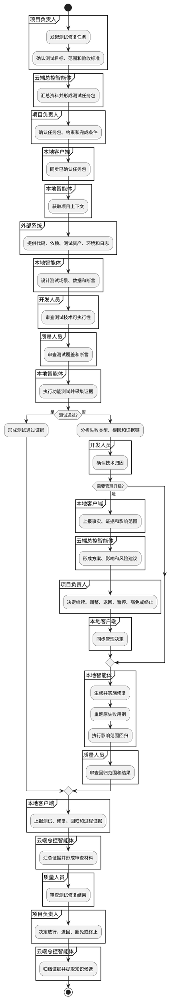
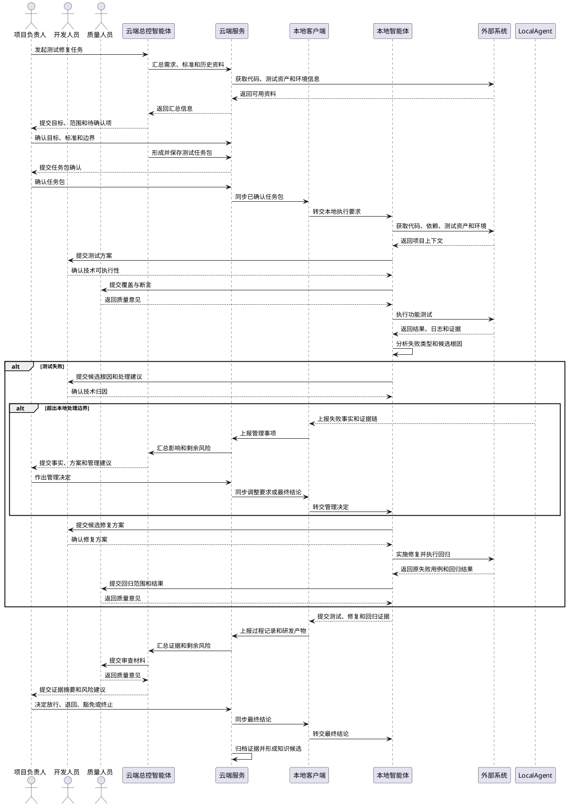
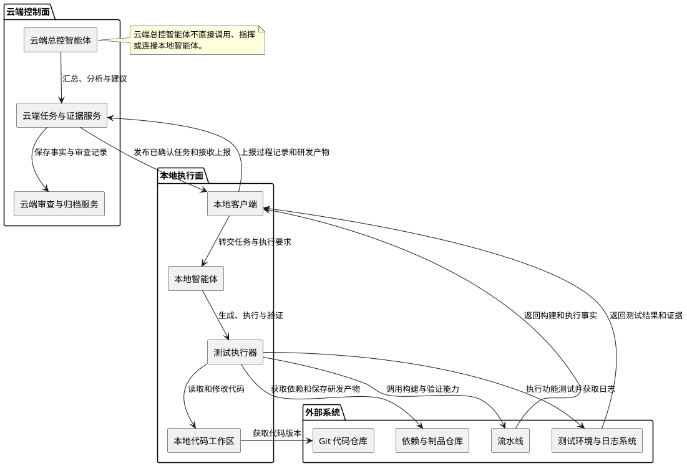

# 智能化软件功能测试与修复用例及 UML 设计

> 文档版本：1.0
> 编制日期：2026-07-13
> 建模主题：智能化软件功能测试与修复
> 适用范围：面向桌面端研发过程的功能测试、失败归因、修复、回归与结果归档

## 1. 场景说明

本文围绕“智能化软件功能测试与修复”场景，将测试目标、验收标准和研发执行过程转化为可评审、可追踪的业务用例与统一建模语言图。场景重点回答以下问题：

1. 项目负责人如何明确测试目标、范围和验收标准。
2. 云端总控智能体如何将管理要求整理为可执行的测试任务包。
3. 本地智能体如何在受控环境中获取上下文、设计并执行功能测试。
4. 测试失败如何形成证据链、完成技术归因并判断是否需要升级。
5. 修复如何在授权范围内实施，并通过回归验证确认原问题已解决。
6. 项目负责人、质量人员和云端总控智能体如何基于完整证据审查结果并沉淀知识候选。

### 场景主线

```text
发起测试修复任务
  → 形成测试任务包
  → 获取项目上下文
  → 设计功能测试
  → 执行功能测试并采集证据
  → 分析测试失败
  → 必要时升级管理事项
  → 生成并实施修复
  → 执行回归验证
  → 审查测试修复结果
  → 归档证据与沉淀知识
```

本场景区分云端管理侧与本地研发侧：云端总控智能体负责信息汇总、证据分析、建议和审查辅助；本地客户端负责同步任务、采集研发过程记录和研发产物并上报云端；本地智能体负责在本地受控环境中获取上下文、执行测试、分析失败、实施修复和回归验证。云端总控智能体不直接调用、指挥或与本地智能体交互。

## 2. 系统参与者

本文只保留以下六类参与者。

| 参与者 | 职责定位 | 主要操作 | 决策边界 |
| --- | --- | --- | --- |
| 项目负责人 | 负责项目目标、范围、验收或交付标准、风险处置和阶段结论的管理决策 | 提交或确认需求与任务，确认约束，决定风险处理、阶段推进和基线 | 对项目目标、范围、风险接受、阶段推进和正式基线作最终管理决策 |
| 开发人员 | 负责技术可执行性、本地环境、人工审阅、技术归因和修复或整改实施 | 准备工作区，补充技术上下文，审阅计划与差异，处理异常并确认技术结果 | 负责本地技术确认和人工接管，不得擅自改变项目目标、验收标准或管理结论 |
| 云端总控智能体 | 面向项目负责人和质量人员提供云端分析、规划、事实汇总和决策辅助 | 形成任务与上下文建议，汇总研发事实，辅助审查，提出风险和知识建议 | 不替代人员作最终批准，不直接调用、指挥或与本地智能体交互 |
| 本地智能体 | 在本地受控环境中执行已批准的研发任务、验证和成果整理 | 读取受控上下文，执行分析、设计、编码、测试、修复、验证和成果整理 | 只能在任务范围、权限和验收约束内执行，不得自行扩大范围或修改管理要求 |
| 质量人员 | 负责独立审查过程、证据、质量风险、门禁和放行条件 | 审查测试与证据，提出整改要求，确认质量结论和剩余风险 | 独立判断质量结果；硬性门禁失败时不得放行，除非按规则完成风险处置 |
| 外部系统 | 提供代码、依赖、构建、测试、制品、运行环境和日志等工程能力 | 提供仓库、流水线、扫描、制品和环境结果 | 提供工程事实和执行能力，不承担业务或质量决策 |

### 2.1 责任边界

```text
项目负责人：决定做什么、做到什么程度、是否调整范围以及是否进入下一阶段。
开发人员：负责技术可执行性、本地环境确认、人工审阅和执行兜底。
云端总控智能体：负责云端分析、规划、汇总、审查辅助和知识提炼，只辅助项目负责人和质量人员决策。
本地智能体：负责在本地受控环境中实际执行、验证、修复和整理成果，只接受已批准任务包和权限约束。
质量人员：负责独立审查覆盖、证据、门禁和剩余质量风险，不由智能体自证通过。
外部系统：提供真实的代码、构建、测试、制品、环境和日志事实，不负责业务或质量决策。
```

云端服务负责保存和提供云端任务、上下文、证据与决策记录；本地客户端负责同步已批准内容、采集研发过程记录和研发产物并上报云端。云端总控智能体与本地智能体之间不存在直接调用、指挥或连接。

## 3. 用例总览

| 编号 | 用例 | 主要参与者 | 关键输出 |
| --- | --- | --- | --- |
| UC-01 | 发起测试修复任务 | 项目负责人、云端总控智能体 | 已确认的测试目标、范围、优先级和验收标准 |
| UC-02 | 形成测试任务包 | 云端总控智能体、项目负责人 | 可供本地执行的任务包、约束和完成标准 |
| UC-03 | 获取项目上下文 | 本地智能体、开发人员、外部系统 | 项目代码、测试资产、环境检查结果和上下文摘要 |
| UC-04 | 设计功能测试 | 本地智能体、开发人员、质量人员 | 测试场景、步骤、数据、断言和测试计划 |
| UC-05 | 执行功能测试 | 本地智能体、外部系统 | 测试结果、日志、失败清单和测试证据 |
| UC-06 | 分析测试失败 | 本地智能体、开发人员 | 失败分类、候选根因、证据链和处理建议 |
| UC-07 | 升级管理事项 | 本地智能体、云端总控智能体、项目负责人 | 管理决定、调整要求、风险接受或终止结论 |
| UC-08 | 生成并实施修复 | 本地智能体、开发人员、外部系统 | 修复方案、代码变更、补丁和修复记录 |
| UC-09 | 执行回归验证 | 本地智能体、质量人员、外部系统 | 原失败用例结果、影响范围回归结果和质量意见 |
| UC-10 | 审查测试修复结果 | 云端总控智能体、项目负责人、质量人员 | 放行、退回、豁免或终止结论 |
| UC-11 | 归档证据与沉淀知识 | 云端总控智能体、项目负责人、质量人员 | 测试修复证据包、审查记录和知识候选 |

## 4. 核心用例说明

## UC-01 发起测试修复任务

| 项目 | 内容 |
| --- | --- |
| 用例目标 | 明确本次功能测试与修复任务的目标、范围、优先级、验收标准和完成条件。 |
| 主要参与者 | 项目负责人、云端总控智能体 |
| 前置条件 | 已存在需求、缺陷、代码变更或版本验证任务，项目负责人具备任务发起权限。 |
| 基本流程 | 1. 项目负责人发起测试修复任务。<br>2. 云端总控智能体汇总需求、验收标准、历史缺陷、代码版本和已有测试信息。<br>3. 云端总控智能体识别资料缺失、目标冲突和待确认事项。<br>4. 项目负责人确认测试目标、范围、优先级、验收标准和完成条件。<br>5. 形成正式测试修复任务，并记录确认版本。 |
| 强制升级 | 需求或验收标准存在重大歧义、冲突或缺失时，必须返回补充确认，不得以未确认的推断形成正式任务。 |
| 输出 | 已确认的测试目标、范围、优先级、验收标准、完成条件和待确认项清单。 |

## UC-02 形成测试任务包

| 项目 | 内容 |
| --- | --- |
| 用例目标 | 将已确认的管理要求转化为本地智能体可以执行、反馈和验收的测试任务包。 |
| 主要参与者 | 云端总控智能体、项目负责人 |
| 前置条件 | UC-01 已形成正式任务，目标、范围和验收标准已确认。 |
| 基本流程 | 1. 云端总控智能体整理任务目标、代码范围、测试重点和验收标准。<br>2. 明确需要获取的项目上下文、测试资产、环境条件、输出证据和完成标准。<br>3. 写入失败分类、升级条件、修复约束和回归要求。<br>4. 项目负责人确认任务包的范围、约束和完成条件。<br>5. 云端服务保存任务包版本，本地客户端同步已确认任务包并转交本地智能体。 |
| 强制升级 | 任务范围超出授权、验收标准不完整、回归要求无法定义或任务包与已确认目标不一致时，必须由项目负责人重新确认；云端总控智能体不得绕过本地客户端直接向本地智能体下发任务。 |
| 输出 | 已确认的测试任务包、执行约束、升级条件、回归要求和任务包版本。 |

## UC-03 获取项目上下文

| 项目 | 内容 |
| --- | --- |
| 用例目标 | 为本地测试与修复提供真实、完整且可追踪的代码、测试资产和运行环境上下文。 |
| 主要参与者 | 本地智能体、开发人员、外部系统 |
| 前置条件 | UC-02 已形成已确认任务包，本地客户端已连接并具备受控执行条件。 |
| 基本流程 | 1. 本地客户端获取任务包、项目规范、验收标准、门禁信息和执行要求。<br>2. 本地智能体从外部系统获取指定代码版本、依赖、测试资产和环境信息。<br>3. 本地智能体读取工程结构、接口、数据、配置和已有测试。<br>4. 检查本地工具、运行环境、权限和依赖可用性。<br>5. 开发人员补充必要的技术上下文并确认代码版本。<br>6. 本地客户端采集上下文摘要和环境检查结果，上报云端服务。 |
| 强制升级 | 代码版本不一致、关键资料无法获取、依赖不可用、权限不足或环境无法满足任务要求时，必须停止后续执行，并通过本地客户端上报阻塞原因。 |
| 输出 | 可执行工作区、项目上下文摘要、代码版本、环境检查结果和阻塞清单。 |

## UC-04 设计功能测试

| 项目 | 内容 |
| --- | --- |
| 用例目标 | 基于验收标准和项目上下文形成覆盖完整、断言合理且技术可执行的功能测试计划。 |
| 主要参与者 | 本地智能体、开发人员、质量人员 |
| 前置条件 | UC-03 已获得可用项目上下文，测试目标和验收标准已明确。 |
| 基本流程 | 1. 本地智能体根据验收标准生成测试场景。<br>2. 覆盖正常、异常、权限、状态流转、边界值和历史缺陷场景。<br>3. 生成测试步骤、测试数据、预期结果和断言。<br>4. 开发人员审查技术可执行性、接口契约和数据条件。<br>5. 质量人员审查覆盖完整性、断言合理性和回归范围。<br>6. 根据审查意见修订并形成测试计划。 |
| 强制升级 | 验收标准无法转化为可验证断言、关键场景不可执行、存在接口契约冲突或质量人员认为覆盖不足时，必须补充确认或升级，不得直接进入测试执行。 |
| 输出 | 测试场景、测试用例、测试步骤、测试数据、断言、覆盖说明和测试计划。 |

## UC-05 执行功能测试

| 项目 | 内容 |
| --- | --- |
| 用例目标 | 执行已确认的功能测试，验证接口、页面、流程、权限和相关回归场景，并形成可审查证据。 |
| 主要参与者 | 本地智能体、外部系统 |
| 前置条件 | UC-04 已形成测试计划，项目上下文和测试环境检查通过。 |
| 基本流程 | 1. 本地客户端将已确认的测试计划同步至本地执行环境。<br>2. 本地智能体按计划准备测试数据并执行接口、页面、流程、权限和相关回归测试。<br>3. 测试执行器调用外部系统的代码、环境和日志能力。<br>4. 本地智能体采集断言结果、日志、截图或其他必要证据。<br>5. 本地客户端记录执行过程和研发产物，并上报测试结果。<br>6. 测试通过则形成通过证据；测试失败则转入 UC-06。 |
| 强制升级 | 环境、依赖或数据问题导致测试无法完成，或测试范围必须扩大、必测项必须跳过时，必须停止并上报，不得以缺少结果替代通过。 |
| 输出 | 测试执行结果、日志、失败清单、测试证据和执行过程记录。 |

## UC-06 分析测试失败

| 项目 | 内容 |
| --- | --- |
| 用例目标 | 基于测试事实和代码变更形成候选根因、证据链和后续处理建议，区分本地修复与管理升级。 |
| 主要参与者 | 本地智能体、开发人员 |
| 前置条件 | UC-05 产生失败结果，且断言、日志、环境、数据和代码变更等证据可供分析。 |
| 基本流程 | 1. 本地智能体分析断言、日志、环境、数据、依赖和代码变更。<br>2. 将失败归类为需求或验收标准、测试用例、测试数据、环境和依赖、接口契约、页面交互、业务逻辑、回归缺陷或非确定性失败。<br>3. 形成候选根因、影响范围、证据链和处理建议。<br>4. 开发人员确认技术归因和是否属于代码问题。<br>5. 本地可处理且不改变目标、标准和授权范围的，转入 UC-08；需要改变业务规则、扩大范围、跳过必测项或接受剩余风险的，转入 UC-07。 |
| 强制升级 | 无法形成可信证据链、根因存在重大分歧、涉及公共接口或跨团队契约、或需要改变任务目标和验收标准时，必须升级管理事项。 |
| 输出 | 失败分类、候选根因、证据链、影响范围、技术归因和处理建议。 |

## UC-07 升级管理事项

| 项目 | 内容 |
| --- | --- |
| 用例目标 | 对超出本地处理边界的问题形成事实完整、影响明确的管理决策。 |
| 主要参与者 | 本地智能体、云端总控智能体、项目负责人 |
| 前置条件 | UC-06 判断事项超出本地授权或处理边界，且已有失败事实、候选根因和影响范围。 |
| 基本流程 | 1. 本地客户端采集失败事实、证据链、候选方案和影响范围并上报云端服务。<br>2. 云端总控智能体汇总事实，形成继续、调整、退回、暂停、豁免或终止建议。<br>3. 云端总控智能体向项目负责人提交问题、方案、影响、剩余风险和建议。<br>4. 项目负责人作出管理决定。<br>5. 云端服务记录决定，本地客户端将调整要求或最终结论同步至本地执行侧。 |
| 强制升级 | 项目负责人无法确认目标、范围、业务规则或剩余风险时不得继续；任何豁免、跳过必测项或扩大范围的决定必须明确记录，不得由云端总控智能体自行作出。 |
| 输出 | 管理决定、调整要求、风险接受记录、暂停或终止结论和同步记录。 |

## UC-08 生成并实施修复

| 项目 | 内容 |
| --- | --- |
| 用例目标 | 在确认技术归因和授权范围内，以最小必要修改实施修复并保留可追踪的代码与测试变化。 |
| 主要参与者 | 本地智能体、开发人员、外部系统 |
| 前置条件 | UC-06 已确认本地可处理，或 UC-07 已允许继续修复；修复范围和约束已明确。 |
| 基本流程 | 1. 本地智能体根据根因和证据链生成修复方案。<br>2. 优先采用最小修改，生成代码变更、配置变更或必要测试补充。<br>3. 开发人员审查技术方案和代码差异，并确认修复授权。<br>4. 本地智能体在外部系统提供的工作区和工具中实施修复。<br>5. 执行基础检查，记录文件变化、命令和修复结果。<br>6. 原失败用例重新执行；仍失败或出现新失败时转入 UC-06。 |
| 强制升级 | 不得删除失败测试、降低断言强度、绕过权限和业务规则、擅自修改验收标准或超出授权范围；涉及公共接口、跨团队契约或无法控制的依赖时必须升级。 |
| 输出 | 修复方案、代码或配置变更、必要测试、命令记录、修复记录和待回归版本。 |

## UC-09 执行回归验证

| 项目 | 内容 |
| --- | --- |
| 用例目标 | 验证原问题已解决，并确认修复未破坏相关功能、权限、状态流转和其他受影响范围。 |
| 主要参与者 | 本地智能体、质量人员、外部系统 |
| 前置条件 | UC-08 已形成修复版本，原失败用例和影响范围已明确。 |
| 基本流程 | 1. 本地智能体重跑原失败用例。<br>2. 根据影响范围执行相关功能、权限、状态流转和历史缺陷回归。<br>3. 外部系统返回测试结果、日志和运行证据。<br>4. 本地客户端采集回归过程记录、结果和研发产物。<br>5. 质量人员审查回归范围、断言和结果可信度。<br>6. 回归通过则形成回归证据；出现新失败或原问题复现则返回 UC-06。 |
| 强制升级 | 无法完成规定回归、关键证据缺失、回归范围不足或存在无法消除的剩余风险时，不得直接进入放行审查，必须补测或升级。 |
| 输出 | 原失败用例结果、影响范围回归结果、日志、回归证据和质量意见。 |

## UC-10 审查测试修复结果

| 项目 | 内容 |
| --- | --- |
| 用例目标 | 基于测试、失败归因、修复、回归和风险证据，形成放行、退回、豁免或终止结论。 |
| 主要参与者 | 云端总控智能体、项目负责人、质量人员 |
| 前置条件 | UC-05、UC-06、UC-08 和 UC-09 的过程记录与证据已由本地客户端上报，质量审查材料可用。 |
| 基本流程 | 1. 云端总控智能体汇总测试结果、失败分类、技术归因、修复差异、回归结果和剩余风险。<br>2. 云端总控智能体向质量人员和项目负责人提交证据摘要及审查材料。<br>3. 质量人员审查覆盖、断言、回归范围和质量风险。<br>4. 项目负责人结合验收标准和管理决定作出放行、退回补测、退回修复、风险豁免或终止结论。<br>5. 云端服务记录结论，本地客户端接收并同步执行结果。 |
| 强制升级 | 证据链不完整、质量意见未闭环、关键测试未执行、剩余风险未确认或结论超出已授权范围时，不得放行；云端总控智能体不得替代项目负责人或质量人员作最终决定。 |
| 输出 | 审查材料、质量意见、放行结论、退回要求、风险豁免或终止记录。 |

## UC-11 归档证据与沉淀知识

| 项目 | 内容 |
| --- | --- |
| 用例目标 | 形成完整、可追踪的测试修复证据包，并将已确认事实整理为可复用的知识候选。 |
| 主要参与者 | 云端总控智能体、项目负责人、质量人员 |
| 前置条件 | UC-10 已形成放行、豁免或终止等最终结论，过程记录和研发产物已由本地客户端上报。 |
| 基本流程 | 1. 云端总控智能体汇总任务目标、任务包、上下文摘要、测试计划、执行日志、失败分析、修复差异、回归结果和审查结论。<br>2. 云端服务保存证据包、版本信息、管理决定和质量意见。<br>3. 云端总控智能体从已确认事实中提取失败模式、修复模式、测试经验和风险提示等知识候选。<br>4. 质量人员审查证据完整性和知识候选的适用范围。<br>5. 项目负责人确认归档结果，形成可查询的历史记录。 |
| 强制升级 | 关键记录、版本信息或最终结论缺失时不得完成归档；未经质量人员或项目负责人确认的推断不得作为正式知识沉淀。 |
| 输出 | 测试修复证据包、版本记录、审查记录、历史可查询记录和知识候选。 |

## 5. 关键业务规则

1. 每个测试修复任务必须关联已确认的测试目标、范围、验收标准和完成条件。
2. 云端总控智能体只提供信息汇总、证据分析、建议和审查辅助，不替代项目负责人或质量人员作最终决定。
3. 本地客户端负责同步任务、转交本地智能体、采集研发过程记录和研发产物并上报云端。
4. 云端总控智能体不得直接调用、指挥或与本地智能体交互；云端服务和本地客户端是两侧之间的衔接层。
5. 本地智能体的代码修改、命令执行、测试结果和回归结果必须可查看、可追踪。
6. 测试设计必须覆盖正常、异常、权限、状态流转、边界值和历史缺陷等与任务相关的场景。
7. 测试失败必须区分需求或验收标准、测试用例、测试数据、环境和依赖、接口契约、页面交互、业务逻辑、回归缺陷及非确定性失败等类型。
8. 自动或辅助修复不得通过删除失败测试、降低断言强度、绕过权限和业务规则、隐藏错误或擅自改变验收标准获得通过。
9. 需求歧义、业务规则变更、范围扩大、必测项跳过、公共接口或跨团队契约变更、规定回归无法完成以及无法消除的剩余风险，必须进入管理升级。
10. 修复优先采用最小修改，并必须重跑原失败用例和规定的影响范围回归。
11. 回归证据不足、质量意见未闭环或剩余风险未确认时，不得形成放行结论。
12. 放行、风险豁免、任务终止和知识正式沉淀必须保留相应人员的确认记录。

## 6. UML 端到端活动图



## 7. UML 核心时序图



## 8. UML 组件图



## 9. 用例与功能映射

| 功能域 | 对应用例 | 主要成果 |
| --- | --- | --- |
| 任务目标与范围 | UC-01、UC-02 | 测试目标、验收标准、任务包、执行约束 |
| 项目上下文准备 | UC-03 | 代码版本、测试资产、环境检查和上下文摘要 |
| 测试设计 | UC-04 | 测试场景、测试数据、断言和测试计划 |
| 测试执行与证据采集 | UC-05 | 执行结果、日志、失败清单和过程证据 |
| 失败归因与管理升级 | UC-06、UC-07 | 失败分类、技术归因、管理决定和风险记录 |
| 修复实施 | UC-08 | 修复方案、代码变更、必要测试和修复记录 |
| 回归验证 | UC-09 | 原失败用例结果、影响范围回归和质量意见 |
| 结果审查 | UC-10 | 放行、退回、豁免或终止结论 |
| 证据归档与知识沉淀 | UC-11 | 证据包、审查记录、历史记录和知识候选 |

## 10. 第一阶段建议实现范围

第一阶段优先打通以下最小闭环：

```text
UC-01 发起测试修复任务
  → UC-02 形成测试任务包
  → UC-03 获取项目上下文
  → UC-04 设计功能测试
  → UC-05 执行功能测试
  → UC-06 分析测试失败
  → UC-07 升级管理事项（按需）
  → UC-08 生成并实施修复
  → UC-09 执行回归验证
  → UC-10 审查测试修复结果
  → UC-11 归档证据与沉淀知识
```

第一阶段建议限定：

- 支持一个可受控的本地执行环境和一条完整的测试修复主线。
- 支持明确范围的需求、缺陷、代码变更或版本验证任务。
- 支持测试任务包同步、上下文采集、功能测试、失败归因和受控修复。
- 支持原失败用例重跑、影响范围回归、质量审查和项目负责人决策。
- 支持测试、修复、回归和管理决定的过程记录与证据归档。
- 支持通过本地客户端和云端服务衔接云端分析与本地执行，不扩大云端总控智能体的直接执行权限。

## 11. 第一阶段验收主线

第一阶段验收应打通以下最小主线：

```text
项目负责人发起测试修复任务
  → 云端总控智能体汇总资料并形成任务包
  → 项目负责人确认目标、范围和验收标准
  → 本地客户端同步任务包和受控上下文
  → 本地智能体设计并执行功能测试
  → 失败时形成分类、证据链和技术归因
  → 必要时通过本地客户端升级管理事项
  → 在授权范围内实施修复并执行原失败用例和影响范围回归
  → 质量人员审查测试与回归结果
  → 项目负责人决定放行、退回、豁免或终止
  → 云端总控智能体归档证据并提取知识候选
```

验收时重点证明：

1. 每个任务都关联已确认的测试目标、范围、验收标准和完成条件。
2. 云端总控智能体只提供分析、建议和审查辅助，不替代项目负责人或质量人员作最终决定。
3. 本地客户端负责任务同步、事实采集和产物上报，云端总控智能体不直接调用、指挥或连接本地智能体。
4. 本地智能体的代码修改、命令执行、测试结果和回归结果可查看、可追踪。
5. 测试失败具有明确分类、候选根因、证据链和人工接管或管理升级路径。
6. 修复不删除失败测试、不降低断言强度、不绕过权限和业务规则，并保留必要测试变化。
7. 原失败用例和规定影响范围完成回归，质量人员能够审查回归充分性。
8. 证据不足、质量意见未闭环或剩余风险未确认时，不形成放行结论。
9. 最终结论、版本信息、过程记录和研发产物能够形成可查询的证据包与知识候选。
