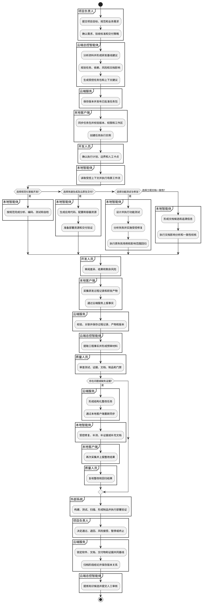
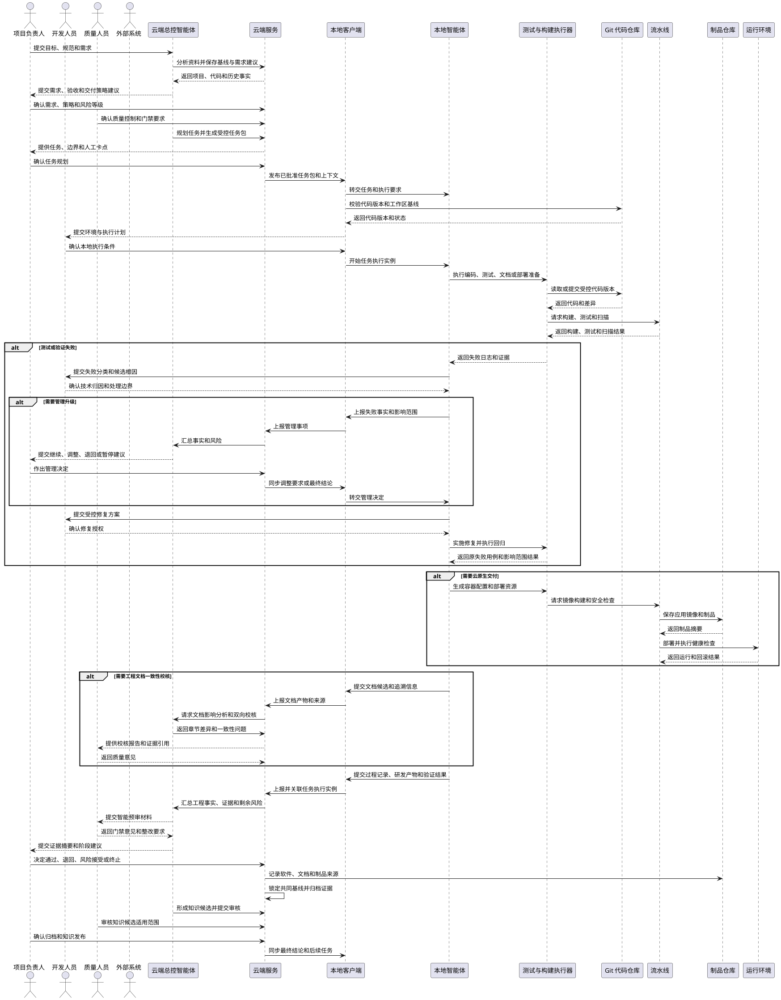
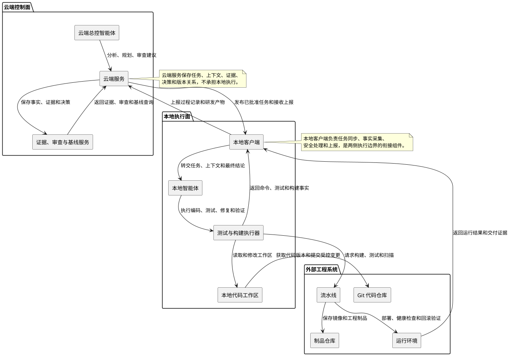

# 智能研发云边协同平台——整体用例与 UML 设计

> 文档版本：1.0
> 编制日期：2026-07-13
> 关联来源：四份场景级用例与 UML 文档
> 适用范围：智能研发云边协同平台

## 1. 场景说明与整体主线

本文在四份场景级用例文档的基础上，建立智能研发云边协同平台的整体用例视图。四类场景不是四个必须顺序完成的阶段，而是同一研发闭环中的不同业务分支和增强能力：规范化智能开发提供治理约束，快速生成及云原生交付提供应用生成和交付能力，智能化软件功能测试与修复提供验证和缺陷闭环能力，生成与智能编码一致的软件工程文档提供追溯、一致性和共同基线能力。

整体主线如下：

```text
建立项目研发基线
  → 确认需求、验收与交付策略
  → 规划任务、依赖与风险
  → 生成并同步受控任务包
  → 本地执行研发与场景工作流
  → 采集过程记录并形成工程证据
  → 智能预审与人工质量门禁
  → 整改、修复与回归验证
  → 形成软件、文档与交付基线
  → 归档证据并沉淀知识
```

同一任务可以按实际目标选择一个或多个场景分支。例如，新应用任务可以从快速生成分支进入云原生交付；存量功能任务可以直接进入规范化开发和功能测试；任何涉及代码、测试或交付物的任务都可以触发文档影响分析。场景分支的结果统一回到工程证据、质量门禁和基线归档主线。

四份场景级文档继续作为详细来源，整体文档只承担公共主线、职责边界、场景挂接和端到端关系的集成，不替代场景级细节。

## 2. 系统参与者与责任边界

本文只保留以下六类参与者。云端服务、本地客户端和各类执行器是衔接或工程组件，不单独列为参与者。

| 参与者 | 职责定位 | 主要操作 | 决策边界 |
| --- | --- | --- | --- |
| 项目负责人 | 负责项目目标、范围、验收与交付标准、风险处置和阶段结论的管理决策 | 提交或确认需求与任务，确认约束，决定风险处理、阶段推进和正式基线 | 对项目目标、范围、风险接受、阶段推进和正式基线作最终管理决策 |
| 开发人员 | 负责技术可执行性、本地环境、人工审阅、技术归因和修复实施 | 准备工作区，补充技术上下文，审阅计划与差异，处理异常并确认技术结果 | 负责本地技术确认和人工接管，不得擅自改变项目目标、验收标准或管理结论 |
| 云端总控智能体 | 面向项目负责人和质量人员提供云端分析、规划、事实汇总和决策辅助 | 形成任务与上下文建议，汇总研发事实，辅助审查，提出风险和知识建议 | 不替代人员作最终批准，不直接调用、指挥或与本地智能体交互 |
| 本地智能体 | 在本地受控环境中执行已批准的研发任务、验证和成果整理 | 读取受控上下文，执行分析、设计、编码、测试、修复、验证和成果整理 | 只能在任务范围、权限和验收约束内执行，不得自行扩大范围或修改管理要求 |
| 质量人员 | 负责独立审查过程、证据、质量风险、门禁和放行条件 | 审查测试与证据，提出整改要求，确认质量结论和剩余风险 | 独立判断质量结果；硬性门禁失败时不得放行，除非按规则完成风险处置 |
| 外部系统 | 提供代码、依赖、构建、测试、制品、运行环境和日志等工程能力 | 提供 Git 仓库、流水线、扫描、制品和环境结果 | 提供工程事实和执行能力，不承担业务或质量决策 |

### 2.1 责任边界

项目负责人决定做什么、做到什么程度、是否调整范围以及是否进入下一阶段。开发人员负责技术可执行性、本地环境确认、人工审阅和执行兜底。质量人员负责独立审查覆盖、证据、门禁和剩余质量风险。

云端总控智能体只辅助项目负责人和质量人员进行云端分析、规划、事实汇总、审查和知识提炼，不直接作最终批准。云端总控智能体与本地智能体之间不建立直接调用、指挥或连接关系。

本地智能体只在已批准的任务、权限、上下文和验收约束内执行。本地客户端负责同步已批准任务，采集研发过程记录和研发产物，经过安全处理后上报云端。云端服务负责保存和提供任务、上下文、证据、审查与决策记录，是云端和本地执行侧之间的衔接组件。

## 3. 核心用例总览

整体核心用例只保留跨场景复用的公共主线。场景特色能力在第 5 节以 `SC-xx` 编号单独描述，并通过第 10 节映射到核心用例。

| 编号 | 用例名称 | 主要参与者 | 关键成果 |
| --- | --- | --- | --- |
| UC-01 | 建立项目研发基线 | 项目负责人、云端总控智能体 | 版本化规范、工作流、门禁和基线记录 |
| UC-02 | 确认需求、验收与交付策略 | 项目负责人、云端总控智能体、质量人员 | 需求基线、验收标准、工程等级、风险等级和交付策略 |
| UC-03 | 规划任务、依赖与风险 | 项目负责人、云端总控智能体、开发人员、质量人员 | 任务图、边界、依赖、风险和人工卡点 |
| UC-04 | 生成并同步受控任务包 | 云端总控智能体、开发人员 | 任务执行包、受控上下文、权限和验证清单 |
| UC-05 | 执行本地研发与场景工作流 | 开发人员、本地智能体、外部系统 | 代码、测试、配置、文档候选、部署或修复结果 |
| UC-06 | 采集过程记录并形成工程证据 | 开发人员、本地智能体、外部系统 | 研发过程记录、研发产物、工程事实和证据索引 |
| UC-07 | 执行智能预审与人工质量门禁 | 云端总控智能体、质量人员、项目负责人 | 预审报告、质量结论、门禁结果和风险决定 |
| UC-08 | 整改、修复与回归验证 | 开发人员、本地智能体、质量人员、外部系统 | 整改任务、修复差异、回归结果和关闭证据 |
| UC-09 | 形成软件、文档与交付基线 | 项目负责人、质量人员、外部系统 | 软件版本、文档版本、制品、部署结果和共同基线 |
| UC-10 | 归档证据与沉淀知识 | 项目负责人、质量人员、云端总控智能体 | 归档证据包、阶段记录、知识候选和知识审核记录 |

## 4. 核心用例说明

## UC-01 建立项目研发基线

| 项目 | 内容 |
| --- | --- |
| 用例目标 | 将项目规范、架构边界、研发工作流、质量要求和人工卡点转化为可执行、可版本化的研发基线。 |
| 主要参与者 | 项目负责人、云端总控智能体 |
| 前置条件 | 项目已创建，项目负责人具备基线维护权限，项目资料和现有工程记录可访问。 |
| 基本流程 | 1. 项目负责人提交项目目标、架构说明、代码仓库和现有规范。<br>2. 云端总控智能体分析目录结构、历史工程记录和规则，形成基线草案。<br>3. 质量人员补充测试、扫描、门禁和证据要求。<br>4. 开发人员补充工程约束和本地执行条件。<br>5. 项目负责人确认模块边界、工作流、人工卡点和适用范围。<br>6. 云端服务发布基线版本，供后续需求和任务绑定。 |
| 异常与人工处理 | 规则来源冲突、架构边界不清或高风险约束无法确认时，必须标记冲突并提交项目负责人；基线更新不得覆盖已启动任务绑定的历史版本。 |
| 输出 | 项目研发基线、工作流、门禁规则、人工卡点、适用范围和版本记录。每次任务执行绑定唯一基线版本，历史基线可查询、可对比且不可覆盖。 |

## UC-02 确认需求、验收与交付策略

| 项目 | 内容 |
| --- | --- |
| 用例目标 | 将原始诉求转化为范围明确、可验收、可交付的需求基线，并确定工程等级、风险等级和交付策略。 |
| 主要参与者 | 项目负责人、云端总控智能体、质量人员 |
| 前置条件 | 项目研发基线已发布，项目背景、现有软件和相关资料可访问。 |
| 基本流程 | 1. 项目负责人提交业务目标、使用对象、核心流程、约束和期望交付方式。<br>2. 云端总控智能体提炼目标、范围、业务规则、非功能要求和验收标准。<br>3. 云端总控智能体识别需求缺失、冲突、高风险假设和交付影响。<br>4. 根据任务类型推荐验证原型、轻量可用或生产级工程等级。<br>5. 根据数据、权限、运行环境和交付对象推荐低、标准或高风险等级及在线、离线或云原生交付方式。<br>6. 开发人员补充技术约束，质量人员补充可验证性和质量控制要求。<br>7. 项目负责人确认需求、验收标准和交付策略。 |
| 异常与人工处理 | 关键目标、验收标准或交付边界无法确认时保持待确认状态，不得进入任务规划；涉及敏感数据、生产环境、数据库迁移、强审计或外部交付时，不得采用低风险控制。 |
| 输出 | 需求基线、验收标准、待确认项、影响范围、工程等级、风险等级、交付策略和人工确认记录。 |

## UC-03 规划任务、依赖与风险

| 项目 | 内容 |
| --- | --- |
| 用例目标 | 将已确认需求拆分为可执行、可审查、可验证的任务，并明确依赖、并行边界、文档影响和风险控制。 |
| 主要参与者 | 项目负责人、云端总控智能体、开发人员、质量人员 |
| 前置条件 | 需求、验收与交付策略已确认，项目研发基线版本有效。 |
| 基本流程 | 1. 云端总控智能体识别影响模块、公共契约、共享资产、外部依赖和交付影响。<br>2. 按契约、独立实现、共享资产、测试修复、文档和集成验证等目标拆分任务。<br>3. 为每个任务定义目标、输入、输出、允许修改范围、禁止修改范围和完成条件。<br>4. 建立需求—任务—代码—测试—文档—制品的追溯关系。<br>5. 形成依赖图、并行关系、风险等级、责任人和人工卡点。<br>6. 开发人员核对可执行性，质量人员核对验证要求。<br>7. 项目负责人确认任务规划。 |
| 异常与人工处理 | 任务粒度过大、依赖形成循环、共享资产无法互斥、公共契约或数据模型影响不明确时，不得发布任务；高风险方案必须先由项目负责人确认。 |
| 输出 | 任务清单、任务图、追溯关系、修改边界、依赖关系、风险等级、验证要求、责任分工和人工卡点。 |

## UC-04 生成并同步受控任务包

| 项目 | 内容 |
| --- | --- |
| 用例目标 | 将已确认任务转换为本地可以执行、验证和上报的受控任务单元，并建立可追溯的任务执行实例。 |
| 主要参与者 | 云端总控智能体、开发人员 |
| 前置条件 | 任务规划已确认，需求基线和项目研发基线版本有效，本地客户端具备同步条件。 |
| 基本流程 | 1. 云端总控智能体绑定需求、基线、任务和交付策略版本。<br>2. 装配相关代码、接口、文档、历史案例、测试资产和运行约束。<br>3. 注入允许修改范围、禁止修改范围、工作流、工具权限、验证命令和必须提交的研发产物。<br>4. 云端服务生成并保存受控任务包和上下文包。<br>5. 本地客户端同步已批准任务包，校验版本、完整性和有效期。<br>6. 开发人员确认任务目标、执行条件和本地工作区。<br>7. 本地客户端建立任务执行实例并将任务包转交本地智能体。 |
| 异常与人工处理 | 任务、需求、基线或交付策略发生重大变化时，原任务包失效并重新生成；引用内容冲突、过期、权限不足或代码基线不一致时不得开始执行。 |
| 输出 | 受控任务执行包、上下文版本、工作流配置、工具权限、验证清单、同步记录和任务执行实例。 |

## UC-05 执行本地研发与场景工作流

| 项目 | 内容 |
| --- | --- |
| 用例目标 | 在受控本地环境中完成规范化开发、快速生成、功能测试修复、云原生交付或工程文档等场景工作流。 |
| 主要参与者 | 开发人员、本地智能体、外部系统 |
| 前置条件 | 任务执行实例已创建，任务包、受控上下文、权限、工作区和执行计划已确认。 |
| 基本流程 | 1. 本地智能体读取任务包、项目上下文、场景要求和历史记录，形成实现或验证计划。<br>2. 开发人员确认计划、影响范围和高风险事项。<br>3. 本地智能体在允许范围内执行分析、设计、编码、配置生成、测试、修复、文档生成或部署准备。<br>4. 外部系统提供代码、依赖、构建、测试、扫描、制品和运行环境能力。<br>5. 本地智能体执行编译、测试、扫描、部署验证或一致性校核。<br>6. 对可修复问题进行受控修复并重新验证。<br>7. 开发人员审阅差异、结果、剩余风险和待提交产物。 |
| 异常与人工处理 | 触碰禁止范围、公共契约、核心权限、敏感配置或生产资源时立即暂停；自动修复超过策略限制、验证无法完成或需要改变目标和验收标准时转人工或管理升级。不得通过删除测试、降低门禁或隐藏错误获得通过。 |
| 输出 | 代码、测试、配置、文档候选、镜像或部署资源、执行结果、修复记录、验证结果、风险清单和人工确认记录。 |

## UC-06 采集过程记录并形成工程证据

| 项目 | 内容 |
| --- | --- |
| 用例目标 | 将本地研发行为、研发产物和外部系统结果组织为可审查、可校核、可追溯的工程事实与证据。 |
| 主要参与者 | 开发人员、本地智能体、外部系统 |
| 前置条件 | 任务执行实例已创建，本地客户端已启用过程采集和安全策略，研发执行产生了记录或产物。 |
| 基本流程 | 1. 本地客户端采集人机交互、上下文引用、工具调用、命令结果、文件变化和代码差异。<br>2. 采集测试、构建、扫描、部署、运行和文档校核结果。<br>3. 关联项目、需求、任务、基线、任务执行实例、版本和阶段。<br>4. 按安全策略脱敏、摘要和引用化，并在断网时写入本地可靠缓存。<br>5. 本地客户端通过云端服务持续上报研发过程记录和研发产物。<br>6. 云端服务执行幂等校验、去重和版本校验。<br>7. 云端总控智能体基于已上报事实形成证据候选，标记来源、可信度和缺失项。 |
| 异常与人工处理 | 敏感内容命中禁止规则时停止上报并告警；网络中断或云端接收失败时必须保留并重试，不能静默丢失；来源、版本或关联关系不完整时不得形成正式证据。 |
| 输出 | 研发过程记录、研发产物元数据、事件来源、上报状态、失败重试记录、工程事实、实现证据、验证证据和缺失问题清单。 |

## UC-07 执行智能预审与人工质量门禁

| 项目 | 内容 |
| --- | --- |
| 用例目标 | 在人工决策前汇总需求、任务、实际变化、证据和风险，并由质量人员和项目负责人形成正式门禁结论。 |
| 主要参与者 | 云端总控智能体、质量人员、项目负责人 |
| 前置条件 | 过程记录、研发产物、工程事实、验证结果和证据索引已由云端服务汇总。 |
| 基本流程 | 1. 云端总控智能体检查任务使用的基线、上下文、工作流、权限和人工卡点。<br>2. 对比计划范围与实际修改范围，分析需求、代码、测试、文档、制品和交付结果的一致性。<br>3. 汇总测试覆盖、失败归因、修复差异、回归结果、文档影响、部署验证和剩余风险。<br>4. 生成预审摘要、证据索引、问题清单、严重级别和待人工确认项。<br>5. 质量人员核对过程、证据、门禁和风险，必要时要求补充测试或证据。<br>6. 项目负责人结合验收和交付策略作出通过、退回、补充、风险接受、暂停或终止决定。<br>7. 云端服务记录结论和后续任务。 |
| 异常与人工处理 | 预审建议必须展示依据，规则问题和 AI 语义建议必须区分；缺失证据、范围外修改、高风险问题或硬性门禁失败时不得直接放行；云端总控智能体不得替代人工批准。 |
| 输出 | 预审报告、验收覆盖表、质量审查单、门禁结论、风险接受记录、整改任务或阶段决策。 |

## UC-08 整改、修复与回归验证

| 项目 | 内容 |
| --- | --- |
| 用例目标 | 将审查、测试、部署或一致性问题转换为受控整改任务，完成最小必要修复并通过影响范围回归验证。 |
| 主要参与者 | 开发人员、本地智能体、质量人员、外部系统 |
| 前置条件 | 已形成带有依据、影响范围、责任人和通过条件的问题或整改要求，且允许继续修复或补测。 |
| 基本流程 | 1. 云端服务保存问题与依据，云端总控智能体整理整改建议。<br>2. 开发人员确认技术归因、修复范围和是否需要管理升级。<br>3. 本地客户端同步结构化整改任务并创建新的任务执行实例。<br>4. 本地智能体在授权范围内实施代码、配置、测试、文档或部署修复。<br>5. 重跑原失败用例、原门禁和规定的影响范围回归或部署验证。<br>6. 本地客户端采集并上报整改前后差异、命令、结果和证据。<br>7. 云端总控智能体更新预审材料，质量人员复核；通过则关闭问题，否则再次退回或升级管理事项。 |
| 异常与人工处理 | 不得删除失败测试、降低断言强度、绕过权限和业务规则、改变验收标准或扩大授权范围；涉及公共接口、跨团队契约、需求变更、必测项跳过或无法控制的依赖时必须由项目负责人决策。 |
| 输出 | 结构化整改任务、修复方案、代码或配置变更、必要测试、回归结果、部署验证、整改前后证据和问题关闭或再次升级结论。 |

## UC-09 形成软件、文档与交付基线

| 项目 | 内容 |
| --- | --- |
| 用例目标 | 将通过质量门禁的软件版本、工程文档、构建制品、部署结果和追溯证据统一固化为可交付基线。 |
| 主要参与者 | 项目负责人、质量人员、外部系统 |
| 前置条件 | 必要测试、修复、文档校核、构建或部署验证已完成，高风险问题已关闭或形成有效风险接受记录。 |
| 基本流程 | 1. 外部系统锁定提交范围、软件版本、构建记录、镜像或其他制品。<br>2. 根据追溯关系锁定工程文档、文档版本、章节差异和文档来源标记。<br>3. 质量人员检查软件、文档、测试、制品、部署结果和证据索引的完整性。<br>4. 对在线交付记录目标环境、健康检查、运行证据和回滚说明；对离线交付形成完整交付包和校验信息。<br>5. 项目负责人确认交付范围、遗留风险和共同基线。<br>6. 云端服务保存软件—文档—制品—证据追溯关系并锁定基线。 |
| 异常与人工处理 | 软件、文档、制品和证据版本来源不明或不一致时不得固化；生产资源、外部交付或高风险部署未完成必要人工确认时不得交付；已归档基线不得被覆盖，只能形成新版本。 |
| 输出 | 软件版本、文档包、文档版本、构建制品、镜像摘要、部署或离线交付结果、回滚信息、追溯矩阵和共同基线。 |

## UC-10 归档证据与沉淀知识

| 项目 | 内容 |
| --- | --- |
| 用例目标 | 归档研发闭环中的事实、证据、决策和版本，并从已确认结果中形成可审核、可复用的知识候选。 |
| 主要参与者 | 项目负责人、质量人员、云端总控智能体 |
| 前置条件 | 阶段或交付结论已形成，过程记录、研发产物、审查意见、质量结论和版本信息已上报。 |
| 基本流程 | 1. 云端服务汇总需求、任务、基线、任务执行实例、过程记录、证据、测试、修复、文档、制品和交付结果。<br>2. 云端总控智能体识别重复问题、有效做法、失败模式、边界条件和可验证规则。<br>3. 标记知识候选的来源、适用范围、预期作用、潜在影响和证据。<br>4. 质量人员审查证据完整性、规则可验证性和误拦截风险。<br>5. 项目负责人确认归档结果和知识候选是否进入项目知识。<br>6. 云端服务保存阶段结论、版本关系、人工决策、知识版本和回退信息。 |
| 异常与人工处理 | 关键记录、版本信息、证据链或最终结论缺失时不得完成归档；单次个案、缺乏来源或适用边界不清的经验不得直接发布为正式知识；正式知识必须保留审核和回退能力。 |
| 输出 | 归档证据包、阶段结论、决策记录、版本关系、历史查询记录、知识候选、审核记录和知识版本。 |

## 5. 四大场景特色用例

场景特色用例不另起一条独立生命周期，而是挂接到第 4 节的核心用例。每个特色用例保留统一六字段，具体场景级细节仍以四份来源文档为准。

### 5.1 规范化智能开发

#### SC-01 配置项目规范、工作流与人工卡点

| 项目 | 内容 |
| --- | --- |
| 用例目标 | 将团队规范、编码约束、验证流程和人工决策点配置为任务可执行的治理规则。 |
| 主要参与者 | 项目负责人、云端总控智能体、质量人员 |
| 前置条件 | 项目资料、现有规范、架构边界和质量要求可访问。 |
| 基本流程 | 1. 项目负责人提交规范、工作流和适用范围。<br>2. 云端总控智能体识别规则冲突、缺失和可执行性。<br>3. 质量人员补充测试、扫描、证据和门禁要求。<br>4. 项目负责人确认人工卡点、规则优先级和生效范围。<br>5. 云端服务形成可版本化的项目研发基线。 |
| 异常与人工处理 | 规则冲突、人工卡点缺失或规则无法验证时不得发布；已绑定任务的历史版本不得被静默改变。 |
| 输出 | 规范基线、工作流、人工卡点、质量门禁、规则优先级和版本记录。 |

#### SC-02 约束任务边界、依赖与并行风险

| 项目 | 内容 |
| --- | --- |
| 用例目标 | 在任务规划阶段明确可修改范围、共享资产、依赖关系和并行执行风险。 |
| 主要参与者 | 云端总控智能体、项目负责人、开发人员、质量人员 |
| 前置条件 | 需求基线和项目研发基线已确认，影响模块和公共契约可分析。 |
| 基本流程 | 1. 云端总控智能体识别公共契约、共享资产和外部依赖。<br>2. 拆分契约任务、独立任务、共享资产任务和集成验证任务。<br>3. 形成允许修改、禁止修改、前置依赖和完成定义。<br>4. 开发人员核对技术可执行性，质量人员核对验证边界。<br>5. 项目负责人确认并行策略和高风险人工卡点。 |
| 异常与人工处理 | 依赖形成循环、共享资产无法互斥、任务越界风险不可控或触及核心契约时，必须暂停并人工确认。 |
| 输出 | 任务边界、依赖图、并行约束、风险清单、责任分工和人工确认记录。 |

#### SC-03 整改复核与知识候选演进

| 项目 | 内容 |
| --- | --- |
| 用例目标 | 将重复问题、整改经验和有效规则纳入复核闭环，形成可审核的项目知识候选。 |
| 主要参与者 | 云端总控智能体、质量人员、项目负责人、开发人员 |
| 前置条件 | 已形成整改前后差异、验证结果、质量结论或重复问题记录。 |
| 基本流程 | 1. 云端总控智能体汇总问题、修复、复核和质量结论。<br>2. 提炼适用范围、边界条件和可验证规则。<br>3. 开发人员补充工程上下文，质量人员评估可验证性和误拦截风险。<br>4. 项目负责人决定发布为规范、模板、指令、上下文资料或检查规则。<br>5. 云端服务记录版本、效果和回退关系。 |
| 异常与人工处理 | 单次个案、来源不完整或影响既有规范的候选不得直接发布；规则效果不明时先进入试用和复核。 |
| 输出 | 知识候选、来源证据、适用范围、审核记录、正式知识版本或退回意见。 |

### 5.2 快速生成及云原生交付

#### SC-04 确定工程等级、风险等级与交付策略

| 项目 | 内容 |
| --- | --- |
| 用例目标 | 根据需求成熟度、数据和运行环境确定生成深度、验证强度和在线或离线交付方式。 |
| 主要参与者 | 项目负责人、云端总控智能体、质量人员 |
| 前置条件 | 需求目标、使用对象、核心流程和期望交付方式已提交。 |
| 基本流程 | 1. 云端总控智能体识别验证原型、轻量可用或生产级工程等级。<br>2. 分析数据敏感性、权限、生产影响、审计要求和交付对象。<br>3. 推荐低、标准或高风险控制。<br>4. 推荐本地、容器、云环境或离线交付。<br>5. 质量人员确认高风险控制要求，项目负责人确认策略。 |
| 异常与人工处理 | 涉及敏感数据、生产环境、数据库迁移、外部交付、强审计或离线部署时，不得降低控制等级；等级或策略冲突时必须人工裁决。 |
| 输出 | 工程等级、风险等级、生成深度、验证要求、交付方式和人工确认点。 |

#### SC-05 生成应用代码、配置与容器资源

| 项目 | 内容 |
| --- | --- |
| 用例目标 | 按受控上下文生成或修改应用代码、配置、容器构建文件和必要测试。 |
| 主要参与者 | 开发人员、本地智能体、外部系统 |
| 前置条件 | 生成策略、任务包、本地项目上下文和工作区已准备完成。 |
| 基本流程 | 1. 本地智能体读取运行时、依赖、接口、数据模型和项目规范。<br>2. 生成或修改应用代码、配置、迁移脚本和测试。<br>3. 识别启动命令、端口、依赖和环境变量，生成容器构建资源。<br>4. 执行语法、编译和基础启动检查。<br>5. 开发人员审阅差异并确认敏感信息、范围和构建配置。 |
| 异常与人工处理 | 不得写入敏感信息、生成未声明依赖或修改无关模块；启动配置、镜像引用或高风险参数无法校验时不得进入构建和部署。 |
| 输出 | 应用代码、配置、测试、容器构建文件、环境变量模板、变更说明和基础验证结果。 |

#### SC-06 部署验证并形成在线或离线交付结果

| 项目 | 内容 |
| --- | --- |
| 用例目标 | 验证应用镜像和部署资源在目标或模拟环境中可部署、可运行、可检查并可回滚，形成交付结果。 |
| 主要参与者 | 开发人员、质量人员、外部系统 |
| 前置条件 | 应用镜像、部署资源、环境约束和回滚说明已准备，交付策略已确认。 |
| 基本流程 | 1. 外部系统构建并保存镜像和构建事实。<br>2. 校验部署资源、镜像摘要、配置、端口、资源限制和健康检查。<br>3. 在目标或模拟环境部署应用并执行启动、核心流程、健康检查和回滚验证。<br>4. 质量人员审查运行结果和风险。<br>5. 对在线交付记录环境和运行证据，对离线交付形成带校验信息的交付包。 |
| 异常与人工处理 | 构建、部署、健康检查或回滚失败时不得交付；生产环境、高风险参数或外部交付必须完成开发人员、质量人员和项目负责人规定的人工确认。 |
| 输出 | 镜像摘要、部署结果、运行日志、健康检查、回滚结果、在线交付记录或离线交付包。 |

### 5.3 智能化软件功能测试与修复

#### SC-07 设计并执行功能测试

| 项目 | 内容 |
| --- | --- |
| 用例目标 | 根据需求、验收标准和影响范围设计并执行覆盖正常、异常、权限、状态和边界的功能测试。 |
| 主要参与者 | 本地智能体、开发人员、质量人员、外部系统 |
| 前置条件 | 测试任务包、项目上下文、测试环境和验收标准已确认。 |
| 基本流程 | 1. 本地智能体分析需求、接口、页面、数据、权限和历史缺陷。<br>2. 生成测试场景、测试数据、断言和执行计划。<br>3. 开发人员审查技术可执行性，质量人员审查覆盖和断言。<br>4. 本地智能体调用外部系统执行测试并采集日志、结果和必要证据。<br>5. 本地客户端关联任务执行实例并上报测试过程记录和研发产物。 |
| 异常与人工处理 | 环境、依赖或数据问题导致测试无法完成，或必须跳过必测项、扩大范围时必须停止并上报，不得以缺少结果替代通过。 |
| 输出 | 测试场景、测试用例、测试数据、断言、执行结果、日志、失败清单和测试证据。 |

#### SC-08 分析测试失败并升级管理事项

| 项目 | 内容 |
| --- | --- |
| 用例目标 | 基于断言、日志、环境、数据、依赖和代码变化形成失败分类、候选根因和后续处理建议。 |
| 主要参与者 | 开发人员、本地智能体、项目负责人、云端总控智能体 |
| 前置条件 | 测试产生失败结果，且失败证据和相关版本可访问。 |
| 基本流程 | 1. 本地智能体将失败归类为需求、测试、数据、环境、依赖、接口、页面、业务逻辑、回归或非确定性问题。<br>2. 形成候选根因、影响范围和证据链。<br>3. 开发人员确认技术归因和是否属于本地授权范围。<br>4. 本地可处理事项进入受控修复；涉及需求、范围、公共契约、必测项或风险接受的事项经本地客户端上报。<br>5. 云端总控智能体汇总事实和方案，项目负责人决定继续、调整、退回、暂停、豁免或终止。 |
| 异常与人工处理 | 证据链不可信、根因存在重大分歧、需要改变验收标准或无法控制的依赖时不得由本地执行侧自行决定；豁免、跳过必测项和范围扩大必须形成明确管理记录。 |
| 输出 | 失败分类、候选根因、证据链、影响范围、管理事项、风险接受或调整决定。 |

#### SC-09 受控修复与影响范围回归

| 项目 | 内容 |
| --- | --- |
| 用例目标 | 以最小必要修改解决已确认问题，并通过原失败用例和影响范围回归验证修复有效性。 |
| 主要参与者 | 开发人员、本地智能体、质量人员、外部系统 |
| 前置条件 | 技术归因和修复授权已确认，原失败用例、影响范围和回归条件已明确。 |
| 基本流程 | 1. 本地智能体根据根因和证据链形成修复方案。<br>2. 开发人员审阅方案和代码差异并确认修复授权。<br>3. 本地智能体修改代码、配置或必要测试并执行基础检查。<br>4. 重跑原失败用例，并根据影响范围执行相关功能、权限、状态流转和历史缺陷回归。<br>5. 本地客户端采集修复前后差异和回归结果并上报。<br>6. 质量人员审查回归范围、断言和结果可信度。 |
| 异常与人工处理 | 不得删除失败测试、降低断言强度、绕过权限或擅自扩大修复范围；回归无法完成、关键证据缺失或出现新失败时不得放行，必须补测、退回或升级。 |
| 输出 | 修复方案、代码或配置变更、必要测试、原失败用例结果、影响范围回归结果、日志、回归证据和质量意见。 |

### 5.4 生成与智能编码一致的软件工程文档

#### SC-10 建立需求—代码—测试—文档追溯

| 项目 | 内容 |
| --- | --- |
| 用例目标 | 建立从需求、任务、代码、测试到工程文档和版本的双向追溯关系，为生成和审查提供来源。 |
| 主要参与者 | 项目负责人、云端总控智能体、质量人员、开发人员 |
| 前置条件 | 需求、任务、代码、测试、文档基线和版本信息可访问。 |
| 基本流程 | 1. 云端总控智能体分析需求、任务、代码模块、接口、数据、测试和文档章节。<br>2. 建立需求—任务—代码—测试—文档—制品关系。<br>3. 标记来源、版本、责任人和证据。<br>4. 开发人员补充技术关联，质量人员检查可验证性。<br>5. 项目负责人确认关键追溯关系并绑定任务执行实例。 |
| 异常与人工处理 | 任务缺少边界、验收条件或文档影响时不得发布；关系来源不明、版本失效或关键验收项无法追溯时必须补充或人工裁决。 |
| 输出 | 追溯矩阵、章节影响范围、来源标记、版本关系、证据引用和确认记录。 |

#### SC-11 文档影响分析与增量生成

| 项目 | 内容 |
| --- | --- |
| 用例目标 | 根据已确认工程事实识别受影响文档和章节，生成可审查、可回退的增量文档修改建议。 |
| 主要参与者 | 云端总控智能体、项目负责人、开发人员 |
| 前置条件 | 工程事实、证据、追溯关系和当前文档基线可访问。 |
| 基本流程 | 1. 识别需求、设计、接口、数据、测试、代码和版本变化。<br>2. 定位必须更新、建议更新、待确认和可能失效的章节。<br>3. 云端总控智能体基于模板、工程事实和证据生成增量内容。<br>4. 标记工程事实、规则生成、AI 归纳、AI 推断和人工编写等来源。<br>5. 展示前后差异并检查人工锁定内容冲突。<br>6. 项目负责人确认、编辑或驳回，形成文档草案新版本。 |
| 异常与人工处理 | 未受影响章节不得无故重新生成；人工内容不得被静默覆盖；AI 推断必须显式标记；缺少有效证据的关键结论不得进入正式文档。 |
| 输出 | 文档影响范围、章节级差异、内容来源标记、文档草案、待确认问题和人工确认记录。 |

#### SC-12 双向一致性校核与软件—文档共同基线

| 项目 | 内容 |
| --- | --- |
| 用例目标 | 校核代码是否符合已确认文档、文档是否真实反映当前软件，并共同固化软件和文档基线。 |
| 主要参与者 | 云端总控智能体、质量人员、项目负责人、外部系统 |
| 前置条件 | 当前软件、测试、文档、追溯关系、构建制品和证据已准备完成。 |
| 基本流程 | 1. 执行需求、设计、接口、数据、测试、版本和文档一致性规则校核。<br>2. 云端总控智能体执行语义辅助校核并引用证据。<br>3. 质量人员区分规则问题和 AI 建议，确认影响范围和处理状态。<br>4. 代码、文档、证据或需求责任不清时提交项目负责人裁决。<br>5. 通过后锁定软件版本、文档版本、制品摘要、追溯矩阵和人工批准记录。 |
| 异常与人工处理 | 未处理高风险问题、证据链不完整、软件与文档版本不匹配或无法确定责任边界时不得批准共同基线；归档后只能形成新版本，不能覆盖原基线。 |
| 输出 | 双向一致性报告、问题清单、证据引用、软件—文档共同基线、人工批准记录和版本关系。 |

## 6. 关键业务规则

1. 所有研发执行必须绑定有效的需求基线、项目研发基线、受控任务包、工作流版本和任务执行实例。
2. 四大场景是同一研发闭环的可组合分支，不要求按固定顺序全部执行；场景分支的结果必须回到统一证据、质量门禁和基线主线。
3. 云端总控智能体只辅助项目负责人和质量人员进行云端分析、规划、审查和知识提炼，不替代人员作最终管理决策。
4. 本地智能体只能在任务包规定的上下文、权限、工具和修改范围内执行；不得自行改变目标、验收标准或管理要求。
5. 本地客户端负责同步已批准任务，采集研发过程记录和研发产物，并通过云端服务上报；网络异常时必须缓存、重试和保留失败原因。
6. 云端总控智能体与本地智能体之间不建立直接调用、指挥或连接关系，所有任务发布、事实采集和结果回传都经过云端服务和本地客户端。
7. 研发过程记录是事实来源，不自动等同于正式证据；正式证据必须绑定结论、版本、来源和关联关系。
8. 任务范围外修改、公共契约、数据模型、核心权限、敏感配置、生产资源和高风险交付必须进入人工确认或管理升级。
9. 测试失败必须区分需求、测试、数据、环境、依赖、接口、业务逻辑、回归缺陷和非确定性失败，并保留失败证据和技术归因。
10. 修复必须优先采用最小必要修改，必须重跑原失败用例和规定的影响范围回归，不得通过删除测试、降低断言强度、绕过权限或隐藏错误获得通过。
11. 规则校核和 AI 语义建议必须区分；缺少依据的建议只能作为待确认项，不得直接形成通过或正式文档结论。
12. 软件、测试、文档、制品、部署结果和证据必须保持版本可追溯；正式软件—文档共同基线一经归档不得覆盖。
13. 硬性门禁失败、关键证据缺失、质量意见未闭环或高风险问题未处置时不得放行；风险接受必须记录影响、责任人、期限和批准人。
14. 知识候选必须有来源、适用范围、证据和审核记录；正式知识必须可版本化、可停用和可回退。

## 7. UML 端到端活动图



## 8. UML 核心时序图



## 9. UML 组件图



## 10. 用例与场景功能映射

| 场景来源 | 场景特色用例 | 挂接的核心用例 | 集成说明 |
| --- | --- | --- | --- |
| 规范化智能开发 | SC-01、SC-02、SC-03 | UC-01、UC-03、UC-08、UC-10 | 规范、边界、并行风险和知识演进作为公共治理约束，不另建一条执行主线。 |
| 快速生成及云原生交付 | SC-04、SC-05、SC-06 | UC-02、UC-05、UC-07、UC-09 | 工程等级和风险等级在需求策略阶段确定，生成、镜像、部署和交付结果回到质量与基线闭环。 |
| 智能化软件功能测试与修复 | SC-07、SC-08、SC-09 | UC-05、UC-06、UC-07、UC-08、UC-10 | 测试、失败归因、管理升级、修复和回归是本地执行与整改闭环的专项分支。 |
| 生成与智能编码一致的软件工程文档 | SC-10、SC-11、SC-12 | UC-03、UC-06、UC-07、UC-09、UC-10 | 追溯、文档增量生成和双向一致性校核贯穿证据审查，并与软件共同固化。 |

核心用例与场景特色用例的关系不是一对一替换关系：一个场景特色用例可以跨越多个公共用例，一个公共用例也可以承载多个场景分支。所有场景最终都必须遵守统一的任务边界、证据、人工门禁和版本规则。

## 11. 第一阶段建议实现范围

第一阶段以一个桌面端本地执行环境和一条可追溯任务主线为范围，优先打通：

```text
UC-01 建立项目研发基线
  → UC-02 确认需求、验收与交付策略
  → UC-03 规划任务、依赖与风险
  → UC-04 生成并同步受控任务包
  → UC-05 执行本地研发与场景工作流
  → UC-06 采集过程记录并形成工程证据
  → UC-07 执行智能预审与人工质量门禁
  → UC-08 整改、修复与回归验证
  → UC-09 形成软件、文档与交付基线
  → UC-10 归档证据与沉淀知识
```

第一阶段建议至少覆盖以下场景能力：

- 规范化智能开发：项目规范、任务边界、人工卡点、过程采集和门禁复核。
- 快速生成及云原生交付：一个受控技术栈的应用代码、容器配置、镜像构建和部署验证。
- 智能化软件功能测试与修复：核心功能测试、失败归因、受控修复、原失败用例重跑和影响范围回归。
- 工程文档一致性：需求—代码—测试—文档追溯、受影响章节识别、增量文档生成和双向一致性问题记录。

第一阶段暂不扩大到复杂多智能体编排、组织级知识市场、全面技术栈适配和自动替代人员审批。高风险任务、生产交付、外部交付和门禁例外仍保留人工确认。

## 12. 第一阶段验收主线

验收应证明以下闭环可以在桌面端研发环境中完成：

```text
项目负责人建立研发基线并确认需求、验收和交付策略
  → 云端总控智能体形成任务规划、边界、风险和受控任务包
  → 本地客户端同步任务包并创建任务执行实例
  → 开发人员确认计划，本地智能体执行规范化开发、生成、测试修复或文档分支
  → 本地客户端采集研发过程记录和研发产物并上报云端
  → 云端服务形成工程事实，云端总控智能体完成智能预审
  → 质量人员完成审查和门禁，项目负责人作出阶段决定
  → 必要时通过结构化整改任务完成修复、补测、回归和复核
  → 软件、文档、制品、部署结果和证据形成共同基线
  → 云端服务归档证据，云端总控智能体形成知识候选并提交审核
```

验收重点如下：

1. 每次任务执行都关联已确认需求、研发基线、受控任务包、工作流版本和任务执行实例。
2. 云端总控智能体只提供分析、规划、预审和知识建议，不替代项目负责人或质量人员作最终决定。
3. 本地客户端负责任务同步、研发过程记录和研发产物采集及上报；云端服务和本地客户端承担两侧衔接。
4. 本地智能体的代码修改、命令执行、测试结果、文档差异、部署结果和人工确认均可查看、可追踪。
5. 四类场景可以按任务需要选择或组合，且每个场景结果都能回到统一证据、门禁和基线主线。
6. 测试失败具有分类、候选根因、证据链、人工接管和管理升级路径；修复完成原失败用例和影响范围回归。
7. 需求、代码、测试、文档、制品、部署和证据之间具备双向或可查询追溯关系。
8. 证据不足、硬性门禁失败、质量意见未闭环或高风险问题未处置时，不形成通过或正式交付结论。
9. 归档基线、阶段结论、人工决策和知识候选具备版本、来源、适用范围和回退信息。
