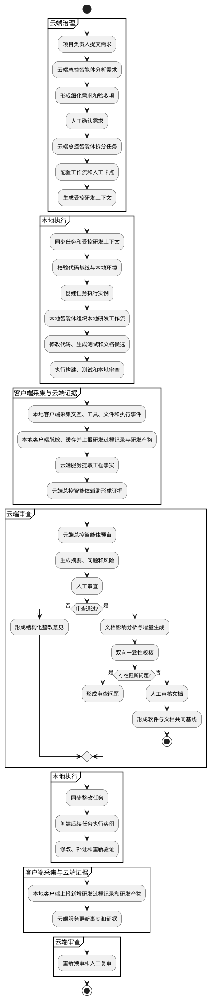
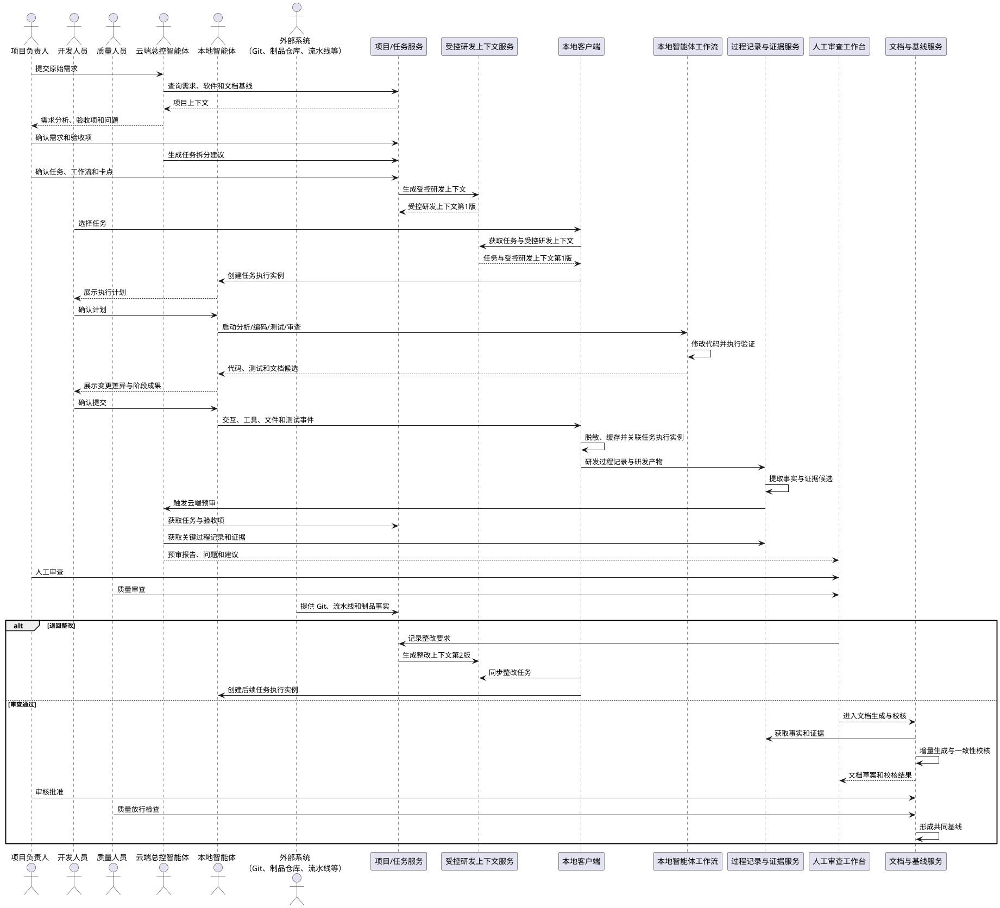
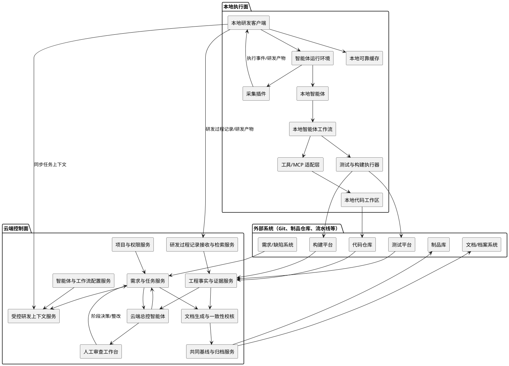

# 云端治理与本地智能研发协同平台 用例与 UML

**版本：** 1.0
**适用场景：** 生成与智能编码一致的软件工程文档
**说明：** 本文中的“用例”按软件工程通用定义使用。

---

## 1. 场景说明

本场景聚焦“生成与智能编码一致的软件工程文档”：云端总控智能体负责辅助项目负责人和质量人员进行云端决策；本地智能体负责在真实代码环境中执行智能编码；本地客户端负责采集并上报研发事实。

- 云端总控智能体辅助项目负责人和质量人员完成需求分析、任务划分、阶段预审、文档校核和整改决策。
- 开发人员基于云端下发的项目上下文，通过本地智能体工作流在真实代码与工具环境中完成研发。
- 本地客户端采集开发人员、本地智能体、工具和外部系统产生的交互、文件变化、测试、构建及产物信息，形成研发过程记录并回传云端。
- 云端服务从研发过程记录和研发产物中提取工程事实；云端总控智能体基于这些事实辅助项目负责人和质量人员形成判断。
- 项目负责人通过人工卡点完成需求确认、任务确认、阶段审查、风险接受和基线批准；质量人员负责质量结论和放行检查。
- 软件工程文档根据已确认的需求、实现、测试和审查事实增量生成，并与软件版本共同形成正式基线。
- 项目知识仅作为可选上下文输入，不作为本文主流程。

一句话概括：

> 云端负责规划、审查和文档生成，本地负责基于受控上下文执行研发；全过程研发事实回流云端，最终形成与软件版本一致的工程文档。

---

## 2. 系统参与者

| 参与者 | 主要职责 |
|---|---|
| 项目负责人 | 维护项目目标和约束，确认需求、任务、阶段结论、风险及软件与文档基线 |
| 开发人员 | 在本地工作区启动、监督和确认智能体执行，处理技术异常并审阅变更 |
| 云端总控智能体 | 在云端分析需求、拆分任务、生成受控上下文、汇总事实并辅助项目负责人和质量人员决策 |
| 本地智能体 | 读取受控研发上下文，组织本地研发工作流，执行分析、设计、编码、测试、审查和文档候选生成 |
| 质量人员 | 审查测试覆盖、证据、质量问题、一致性结果和放行条件 |
| 外部系统（如 Git、制品仓库、流水线等） | 提供代码、需求/缺陷、测试、构建、制品和档案等研发事实 |

---

## 3. 用例总览

本文只保留直接支撑“需求—代码—事实—文档”闭环的用例。项目初始化、组织级知识管理、复杂多智能体调度和自动审批属于平台支撑或后续扩展，不作为本场景主线展开。

| 编号 | 用例 | 主要参与者 | 关键输出 |
|---|---|---|---|
| UC-02 | 需求与验收项确认 | 项目负责人、云端总控智能体 | 需求版本、验收项、确认记录 |
| UC-03 | 编码任务与文档影响规划 | 项目负责人、云端总控智能体 | 任务、追溯关系、文档影响范围 |
| UC-04 | 生成受控研发上下文 | 云端总控智能体、项目负责人 | 受控研发上下文版本 |
| UC-05 | 同步任务与本地环境校验 | 开发人员、本地智能体、外部系统 | 任务执行实例、执行计划 |
| UC-06 | 执行智能编码工作流 | 开发人员、本地智能体、外部系统 | 代码、测试、文档候选 |
| UC-07 | 客户端采集研发过程记录与研发产物 | 开发人员、外部系统 | 研发过程记录、研发产物元数据 |
| UC-08 | 提取工程事实与证据 | 云端总控智能体、外部系统 | 工程事实、证据 |
| UC-09 | 云端总控智能体预审 | 云端总控智能体、质量人员 | 预审报告、问题和风险 |
| UC-10 | 人工审查与阶段决策 | 项目负责人、质量人员 | 审查结论、整改决定 |
| UC-11 | 整改反馈与重新执行 | 云端总控智能体、开发人员、本地智能体 | 整改任务、新任务执行实例 |
| UC-12 | 文档影响分析与增量生成 | 云端总控智能体、项目负责人 | 文档草案、章节差异、来源标记 |
| UC-13 | 双向一致性校核 | 云端总控智能体、质量人员、外部系统 | 一致性报告、审查问题 |
| UC-14 | 形成软件与文档共同基线 | 项目负责人、质量人员、外部系统 | 软件版本、文档版本、证据索引 |

---

## UC-02 需求与验收项确认

| 项目 | 内容 |
| --- | --- |
| 用例目标 | 将原始业务需求转化为可开发、可验证、可追溯的正式需求和验收项。 |
| 主要参与者 | 项目负责人、云端总控智能体 |
| 前置条件 | 项目已初始化；项目背景、现有软件和文档基线可访问。 |
| 基本流程 | 1. 项目负责人输入原始需求。<br>2. 云端总控智能体读取项目背景、现有软件和文档基线。<br>3. 深化业务场景、目标用户、核心流程和边界。<br>4. 生成细化需求、验收项和影响范围建议。<br>5. 识别冲突、风险和待澄清问题。<br>6. 项目负责人修正并确认需求和验收项。<br>7. 系统固化需求版本和人工确认记录。 |
| 强制升级 | 核心目标无法确定时保持“待澄清”；验收项不可验证时不得进入任务规划；与已批准需求冲突时必须提交人工裁决；正式需求至少包含一个可验证验收项。 |
| 输出 | 需求、验收项、需求版本、影响范围、人工确认记录。 |

## UC-03 编码任务与文档影响规划

| 项目 | 内容 |
| --- | --- |
| 用例目标 | 将已确认需求拆分为可执行任务，并确定代码、测试和工程文档的影响范围。 |
| 主要参与者 | 项目负责人、云端总控智能体 |
| 前置条件 | 需求及验收项已确认；项目智能体工作流可用。 |
| 基本流程 | 1. 云端总控智能体分析需求、代码现状、架构和文档结构。<br>2. 生成任务拆分建议。<br>3. 定义任务目标、输入、输出、边界和验收条件。<br>4. 识别依赖和并行关系。<br>5. 建立需求—任务—代码模块—测试—文档章节的追溯关系。<br>6. 标记需要新增、修改或复核的文档章节。<br>7. 配置工作流、强制验证项和必须提交的研发产物。<br>8. 项目负责人确认任务规划和关键人工卡点。 |
| 强制升级 | 任务粒度过大时退回拆分；依赖形成循环时禁止发布；缺少可用工作流时不得下发；每个任务必须具备边界、验收条件和预期文档影响。 |
| 输出 | 任务、依赖关系、需求—代码—测试—文档追溯关系、文档影响范围、验证要求、人工卡点。 |

## UC-04 生成受控研发上下文

| 项目 | 内容 |
| --- | --- |
| 用例目标 | 将本地智能编码所需的权威信息裁剪为受控、版本化研发上下文。 |
| 主要参与者 | 云端总控智能体、项目负责人 |
| 前置条件 | 任务、需求、设计、规则和当前软件/文档基线可访问。 |
| 基本流程 | 1. 读取任务、需求、设计、规则和当前基线。<br>2. 云端总控智能体识别任务实际需要的上下文。<br>3. 加入工作流、工具权限、验证要求和必须提交的研发产物。<br>4. 检查引用内容是否有效、冲突或过期。<br>5. 高风险约束由项目负责人确认。<br>6. 生成受控研发上下文新版本并进入“可下发”状态。 |
| 强制升级 | 引用内容无效、冲突或过期时不得下发；高风险约束未经项目负责人确认不得执行；受控研发上下文变化必须形成新版本；已批准约束不得被本地智能体静默修改。 |
| 输出 | 受控研发上下文版本、任务范围、验证命令、工具权限、研发产物提交要求。 |

## UC-05 同步任务与本地环境校验

| 项目 | 内容 |
| --- | --- |
| 用例目标 | 将云端任务和受控研发上下文安全同步至本地，并建立一次可追溯任务执行实例。 |
| 主要参与者 | 开发人员、本地智能体、外部系统 |
| 前置条件 | 任务和受控研发上下文已发布；本地客户端可访问代码仓库和必要研发工具。 |
| 基本流程 | 1. 开发人员选择待执行任务。<br>2. 客户端获取任务和受控研发上下文。<br>3. 校验上下文版本、完整性和有效性。<br>4. 校验本地仓库、分支、提交基线和工作区状态。<br>5. 开发人员确认本地执行环境。<br>6. 系统创建任务执行实例。<br>7. 本地智能体读取上下文并形成执行计划。<br>8. 开发人员确认计划后开始执行。 |
| 强制升级 | 受控研发上下文过期、代码基线不一致、环境缺失或存在高风险未提交修改时，必须重新同步、建立隔离工作区或暂停执行。 |
| 输出 | 任务执行实例、本地上下文缓存、环境校验记录、执行计划。 |

## UC-06 执行智能编码工作流

| 项目 | 内容 |
| --- | --- |
| 用例目标 | 在真实代码和工具环境中完成分析、设计、编码、测试、审查和文档候选生成。 |
| 主要参与者 | 开发人员、本地智能体、外部系统 |
| 前置条件 | 任务执行实例已创建；本地智能体已读取任务、验收项和执行计划。 |
| 基本流程 | 1. 本地智能体完成影响分析和设计。<br>2. 修改代码并生成或补充测试。<br>3. 执行构建、测试和验证命令。<br>4. 检查代码变更并生成文档候选。<br>5. 汇总代码、测试、文档和风险。<br>6. 开发人员审阅变更差异和阶段成果。<br>7. 开发人员确认提交，任务执行实例进入“待云端预审”状态。 |
| 强制升级 | 高风险工具调用必须人工确认；任务范围外修改必须标记并确认；智能体重试超过策略限制时转人工接管；测试和构建结果必须绑定当前代码版本。 |
| 输出 | 代码变更、测试结果、构建结果、文档候选、风险清单、任务执行实例更新记录。 |

## UC-07 客户端采集研发过程记录与研发产物

| 项目 | 内容 |
| --- | --- |
| 用例目标 | 由本地客户端可靠记录智能编码过程及其产物，为事实提取和文档生成提供来源。 |
| 主要参与者 | 开发人员、外部系统 |
| 前置条件 | 本地客户端已连接任务执行实例，并已启用项目研发过程记录和数据安全策略。 |
| 基本流程 | 1. 本地客户端监听本地智能体、工具和外部系统产生的执行事件。<br>2. 关联项目、任务、任务执行实例、智能体和受控研发上下文版本。<br>3. 按安全策略脱敏、摘要和引用化。<br>4. 将研发过程记录和研发产物写入本地可靠缓存。<br>5. 本地客户端批量上报云端。<br>6. 云端执行幂等校验和重复事件去重。<br>7. 接收成功后清理已确认缓存。 |
| 强制升级 | 网络中断时必须缓存并补传；敏感内容命中禁止规则时停止上报并告警；云端接收失败时必须重试并保留失败原因；上报失败不得静默丢失。 |
| 输出 | 研发过程记录、研发产物元数据、事件来源、上报状态、失败重试记录。 |

## UC-08 提取工程事实与证据

| 项目 | 内容 |
| --- | --- |
| 用例目标 | 将研发过程记录和研发产物转化为可审查、可校核和可证明结论的工程事实与证据。 |
| 主要参与者 | 云端总控智能体、外部系统 |
| 前置条件 | 研发过程记录和研发产物已由本地客户端上报并可被云端服务检索。 |
| 基本流程 | 1. 云端服务解析研发过程记录、研发产物及外部系统结果。<br>2. 识别代码、接口、数据、配置、文档、测试、构建和人工确认事实。<br>3. 将事实关联需求、任务、任务执行实例和软件版本。<br>4. 对比计划范围和实际修改范围。<br>5. 生成实现证据和验证证据候选。<br>6. 确认来源和版本有效性，将有效候选转为正式证据。<br>7. 将缺失、冲突和低可信内容进入问题清单。 |
| 强制升级 | 研发过程记录不得直接等同于正式证据；证据必须支撑具体结论并绑定软件版本；来源、版本或关联关系不完整时不得形成正式证据；关键验收项缺少实现或验证证据时不得判定完成。 |
| 输出 | 工程事实、实现证据、验证证据、证据索引、缺失/冲突/低可信问题清单。 |

## UC-09 云端总控智能体预审

| 项目 | 内容 |
| --- | --- |
| 用例目标 | 在人工审查前汇总任务完成情况、关键研发过程记录、证据、问题和风险。 |
| 主要参与者 | 云端总控智能体、质量人员 |
| 前置条件 | 任务、验收项、任务执行实例、研发过程记录、研发产物和证据可访问。 |
| 基本流程 | 1. 云端总控智能体读取任务、验收项和人工卡点要求。<br>2. 汇总任务执行实例关键路径和主要研发产物。<br>3. 对比计划范围与实际变化。<br>4. 分析验收项实现和验证覆盖。<br>5. 检查工作流完整性、异常重试、范围外修改和缺失证据。<br>6. 初步检查代码、测试和文档一致性。<br>7. 生成问题清单、严重级别和建议通过/退回/补充的预审意见。 |
| 强制升级 | 预审建议必须展示依据；规则问题与 AI 语义建议必须区分；存在缺失证据、范围外修改或高风险问题时必须进入人工审查；云端总控智能体不得直接批准。 |
| 输出 | 任务执行摘要、验收覆盖表、关键研发过程记录、证据索引、问题与风险清单、预审建议。 |

## UC-10 人工审查与阶段决策

| 项目 | 内容 |
| --- | --- |
| 用例目标 | 由项目负责人和质量人员基于预审、代码/文档差异和证据作出正式阶段决策。 |
| 主要参与者 | 项目负责人、质量人员 |
| 前置条件 | 云端预审已完成；代码、测试、文档差异和证据可审查。 |
| 基本流程 | 1. 项目负责人或质量人员打开审查任务。<br>2. 查看任务要求、实际变化、预审摘要、代码变更差异、测试结果、文档差异和证据。<br>3. 判断问题和风险。<br>4. 选择通过、退回修改、补充测试/证据、调整需求/设计、接受风险、暂停或终止。<br>5. 填写审查意见、责任人和期限。<br>6. 系统记录人工决策并推进阶段或创建整改任务。 |
| 强制升级 | 正式通过必须有人工决策记录；风险接受必须记录影响、责任人和有效期限；未关闭高风险问题不得直接通过；云端总控智能体的建议不能替代人工批准。 |
| 输出 | 审查结论、审查意见、风险接受记录、责任人和期限、整改任务或阶段通过状态。 |

## UC-11 整改反馈与重新执行

| 项目 | 内容 |
| --- | --- |
| 用例目标 | 将云端审查问题转换为可由开发人员通过本地客户端执行的结构化整改任务。 |
| 主要参与者 | 云端总控智能体、开发人员、本地智能体 |
| 前置条件 | 审查问题已创建并包含问题依据、影响范围和通过条件。 |
| 基本流程 | 1. 云端总控智能体整理审查问题。<br>2. 关联问题描述、证据位置、影响范围和通过条件。<br>3. 更新原任务或生成整改子任务。<br>4. 必要时生成受控研发上下文新版本。<br>5. 开发人员通过本地客户端同步整改任务。<br>6. 本地客户端创建新的任务执行实例并关联原执行实例和审查任务。<br>7. 本地智能体修改代码、测试、文档或补充证据。<br>8. 重新验证、采集并上报研发过程记录和研发产物，云端重新提取证据并复审。 |
| 强制升级 | 整改意见不得只有自然语言；新任务执行实例必须关联原问题和原执行实例；云端总控智能体不直接调用本地智能体；问题关闭必须具有规则或人工复核结论。 |
| 输出 | 结构化审查问题、整改任务、受控研发上下文新版本、新任务执行实例、复审结论。 |

## UC-12 文档影响分析与增量生成

| 项目 | 内容 |
| --- | --- |
| 用例目标 | 根据已确认工程事实识别受影响文档和章节，并生成可审查的增量修改建议。 |
| 主要参与者 | 云端总控智能体、项目负责人 |
| 前置条件 | 工程事实、证据、需求/设计追溯关系和文档基线可访问。 |
| 基本流程 | 1. 识别需求、设计、代码、接口、数据、测试和版本变化。<br>2. 根据追溯关系定位受影响文档、章节和内容单元。<br>3. 标记必须更新、建议更新、待确认和可能失效内容。<br>4. 云端总控智能体基于模板、工程事实和证据生成修改建议。<br>5. 标记工程事实、规则生成、AI 归纳、AI 推断和人工编写等内容来源。<br>6. 展示生成前后差异并检测人工锁定内容冲突。<br>7. 项目负责人确认、编辑或驳回，形成文档草案新版本。 |
| 强制升级 | 未受影响章节不得无故重新生成；人工内容不得被静默覆盖；AI 推断必须显式标记；关键结论没有有效证据时不得作为正式文档结论。 |
| 输出 | 文档影响范围、章节级差异、内容来源标记、文档草案新版本、待确认问题。 |

## UC-13 双向一致性校核

| 项目 | 内容 |
| --- | --- |
| 用例目标 | 同时验证代码是否符合已确认文档，以及文档是否真实反映当前软件。 |
| 主要参与者 | 云端总控智能体、质量人员、外部系统 |
| 前置条件 | 当前软件、测试、文档、追溯关系和证据已准备完成。 |
| 基本流程 | 1. 执行需求、设计、接口、数据、测试、状态、过程和版本一致性规则校核。<br>2. 云端总控智能体执行语义辅助校核。<br>3. 生成问题、严重级别、影响范围、处理建议和证据。<br>4. 将问题归类为修改代码、修改文档、发起变更、补充证据、接受风险或驳回 AI 建议。<br>5. 阻断问题进入审查问题整改闭环。 |
| 强制升级 | 规则问题和 AI 建议必须区分；每个问题必须有来源、影响范围和处理状态；未处理高风险问题不得进入基线批准；无法确定代码与文档责任边界时必须升级人工裁决。 |
| 输出 | 双向一致性报告、问题清单、严重级别、影响范围、证据引用、审查问题。 |

## UC-14 形成软件与文档共同基线

| 项目 | 内容 |
| --- | --- |
| 用例目标 | 将已通过审查的软件版本、构建产物、工程文档和证据统一固化。 |
| 主要参与者 | 项目负责人、质量人员、外部系统 |
| 前置条件 | 一致性校核完成；高风险问题已关闭或形成有效风险接受记录。 |
| 基本流程 | 1. 锁定提交范围、软件版本和构建制品。<br>2. 锁定文档包、文档版本和章节差异。<br>3. 关联追溯矩阵、证据索引、校核报告和人工决策。<br>4. 质量人员执行最终完整性检查。<br>5. 项目负责人确认共同基线。<br>6. 系统锁定并归档基线，更新当前有效的软件—文档共同基线。 |
| 强制升级 | 正式文档必须绑定唯一软件版本和构建制品；高风险问题未处理或证据链不完整时不得批准；已归档基线不得被重新生成覆盖，只能形成新版本。 |
| 输出 | 软件基线、文档包、文档版本、构建制品摘要、证据索引、校核报告、人工批准记录。 |

---

## 4. 关键业务规则

1. 云端总控智能体只在云端辅助项目负责人和质量人员决策，不直接调用或指挥本地智能体。
2. 每个任务执行实例必须关联唯一任务和受控研发上下文版本。
3. 智能体的自然语言“已完成”声明不能直接成为正式完成事实。
4. 研发过程记录只有经过事实提取、任务关联和有效性确认后，才能成为证据。
5. 必要验收项必须具有实现证据和验证证据。
6. 超出任务边界的修改必须经过人工确认。
7. 退回整改必须形成结构化审查问题。
8. 整改必须创建新任务执行实例或明确续接关系。
9. 文档关键结论必须关联有效证据。
10. AI 推断内容必须显式标记。
11. 人工、已审核和已归档内容不得被静默覆盖。
12. 正式文档必须绑定软件版本和构建产物。
13. 研发过程记录和源码上报必须由本地客户端遵循项目安全策略执行。
14. 已归档共同基线只能形成新版本，不能直接修改。


## 5. UML 端到端活动图



---

## 6. UML 核心时序图



---

## 7. UML 组件图



---

## 8. 第一阶段建议实现范围

第一阶段优先实现以下用例：

1. UC-02 需求与验收项确认。
2. UC-03 编码任务与文档影响规划。
3. UC-04 生成受控研发上下文。
4. UC-05 同步任务与本地环境校验。
5. UC-06 执行智能编码工作流。
6. UC-07 客户端采集研发过程记录与研发产物。
7. UC-08 提取工程事实与证据。
8. UC-09 云端总控智能体预审。
9. UC-10 人工审查与阶段决策。
10. UC-11 整改反馈与重新执行。
11. UC-12 文档影响分析与增量生成。
12. UC-13 双向一致性校核。
13. UC-14 形成软件与文档共同基线。

第一阶段暂不优先：

- 复杂跨项目多智能体调度。
- 完整组织级知识图谱。
- 全部 GJB 文档自动生成。
- 自动审批和自动风险接受。
- 全量源码和全量交互永久云端存储。
- 复杂多级会签和档案系统替代。

---

## 9. 第一阶段验收主线

```text
项目负责人提交需求
  -> 云端总控智能体形成需求分析和验收项
  -> 人工确认
  -> 云端总控智能体拆分任务
  -> 生成受控研发上下文
  -> 本地同步并执行智能编码工作流
  -> 产生代码、测试和文档候选
  -> 本地客户端采集并上报研发过程记录与研发产物
  -> 云端提取工程事实和证据
  -> 云端总控智能体预审
  -> 人工通过或退回
  -> 本地按结构化问题整改
  -> 文档增量生成和双向一致性校核
  -> 软件版本与文档版本共同形成基线
```

验收时重点证明：

- 云端与本地使用同一任务和受控研发上下文版本。
- 项目负责人和质量人员能够查看关键研发过程和真实差异。
- 任务完成结论具有实现证据和验证证据。
- 云端问题能够结构化反馈至本地继续执行。
- 文档能够根据代码变化进行章节级增量更新。
- 正式文档能够绑定明确的软件版本和构建产物。
