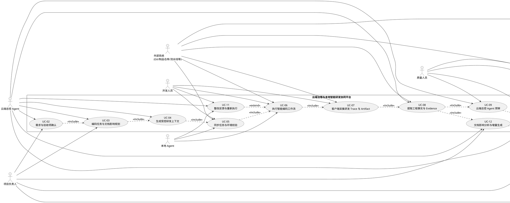
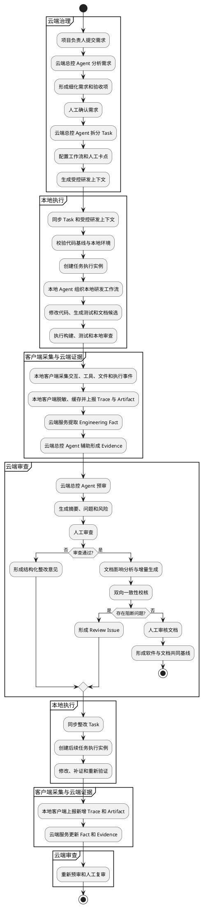
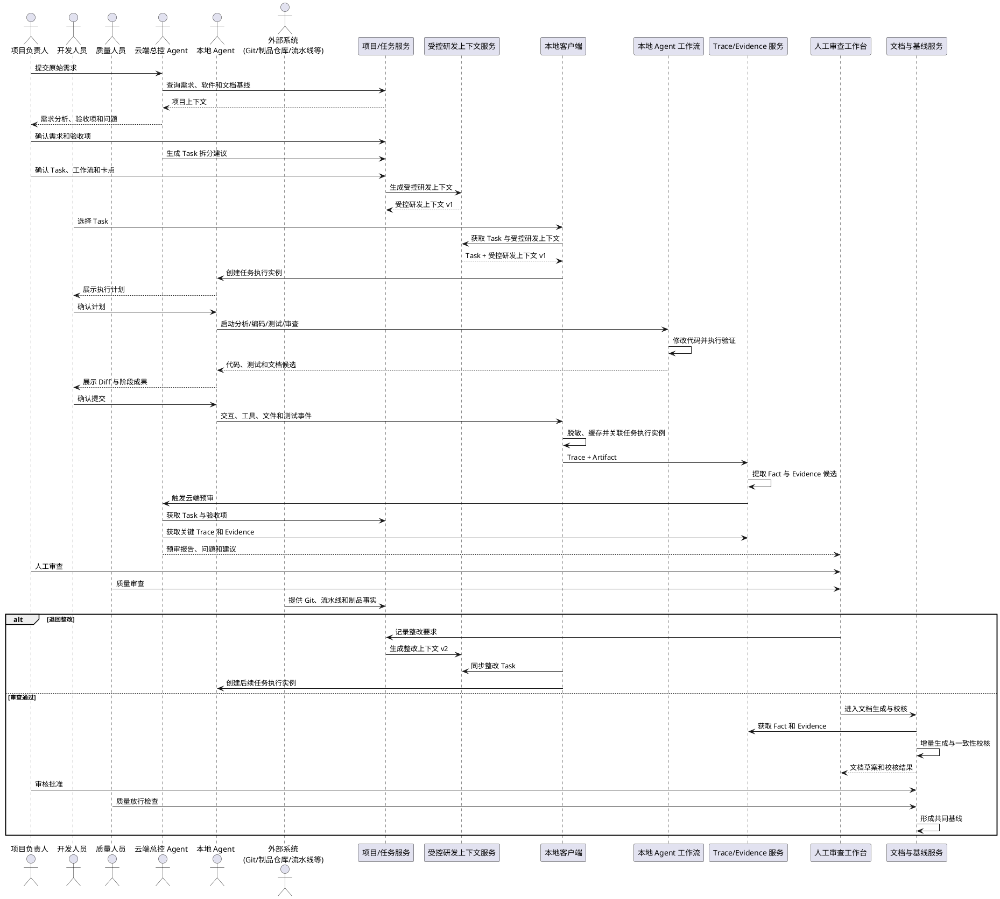
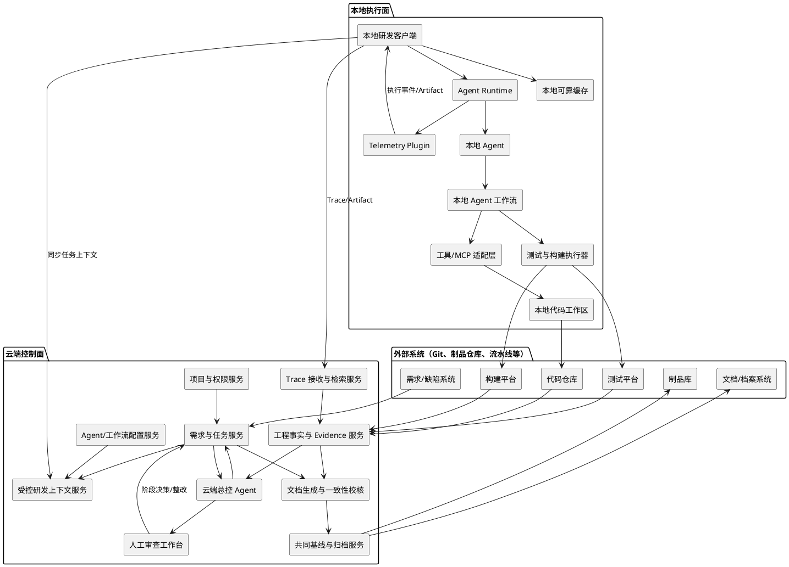
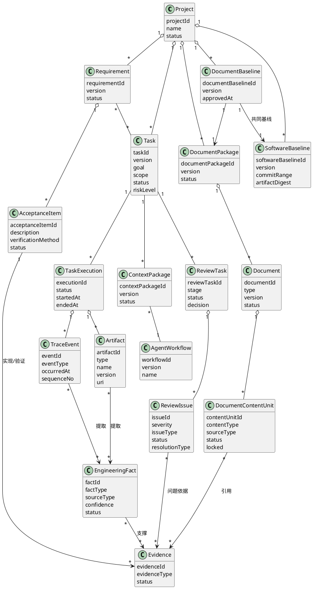
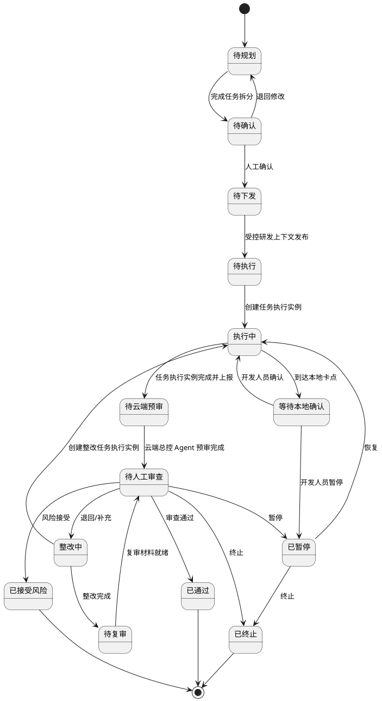
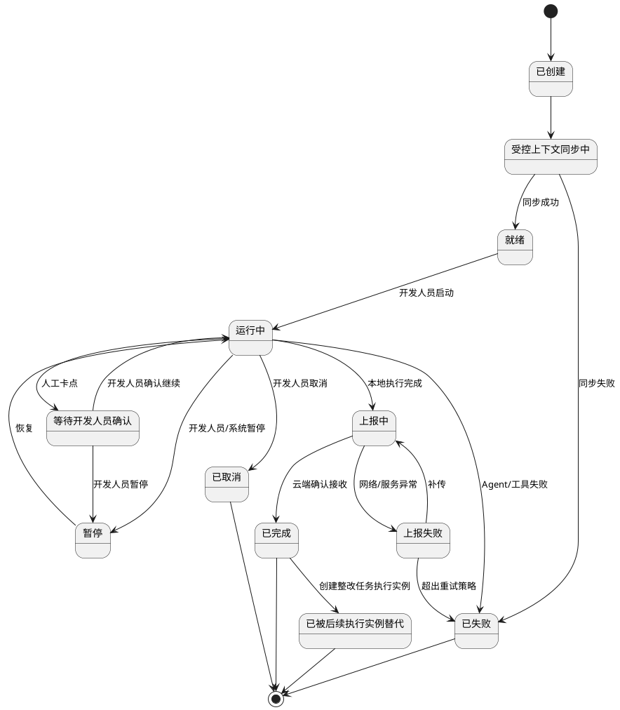

# 云端治理与本地智能研发协同平台 Use Case 与 UML

**版本：** 1.0
**适用场景：** 生成与智能编码一致的软件工程文档
**说明：** 本文中的“User Case”按软件工程通用术语统一表述为“Use Case（用例）”。

---

## 1. 场景说明

本场景聚焦“生成与智能编码一致的软件工程文档”：云端总控 Agent 负责辅助项目负责人和质量人员进行云端决策；本地 Agent 负责在真实代码环境中执行智能编码；本地客户端负责采集并上报研发事实。

- 云端总控 Agent 辅助项目负责人和质量人员完成需求分析、任务划分、阶段预审、文档校核和整改决策。
- 开发人员基于云端下发的项目上下文，通过本地 Agent 工作流在真实代码与工具环境中完成研发。
- 本地客户端采集开发人员、本地 Agent、工具和外部系统产生的交互、文件变化、测试、构建及产物信息，形成 Trace 并回传云端。
- 云端服务从 Trace 和 Artifact 中提取 Engineering Fact；云端总控 Agent 基于这些事实辅助项目负责人和质量人员形成判断。
- 项目负责人通过人工卡点完成需求确认、任务确认、阶段审查、风险接受和基线批准；质量人员负责质量结论和放行检查。
- 软件工程文档根据已确认的需求、实现、测试和审查事实增量生成，并与软件版本共同形成正式基线。
- 项目知识仅作为可选上下文输入，不作为本文主流程。

一句话概括：

> 云端负责规划、审查和文档生成，本地负责基于受控上下文执行研发；全过程研发事实回流云端，最终形成与软件版本一致的工程文档。

---

## 2. 系统参与者

| 参与者 | 主要职责 |
|---|---|
| 项目负责人 | 维护项目目标和约束，确认需求、任务、阶段结论、风险及软件与文档基线 |
| 开发人员 | 在本地工作区启动、监督和确认 Agent 执行，处理技术异常并审阅变更 |
| 云端总控 Agent | 在云端分析需求、拆分任务、生成受控上下文、汇总事实并辅助项目负责人和质量人员决策 |
| 本地 Agent | 读取受控研发上下文，组织本地研发工作流，执行分析、设计、编码、测试、审查和文档候选生成 |
| 质量人员 | 审查测试覆盖、Evidence、质量问题、一致性结果和放行条件 |
| 外部系统（如 Git、制品仓库、流水线等） | 提供代码、需求/缺陷、测试、构建、制品和档案等研发事实 |

---

## 3. 用例总览

本文只保留直接支撑“需求—代码—事实—文档”闭环的用例。项目初始化、组织级知识管理、复杂多 Agent 调度和自动审批属于平台支撑或后续扩展，不作为本场景主线展开。

| 编号 | 用例 | 主要参与者 | 关键输出 |
|---|---|---|---|
| UC-02 | 需求与验收项确认 | 项目负责人、云端总控 Agent | 需求版本、验收项、确认记录 |
| UC-03 | 编码任务与文档影响规划 | 项目负责人、云端总控 Agent | Task、追溯关系、文档影响范围 |
| UC-04 | 生成受控研发上下文 | 云端总控 Agent、项目负责人 | 受控研发上下文（Context Package）版本 |
| UC-05 | 同步任务与本地环境校验 | 开发人员、本地 Agent、外部系统 | 任务执行实例、执行计划 |
| UC-06 | 执行智能编码工作流 | 开发人员、本地 Agent、外部系统 | 代码、测试、文档候选 |
| UC-07 | 客户端采集研发 Trace 与 Artifact | 开发人员、外部系统 | Trace、Artifact 元数据 |
| UC-08 | 提取工程事实与 Evidence | 云端总控 Agent、外部系统 | Engineering Fact、Evidence |
| UC-09 | 云端总控 Agent 预审 | 云端总控 Agent、质量人员 | 预审报告、问题和风险 |
| UC-10 | 人工审查与阶段决策 | 项目负责人、质量人员 | 审查结论、整改决定 |
| UC-11 | 整改反馈与重新执行 | 云端总控 Agent、开发人员、本地 Agent | 整改任务、新任务执行实例 |
| UC-12 | 文档影响分析与增量生成 | 云端总控 Agent、项目负责人 | 文档草案、章节差异、来源标记 |
| UC-13 | 双向一致性校核 | 云端总控 Agent、质量人员、外部系统 | 一致性报告、Review Issue |
| UC-14 | 形成软件与文档共同基线 | 项目负责人、质量人员、外部系统 | 软件版本、文档版本、证据索引 |

---

## 4. 核心用例规约

### UC-02 需求与验收项确认

**目标：** 将原始业务需求转化为可开发、可验证、可追溯的正式需求和验收项。

**前置条件：**

- 项目已初始化。
- 项目负责人具有需求创建权限。
- 项目背景、现有软件和文档基线可访问。

**主流程：**

1. 项目负责人输入原始需求。
2. 云端总控 Agent 读取项目背景、现有软件和文档基线。
3. 云端总控 Agent 深化业务场景、目标用户、核心流程和边界。
4. 云端总控 Agent 生成细化需求、验收项和影响范围建议。
5. 云端总控 Agent 识别冲突、风险和待澄清问题。
6. 项目负责人补充或修正需求。
7. 项目负责人确认需求和验收项。
8. 系统固化需求版本和人工确认记录。
9. 需求进入“可规划”状态。

**异常流程：**

- 核心目标无法确定：保持“待澄清”状态。
- 验收项不可验证：不得进入任务规划。
- 与已批准需求冲突：生成冲突问题并等待人工裁决。

**输出：**

- Requirement。
- 验收项。
- 需求版本。
- 影响范围。
- 人工确认记录。

**验收要求：**

- 每个正式需求至少具有一个验收项。
- AI 生成内容必须经人工确认。
- 需求变更形成新版本，不得覆盖历史版本。

---

### UC-03 编码任务与文档影响规划

**目标：** 将已确认需求拆分为可执行任务，并确定代码、测试和工程文档的影响范围。

**前置条件：**

- 需求及验收项已确认。
- 项目 Agent 工作流可用。

**主流程：**

1. 云端总控 Agent 分析需求、代码现状、架构和文档结构。
2. 云端总控 Agent 生成任务拆分建议。
3. 为每个任务定义目标、输入、输出、边界和验收条件。
4. 识别任务依赖和并行关系。
5. 建立需求—任务—代码模块—测试—文档章节的追溯关系。
6. 标记需要新增、修改或复核的文档章节。
7. 为任务选择或配置 Agent 工作流，并配置强制验证项和必须提交的 Artifact。
8. 项目负责人审查并确认任务规划和关键人工卡点。
9. Task 进入“待下发”状态。

**异常流程：**

- 任务粒度过大：退回重新拆分。
- 任务依赖形成循环：禁止发布。
- 缺少可用工作流：要求配置通用或专用工作流。

**验收要求：**

- 每个 Task 必须有边界、验收条件和预期文档影响。
- 关键 Task 必须配置代码验证、文档校核或人工审查卡点。
- 任务依赖不得形成循环。

---

### UC-04 生成受控研发上下文

**目标：** 将本地智能编码所需的权威信息裁剪为受控、版本化研发上下文。

**主要内容：**

- 项目和当前任务。
- 已确认需求和验收项。
- 设计、接口和数据约束。
- 当前软件及文档基线。
- Agent、Skill、MCP 和工具权限。
- 研发规范、质量规则和验证命令。
- 必须提交的 Artifact。
- 数据安全和 Trace 上报策略。

**主流程：**

1. 系统读取 Task、Requirement、设计、规则和当前基线。
2. 云端总控 Agent 识别任务实际需要的上下文。
3. 系统加入工作流、工具权限和验证要求。
4. 系统检查引用内容是否有效、冲突或过期。
5. 高风险约束由项目负责人确认。
6. 系统生成受控研发上下文新版本。
7. 受控研发上下文进入“可下发”状态。

**验收要求：**

- 每个任务执行实例绑定唯一受控研发上下文版本。
- 受控研发上下文变化必须形成新版本。
- 已批准约束不得被本地 Agent 静默修改。

---

### UC-05 同步任务与本地环境校验

**目标：** 将云端 Task 和受控研发上下文安全同步至本地，并建立一次可追溯任务执行实例。

**主流程：**

1. 开发人员选择待执行 Task。
2. 客户端获取 Task 和受控研发上下文。
3. 校验上下文版本、完整性和有效性。
4. 校验本地仓库、分支、Commit 基线和工作区状态。
5. 提示未提交修改、版本偏差或环境缺失。
6. 开发人员确认本地执行环境。
7. 系统创建任务执行实例。
8. 本地 Agent 读取上下文并形成执行计划。
9. 开发人员确认计划后开始执行。

**异常流程：**

- 受控研发上下文已过期：要求重新同步。
- 本地代码基线不一致：要求建立隔离分支或工作区。
- 存在高风险未提交修改：阻止自动执行。

**输出：**

- 任务执行实例。
- 本地上下文缓存。
- 环境校验记录。
- 执行计划。

---

### UC-06 执行智能编码工作流

**目标：** 在真实代码和工具环境中完成分析、设计、编码、测试、审查和文档候选生成。

**主流程：**

1. 本地 Agent 读取 Task、验收项和执行计划。
2. 本地 Agent 完成影响分析和设计。
3. 本地 Agent 修改代码。
4. 本地 Agent 生成或补充测试。
5. 执行构建、测试和验证命令。
6. 本地 Agent 检查代码变更。
7. 本地 Agent 生成文档候选内容。
8. 本地 Agent 汇总代码、测试、文档和风险。
9. 开发人员审阅 Diff 和阶段成果。
10. 开发人员确认提交阶段成果。
11. 任务执行实例进入“待云端预审”状态。

**扩展流程：**

- 高风险工具调用必须人工确认。
- 任务范围外修改必须标记并确认。
- Agent 可按策略有限重试。
- 超过重试限制后转人工接管。

**验收要求：**

- Agent 只能在授权的 Skill、MCP 和工具范围内执行。
- 测试和构建结果必须绑定当前代码版本。
- 所有范围外修改必须留痕。

---

### UC-07 客户端采集研发 Trace 与 Artifact

**目标：** 可靠记录智能编码过程及其产物，为事实提取和文档生成提供来源。

**采集范围：**

- 开发人员与本地 Agent 的交互。
- 本地 Agent 与工具、工作区和验证命令的交互。
- Agent、模型、工作流和上下文版本。
- 工具调用、MCP 调用和命令执行。
- 文件读取、文件修改、Git Diff 和 Commit。
- 测试、构建和门禁结果。
- 开发人员确认、暂停、回退和人工接管。
- Artifact 生成和提交。

**主流程：**

1. 本地客户端监听本地 Agent、工具和外部系统产生的执行事件。
2. 关联 Project、Task、任务执行实例、Agent 和受控研发上下文版本。
3. 按安全策略进行脱敏、摘要和引用化。
4. Trace 和 Artifact 写入本地可靠缓存。
5. 本地客户端批量上报云端。
6. 云端执行幂等校验和重复事件去重。
7. 云端返回接收状态。
8. 本地清理已确认缓存。

**异常流程：**

- 网络中断：缓存并在恢复后补传。
- 敏感内容命中禁止规则：停止该内容上报并告警。
- 云端接收失败：重试并保留失败原因。

**验收要求：**

- 上报失败不得静默丢失。
- Trace 可按 Task 和任务执行实例检索，并能区分事件来源。
- 数据上报符合项目安全策略。

---

### UC-08 提取工程事实与 Evidence

**目标：** 将 Trace 和 Artifact 转化为可审查、可校核和可证明结论的事实与证据。

**主流程：**

1. 系统解析 Trace 和 Artifact。
2. 识别代码、接口、数据、配置和文档变化。
3. 识别测试、构建、门禁和人工确认事实。
4. 将事实关联 Requirement、Task、任务执行实例和软件版本。
5. 对比计划范围和实际修改范围。
6. 生成实现 Evidence 候选。
7. 生成验证 Evidence 候选。
8. 规则或人工确认来源和版本有效性。
9. 有效候选转为正式 Evidence。
10. 缺失、冲突和低可信内容进入问题清单。

**验收要求：**

- Trace 不得直接等同于正式 Evidence。
- Evidence 必须支撑具体结论并绑定软件版本。
- Evidence 失效时必须影响对应完成结论。

---

### UC-09 云端总控 Agent 预审

**目标：** 在人工审查前汇总任务完成情况、关键 Trace、Evidence、问题和风险。

**主流程：**

1. 云端总控 Agent 读取 Task、验收项和人工卡点要求。
2. 汇总任务执行实例关键路径和主要 Artifact。
3. 对比计划范围与实际变化。
4. 分析验收项实现和验证覆盖。
5. 检查工作流是否完整执行。
6. 检查异常重试、范围外修改和缺失 Evidence。
7. 初步检查代码、测试和文档一致性。
8. 生成问题清单及严重级别。
9. 生成建议通过、退回或补充的预审意见。
10. 创建 Review Task。

**输出：**

- 任务执行摘要。
- 验收覆盖表。
- 关键 Trace。
- Evidence 索引。
- 问题与风险清单。
- 云端总控 Agent 预审建议。

**验收要求：**

- 预审建议必须展示依据。
- 规则问题与 AI 语义建议必须区分。
- 云端总控 Agent 不得直接执行正式批准。

---

### UC-10 人工审查与阶段决策

**目标：** 由项目负责人和质量人员基于预审、差异和证据作出正式阶段决策。

**主流程：**

1. 项目负责人或质量人员打开 Review Task。
2. 查看任务要求、实际变化和云端总控 Agent 预审摘要。
3. 查看关键代码、测试、文档差异和 Evidence。
4. 对待确认问题进行判断。
5. 选择决策：
   - 通过；
   - 退回修改；
   - 补充测试或证据；
   - 调整需求或设计；
   - 接受风险；
   - 暂停或终止。
6. 填写审查意见、责任人和期限。
7. 系统记录项目负责人和质量人员的人工决策。
8. 根据决策推进阶段或创建整改任务。

**验收要求：**

- 正式通过必须有人工决策记录。
- 风险接受必须记录影响、责任人和有效期限。
- 未关闭高风险问题不得直接通过。

---

### UC-11 整改反馈与重新执行

**目标：** 将云端审查问题转换为本地 Agent 可执行的整改任务。

**主流程：**

1. 云端总控 Agent 整理 Review Issue。
2. 关联问题描述、Evidence 位置、影响范围和通过条件。
3. 更新原 Task 或生成整改子任务。
4. 必要时生成受控研发上下文新版本。
5. 开发人员通过本地客户端同步整改任务。
6. 本地客户端创建新的任务执行实例，并关联原执行实例和 Review Task。
7. 本地 Agent 修改代码、测试、文档或补充证据。
8. 执行重新验证。
9. 上报新增 Trace 和 Artifact。
10. 云端重新提取 Evidence 并发起复审。
11. 经规则或人工复核后关闭问题。

**验收要求：**

- 整改意见必须结构化，不得只有自然语言消息。
- 新任务执行实例必须关联原问题和原执行实例。
- 问题关闭必须具有复核结论。

---

### UC-12 文档影响分析与增量生成

**目标：** 根据已确认工程事实识别受影响文档和章节，并生成可审查的增量修改建议。

**主流程：**

1. 识别需求、设计、代码、接口、数据、测试和版本变化。
2. 根据追溯关系定位受影响文档。
3. 定位受影响章节和内容单元。
4. 标记必须更新、建议更新、待确认和可能失效内容。
5. 云端总控 Agent 基于模板、Engineering Fact 和 Evidence 生成修改建议。
6. 标记内容来源：
   - 工程事实；
   - 规则生成；
   - AI 归纳；
   - AI 推断；
   - 人工编写。
7. 展示生成前后差异。
8. 检测与人工锁定内容的冲突。
9. 项目负责人确认、编辑或驳回。
10. 形成新文档草案版本。

**验收要求：**

- 未受影响章节不得无故重新生成。
- 人工内容不得被静默覆盖。
- AI 推断必须明确标记。
- 关键结论必须关联 Evidence。

---

### UC-13 双向一致性校核

**目标：** 检查代码是否符合已确认文档，也检查文档是否真实反映当前软件。

**校核范围：**

- 需求一致性。
- 设计一致性。
- 接口一致性。
- 数据一致性。
- 测试一致性。
- 状态一致性。
- 过程一致性。
- 版本一致性。

**主流程：**

1. 执行确定性规则校核。
2. 云端总控 Agent 执行语义辅助校核。
3. 生成问题、严重级别、影响范围和证据。
4. 将问题归类为：
   - 修改代码；
   - 修改文档；
   - 发起需求或设计变更；
   - 补充证据；
   - 接受风险；
   - 驳回 AI 建议。
5. 阻断问题进入 Review Issue 整改闭环。

**验收要求：**

- 规则问题和 AI 建议必须区分。
- 每个问题必须有来源、影响范围和处理状态。
- 未处理高风险问题不得进入基线批准。

---

### UC-14 形成软件与文档共同基线

**目标：** 将已通过审查的软件版本、构建产物、文档和 Evidence 统一固化。

**主流程：**

1. 锁定 Commit 范围和软件版本。
2. 关联构建制品和摘要。
3. 锁定 Document Package 版本。
4. 关联追溯矩阵、Evidence 索引和校核报告。
5. 关联人工审查、批准和风险接受记录。
6. 质量人员执行最终完整性检查。
7. 项目负责人确认共同基线。
8. 系统锁定并归档基线。
9. 更新项目当前有效基线。

**验收要求：**

- 正式文档必须绑定唯一软件版本。
- 已归档基线不得被重新生成覆盖。
- 任一基线能够还原当时的软件、文档、证据和审查状态。

---

### 非主线能力：项目知识沉淀

项目知识提取与发布不属于本文主用例。后续可将已确认的设计决策、问题解决方法和审查经验沉淀为可选上下文，但不得影响“代码—事实—文档”主闭环。

---

## 5. 关键业务规则

1. 云端总控 Agent 只在云端辅助项目负责人和质量人员决策，不直接调用或指挥本地 Agent。
2. 每个任务执行实例必须关联唯一 Task 和受控研发上下文版本。
3. Agent 的自然语言“已完成”声明不能直接成为正式完成事实。
4. Trace 只有经过事实提取、任务关联和有效性确认后，才能成为 Evidence。
5. 必要验收项必须具有实现 Evidence 和验证 Evidence。
6. 超出 Task 边界的修改必须经过人工确认。
7. 退回整改必须形成结构化 Review Issue。
8. 整改必须创建新任务执行实例或明确续接关系。
9. 文档关键结论必须关联有效 Evidence。
10. AI 推断内容必须显式标记。
11. 人工、已审核和已归档内容不得被静默覆盖。
12. 正式文档必须绑定软件版本和构建产物。
13. Trace 和源码上报必须由本地客户端遵循项目安全策略执行。
14. 已归档共同基线只能形成新版本，不能直接修改。


## 6. UML 用例图

以下图使用 PlantUML 语法，可在 PlantUML、IDE 插件或对应渲染器中直接生成图片。



---

## 7. UML 端到端活动图



---

## 8. UML 核心时序图



---

## 9. UML 组件图



---

## 10. UML 领域模型图



---

## 11. UML Task 状态图



---

## 12. UML 任务执行实例状态图



---

## 13. 第一阶段建议实现范围

第一阶段优先实现以下用例：

1. UC-02 需求与验收项确认。
2. UC-03 编码任务与文档影响规划。
3. UC-04 生成受控研发上下文。
4. UC-05 同步任务与本地环境校验。
5. UC-06 执行智能编码工作流。
6. UC-07 客户端采集研发 Trace 与 Artifact。
7. UC-08 提取 Engineering Fact 与 Evidence。
8. UC-09 云端总控 Agent 预审。
9. UC-10 人工审查与阶段决策。
10. UC-11 整改反馈与重新执行。
11. UC-12 文档影响分析与增量生成。
12. UC-13 双向一致性校核。
13. UC-14 形成软件与文档共同基线。

第一阶段暂不优先：

- 复杂跨项目多 Agent 调度。
- 完整组织级知识图谱。
- 全部 GJB 文档自动生成。
- 自动审批和自动风险接受。
- 全量源码和全量交互永久云端存储。
- 复杂多级会签和档案系统替代。

---

## 14. 第一阶段验收主线

```text
项目负责人提交需求
  -> 云端总控 Agent 形成需求分析和验收项
  -> 人工确认
  -> 云端总控 Agent 拆分 Task
  -> 生成受控研发上下文
  -> 本地同步并执行智能编码工作流
  -> 产生代码、测试和文档候选
  -> 本地客户端采集并上报 Trace 与 Artifact
  -> 云端提取 Engineering Fact 和 Evidence
  -> 云端总控 Agent 预审
  -> 人工通过或退回
  -> 本地按结构化问题整改
  -> 文档增量生成和双向一致性校核
  -> 软件版本与文档版本共同形成基线
```

验收时重点证明：

- 云端与本地使用同一 Task 和受控研发上下文版本。
- 项目负责人和质量人员能够查看关键研发过程和真实差异。
- 任务完成结论具有实现 Evidence 和验证 Evidence。
- 云端问题能够结构化反馈至本地继续执行。
- 文档能够根据代码变化进行章节级增量更新。
- 正式文档能够绑定明确的软件版本和构建产物。
