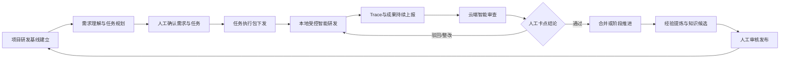

# 实现团队规范化智能开发场景分析

- **版本**：0.2
- **日期**：2026-07-10
- **状态**：修改优化稿

---

## 1. 文档目的

本文面向“实现团队规范化智能开发”主题，对场景目标、业务边界、参与角色、运行流程和功能支撑进行分析，为后续需求规格、产品设计和实施规划提供统一依据。

本文重点回答三个问题：

1. **如何理解团队规范化智能开发。**
2. **团队、管理人员、开发人员与智能体如何协同完成研发。**
3. **平台需要提供哪些功能，才能使研发过程可执行、可审查、可追溯、可持续改进。**

本文不展开具体技术架构、数据库设计、接口协议、智能体调度算法和详细实施任务。后续应在本场景分析基础上，分别形成需求规格、总体设计、数据模型、接口方案、权限模型、Trace 模型和阶段建设计划。

---

## 2. 场景理解

### 2.1 场景定义

团队规范化智能开发，不是简单为每名开发人员配置一个 AI 编码工具，也不是让多个智能体同时生成代码。

它面向 AI 进入团队研发后的工程治理问题：团队需要将原本依靠制度文档、项目经验、代码评审和人员默契维持的研发秩序，转化为能够被人和智能体共同理解、执行、校核和追溯的研发机制。

该场景要解决的核心问题不是“智能体能否写出代码”，而是：

- 智能体是否理解项目目标、架构边界和团队规范；
- 每项任务是否具有明确的目标、范围、依赖和验收标准；
- 智能体是否在批准的上下文、工作流和权限范围内执行；
- 开发人员与智能体的交互、变更和产物是否形成完整过程证据；
- 高风险决策和关键阶段是否经过人工确认；
- 代码、测试、文档和评审结果是否能够相互对应；
- 评审意见、失败经验和优秀实践是否能够沉淀并反哺后续研发。

一句话概括：

```text
个人智能编码解决“一个人如何更快完成局部开发”。
团队规范化智能开发解决“一个团队如何在统一约束下，可靠地使用智能体完成软件研发”。
```

### 2.2 核心矛盾

AI 提高了局部开发速度，但也放大了团队工程治理风险。

```text
智能体生成速度提高
  → 单位时间内代码、文档和方案变更数量增加
  → 隐性规范被绕过、重复建设和架构漂移的概率上升
  → 评审人员需要投入更多精力判断产物是否可信
  → 团队协作和集成成本可能不降反升
```

因此，团队规范化智能开发需要解决的根本矛盾是：

> 如何在不牺牲智能开发效率的前提下，将团队规范、项目上下文、任务边界、研发流程、质量要求和人工决策转化为可执行、可验证、可追溯的智能研发约束。

### 2.3 “规范化”的对象

团队规范化智能开发不是只规范代码格式，而是对研发全过程进行规范化。

| 规范化对象 | 需要明确的内容 |
| --- | --- |
| 需求规范化 | 为什么做、解决什么问题、范围是什么、达到什么结果 |
| 任务规范化 | 谁负责、做什么、依赖什么、允许改什么、如何验收 |
| 上下文规范化 | 智能体可以读取什么、必须参考什么、禁止访问什么 |
| 执行规范化 | 使用哪个智能体、工作流、工具、权限和验证步骤 |
| 产物规范化 | 需要形成哪些代码、测试、文档、报告和证据 |
| 审查规范化 | 哪个阶段由谁审查、依据什么审查、如何作出结论 |
| 知识规范化 | 哪些经验可以沉淀、由谁批准、如何发布和回退 |

### 2.4 场景核心目标

本场景通过四项机制实现团队规范化智能开发：

#### 2.4.1 规范可执行

将团队规范、架构边界、代码约定、测试要求、安全规则和提交规范，转化为可由智能体消费、执行和自动检查的项目研发基线。

#### 2.4.2 任务可控制

由云端总控智能体辅助管理人员完成需求理解、任务拆分、依赖分析、风险分级和人工卡点设置，确保智能体只在明确任务边界内执行。

#### 2.4.3 过程可追溯

将本地开发人员与智能体的交互、上下文引用、工具调用、代码变更、测试结果、产出物和人工干预组织为统一 Trace，形成可审查的研发证据链。

#### 2.4.4 经验可演进

由云端总控智能体基于 Trace 和产物辅助管理人员开展审查、复盘和经验提炼，经人工审核后，将有效经验发布为项目知识、任务模板、开发契约或检查规则。

### 2.5 场景非目标

为避免建设范围失控，本场景当前不以以下内容为主要目标：

- 不以“智能体数量越多越好”为目标；
- 不替代 Git、代码评审、CI、制品库等已有工程基础设施；
- 不取消技术负责人、代码 Owner 和评审人员的责任；
- 不要求所有任务进入同一套重型流程；
- 不默认允许云端智能体直接修改本地真实代码和环境；
- 不将所有聊天记录和日志无差别沉淀为正式项目知识；
- 不在首期建设复杂的全自动多智能体协商和自动合并机制。

---

## 3. 参与角色与职责边界

### 3.1 参与角色

| 角色 | 主要职责 |
| --- | --- |
| 管理人员/项目负责人 | 确认需求目标、任务优先级、责任分工、阶段结论和知识发布 |
| 技术负责人/代码 Owner | 确认架构方案、公共契约、模块边界、高风险变更和合并结论 |
| 云端总控智能体 | 辅助需求分析、任务规划、风险识别、过程审查、问题归纳和知识提炼 |
| 本地开发人员 | 获取任务、控制智能体执行、处理异常、确认变更并提交成果 |
| 本地研发智能体 | 按项目工作流完成分析、设计、编码、测试、自审和修复 |
| 质量与评审人员 | 基于需求、规范、Trace 和产物执行质量审查与阶段把关 |
| 平台管理员 | 维护项目接入、权限、智能体能力、规则、审计和外部工程系统集成 |

### 3.2 云端与本地端边界

#### 3.2.1 云端侧职责

云端侧主要承担项目治理、任务总控、审查协同和知识管理：

- 维护项目研发基线；
- 辅助管理人员完成需求分析和任务规划；
- 形成任务依赖关系、风险等级和人工卡点；
- 生成并下发任务执行包；
- 接收本地 Trace、产物和验证结果；
- 辅助开展过程审查、成果审查和风险识别；
- 形成整改意见并推动阶段流转；
- 提炼知识候选并提交人工审核；
- 维护项目级研发资产和组织级经验。

#### 3.2.2 本地侧职责

本地侧主要承担真实工程环境中的研发执行：

- 获取项目、需求、任务和研发基线上下文；
- 使用项目配置的智能体、Skill、工具和工作流；
- 访问本地代码、依赖、构建环境和测试环境；
- 完成代码、测试和文档修改；
- 执行本地构建、测试、扫描和自审；
- 处理智能体越界、异常和人工确认请求；
- 将交互、变更、验证和产物信息上报云端；
- 接收云端审查意见并完成整改。

#### 3.2.3 边界原则

```text
云端负责“规划、约束、审查、沉淀”。
本地负责“理解、执行、验证、提交”。
服务端 Trace 将两者连接为完整研发闭环。
```

---

## 4. 核心业务对象

### 4.1 项目研发基线

项目研发基线是团队开展智能研发的统一约束集合，包括：

- 项目目标和范围；
- 技术栈和架构说明；
- 模块职责和依赖边界；
- 编码、测试、安全和提交规范；
- 可复用组件、公共能力和禁止事项；
- 智能体、Skill、工具和权限配置；
- 标准研发工作流；
- 风险分级和人工卡点规则；
- 质量门禁和验证命令；
- 代码 Owner 和评审路由；
- 项目知识和历史案例。

项目研发基线必须具备版本，并与任务执行绑定。

### 4.2 需求基线

需求基线是经管理人员确认后的需求事实源，包括：

- 业务背景；
- 目标和范围；
- 使用对象和核心流程；
- 业务规则；
- 非功能要求；
- 验收标准；
- 不在本次范围内的内容；
- 关联资料和确认记录。

### 4.3 任务执行包

任务执行包是云端下发给本地执行的最小受控工作单元，包括：

- 任务目标和任务类型；
- 前置依赖；
- 允许修改范围；
- 禁止修改范围；
- 相关代码、文档和接口；
- 必须复用的公共能力；
- 适用的开发契约；
- 指定的智能体工作流；
- 验证命令和完成定义；
- 风险等级和人工卡点；
- 责任人、评审人和合并路径。

### 4.4 研发执行实例

研发执行实例表示某个任务在某次本地智能研发过程中的实际运行，需绑定：

- 任务版本；
- 需求基线版本；
- 项目研发基线版本；
- 上下文包版本；
- 智能体和工作流版本；
- 执行人员和执行环境；
- 分支、工作区或会话标识。

### 4.5 Trace 与证据包

Trace 是研发执行实例产生的过程记录。证据包是经过组织和筛选、可供审查使用的任务级证据集合。

Trace 至少覆盖：

- 人与智能体的关键交互；
- 智能体使用的上下文和引用来源；
- 智能体、Skill、MCP 和工具调用；
- 命令执行和环境反馈；
- 文件新增、修改和删除；
- 代码 Diff；
- 构建、测试、扫描和门禁结果；
- 代码、测试、文档和报告等产出物；
- 人工暂停、批准、驳回和修订；
- 执行异常、失败原因和未解决问题。

证据包应能够回答：

> 谁在什么任务下，基于什么需求、规范和上下文，通过什么过程，产生了什么结果，经过了哪些验证和人工决策。

### 4.6 审查单

审查单用于记录某一阶段的审查输入、问题、意见和结论，包括：

- 审查对象；
- 审查依据；
- 智能体审查摘要；
- 风险和问题清单；
- 待人工确认项；
- 通过、驳回或有条件通过结论；
- 整改要求；
- 审查责任人和时间；
- 下一阶段进入条件。

### 4.7 知识候选与正式知识

系统应区分以下层级：

```text
原始 Trace
  → 经验候选
  → 知识候选
  → 人工审核
  → 正式项目知识/开发契约/检查规则
```

未经审核的经验不得直接成为正式开发规范。

---

## 5. 总体业务流程

### 5.1 总体闭环



总体流程可概括为：

```text
云端总控规划
  → 本地下发受控任务
  → 本地人与智能体协同研发
  → 全过程 Trace 和成果上报
  → 云端智能审查与人工卡点
  → 整改或阶段推进
  → 经验审核后反哺项目研发基线
```

### 5.2 阶段状态

建议任务至少具备以下状态：

```text
待分析
→ 待确认
→ 待执行
→ 执行中
→ 待审查
→ 整改中
→ 待合并/待交付
→ 已完成
→ 已归档
```

异常情况下可进入：

- 已暂停；
- 已驳回；
- 已取消；
- 执行失败；
- 需重新规划。

---

## 6. 详细业务流程

### 6.1 流程一：项目研发基线建立

#### 6.1.1 业务目标

将团队已有规范、项目事实和研发能力转化为可配置、可下发、可检查的统一研发基线。

#### 6.1.2 参与角色

- 管理人员；
- 技术负责人；
- 平台管理员；
- 云端总控智能体。

#### 6.1.3 输入

- 项目说明和架构文档；
- 代码仓库和目录结构；
- 编码、测试、安全和提交规范；
- 分支、PR 和 CI 规则；
- 历史任务、PR、评审意见和问题复盘；
- 模块 Owner 和评审关系；
- 可使用的智能体、Skill、工具和模型。

#### 6.1.4 处理逻辑

1. 云端总控智能体辅助识别显性规范和历史实践；
2. 管理人员和技术负责人确认项目目标、模块边界和规则适用范围；
3. 平台将规范组织为项目级、模块级、文件级和任务级约束；
4. 配置不同任务类型的工作流、门禁和人工卡点；
5. 形成版本化项目研发基线并发布。

#### 6.1.5 输出

- 项目研发基线；
- 模块边界和代码 Owner；
- 任务模板；
- 智能体工作流；
- 上下文装配规则；
- 质量门禁和人工卡点；
- 规则版本和发布记录。

#### 6.1.6 阶段控制

项目研发基线未经责任人确认，不得作为正式任务执行依据。基线更新后，不自动覆盖已启动任务，历史任务继续绑定原版本。

---

### 6.2 流程二：需求理解与任务规划

#### 6.2.1 业务目标

将原始需求转化为可确认、可拆分、可执行和可验收的需求基线与任务图。

#### 6.2.2 参与角色

- 管理人员/项目负责人；
- 技术负责人；
- 云端总控智能体。

#### 6.2.3 输入

- 原始业务需求；
- 缺陷、问题或技术改造说明；
- 关联页面、接口、日志和代码；
- 项目研发基线；
- 历史相似任务和项目知识。

#### 6.2.4 处理逻辑

1. 云端总控智能体提炼需求目标、使用对象、核心流程和业务规则；
2. 识别需求缺失、冲突和待确认事项；
3. 形成可核对的验收标准；
4. 识别影响模块、公共契约、数据、安全和集成风险；
5. 将需求拆分为契约任务、独立实现任务、共享资产任务和集成验证任务；
6. 形成任务依赖图、并行建议和互斥范围；
7. 推荐责任人、评审人、执行方式和风险等级；
8. 由管理人员和技术负责人完成需求与任务规划确认。

#### 6.2.5 输出

- 需求基线；
- 任务清单和任务依赖图；
- 风险等级；
- 并行和互斥建议；
- 人工卡点；
- 责任人和评审人；
- 任务完成定义。

#### 6.2.6 阶段控制

缺少明确目标、范围、验收标准或关键业务规则的任务，不得直接进入编码。涉及公共契约、数据模型、安全权限和核心架构的任务，必须先完成方案确认。

---

### 6.3 流程三：任务执行包生成与下发

#### 6.3.1 业务目标

将经过确认的任务转化为本地人员和智能体可以直接执行的受控任务包。

#### 6.3.2 参与角色

- 云端总控智能体；
- 管理人员；
- 本地开发人员。

#### 6.3.3 处理逻辑

1. 根据任务类型和风险等级选择适用的研发工作流；
2. 装配相关需求、代码、文档、接口、数据模型和历史案例；
3. 注入允许修改范围、禁止修改范围和必须复用能力；
4. 绑定项目研发基线、上下文包和工作流版本；
5. 配置验证命令、质量要求和提交要求；
6. 形成任务执行包并下发到本地端；
7. 本地开发人员确认任务可执行性和环境准备情况。

#### 6.3.4 输出

- 任务执行包；
- 上下文包；
- 工作流和智能体配置；
- 验证清单；
- 本地执行实例。

#### 6.3.5 阶段控制

任务执行包必须可追溯到具体需求、任务和研发基线版本。任务范围或契约发生重大变化时，应停止原执行实例并重新生成任务执行包。

---

### 6.4 流程四：本地受控智能研发

#### 6.4.1 业务目标

在真实工程环境中，由本地开发人员控制智能体完成分析、编码、测试、自审和修复。

#### 6.4.2 参与角色

- 本地开发人员；
- 本地研发智能体；
- 技术负责人（必要时）。

#### 6.4.3 处理逻辑

1. 本地端创建任务分支、工作区或隔离会话；
2. 本地研发智能体读取任务执行包并形成实现计划；
3. 对高风险方案或不确定事项发起人工确认；
4. 按工作流完成代码、测试和文档修改；
5. 执行构建、测试、扫描和自审；
6. 检查是否超出允许范围或触碰公共契约；
7. 形成变更说明、验证结果、风险和未解决问题；
8. 提交待审查成果。

#### 6.4.4 执行约束

- 智能体只能在批准范围内操作；
- 修改公共契约、共享资产或高风险配置时必须暂停确认；
- 不允许通过静默重试掩盖失败原因；
- 每个关键结论应保留依据；
- 本地开发人员对最终提交内容承担确认责任。

#### 6.4.5 输出

- 代码、测试和文档变更；
- 执行计划和变更说明；
- 构建、测试和扫描结果；
- 风险说明和未解决问题；
- 待审查成果集。

---

### 6.5 流程五：Trace 与证据包形成

#### 6.5.1 业务目标

将研发过程从分散聊天和日志转化为可审查、可复盘、可追责的任务级证据链。

#### 6.5.2 参与角色

- 本地端采集组件；
- 云端 Trace 服务；
- 云端总控智能体；
- 管理人员和评审人员。

#### 6.5.3 处理逻辑

1. 本地持续采集人与智能体交互、工具调用、文件变更和验证结果；
2. 将事件关联到项目、需求、任务、执行实例和阶段；
3. 对敏感信息进行过滤、脱敏和权限控制；
4. 对断网场景进行本地缓存和恢复补传；
5. 云端按阶段和审查目标组织 Trace；
6. 提炼关键决策、关键 Diff、失败原因和人工干预；
7. 形成供审查使用的证据包。

#### 6.5.4 输出

- 原始 Trace；
- 任务时间线；
- 决策和变更关联关系；
- 阶段证据包；
- Trace 完整性检查结果。

#### 6.5.5 阶段控制

Trace 缺失不应被自动视为任务失败，但对于要求过程合规的任务，证据不完整时不得直接通过高风险阶段审查。

---

### 6.6 流程六：云端智能审查与人工卡点

#### 6.6.1 业务目标

基于需求、任务、研发基线、Trace 和成果物，判断研发过程是否规范、结果是否满足要求，并由人工作出关键阶段决定。

#### 6.6.2 参与角色

- 云端总控智能体；
- 管理人员；
- 技术负责人；
- 质量与评审人员。

#### 6.6.3 审查内容

##### 过程规范性审查

- 是否使用指定任务执行包和工作流；
- 是否使用批准的上下文和开发契约；
- 是否超出允许修改范围；
- 是否经过必要人工卡点；
- 是否执行要求的验证步骤；
- 是否形成完整过程证据。

##### 结果质量审查

- 是否满足需求目标和验收标准；
- 是否符合架构和模块边界；
- 是否重复建设或错误引入新能力；
- 测试是否覆盖关键场景；
- 是否存在安全、兼容性和维护风险；
- 代码、测试、文档和变更说明是否一致；
- 是否具备合并、交付和回滚条件。

#### 6.6.4 人工卡点

| 卡点 | 主要判断内容 | 责任人 |
| --- | --- | --- |
| 需求确认 | 需求理解、范围和验收标准是否正确 | 管理人员/业务负责人 |
| 任务规划确认 | 拆分、依赖、并行边界和责任分工是否合理 | 项目负责人/技术负责人 |
| 高风险方案确认 | 架构、数据、安全、公共契约是否允许变更 | 技术负责人/代码 Owner |
| 阶段成果审查 | 过程是否合规、成果是否具备进入下一阶段条件 | 评审人员/管理人员 |
| 合并或交付批准 | 是否允许进入主干、制品或交付环节 | 代码 Owner/项目负责人 |
| 知识发布确认 | 经验是否可复用、适用范围是否正确 | 技术负责人/知识责任人 |

#### 6.6.5 输出

- 审查摘要；
- 风险和问题清单；
- 整改建议；
- 通过、驳回或有条件通过结论；
- 下一阶段进入条件；
- 审查责任和记录。

---

### 6.7 流程七：整改闭环与阶段推进

#### 6.7.1 业务目标

将审查问题转化为可执行整改项，并保留多轮修订和审查记录。

#### 6.7.2 处理逻辑

1. 云端将审查问题关联到需求、任务、文件、Diff 或验证项；
2. 形成结构化整改任务并反馈本地；
3. 本地开发人员与智能体完成修订；
4. 新一轮执行继续形成 Trace；
5. 云端对整改项进行复核；
6. 通过后推进到合并、交付或下一研发阶段；
7. 未通过时继续整改，必要时退回任务规划或需求确认阶段。

#### 6.7.3 输出

- 整改任务；
- 修订记录；
- 问题关闭证据；
- 阶段流转记录；
- 合并或交付结论。

---

### 6.8 流程八：经验提炼与知识演进

#### 6.8.1 业务目标

将一次研发任务中的有效经验转化为后续人员和智能体可以复用的项目资产。

#### 6.8.2 经验来源

- 评审意见；
- 越界修改；
- 门禁失败；
- 合并和集成问题；
- 重复建设；
- 测试遗漏；
- 人工修正；
- 生产缺陷；
- 优秀实现和高质量任务样例。

#### 6.8.3 处理逻辑

1. 云端总控智能体从 Trace 和审查记录中识别重复出现的问题或有效实践；
2. 生成知识候选，说明来源、适用范围和预期作用；
3. 由责任人判断是否具有通用性和正确性；
4. 将审核通过的知识发布为：
   - 开发契约；
   - 任务模板；
   - 上下文资料；
   - 智能体指令；
   - 自动检查规则；
   - 评审清单；
5. 对知识使用情况和问题改善效果进行跟踪；
6. 对无效或错误知识进行修订、停用和回退。

#### 6.8.4 输出

- 经验候选；
- 知识候选；
- 审核记录；
- 正式项目知识；
- 研发基线更新；
- 知识使用和效果数据。

---

## 7. 功能设计

### 7.1 项目研发基线与智能体能力管理

作为团队规范化智能开发的基础配置中心，承接项目规范、工程事实和智能体能力，形成可版本化、可下发、可审查的研发基线。

主要功能包括：

- 项目目标、技术栈和架构信息维护；
- 模块职责、依赖边界和禁止规则维护；
- 编码、测试、安全、分支和提交规范管理；
- 智能体、Skill、模型、工具和 MCP 配置；
- 研发工作流配置；
- 质量门禁和人工卡点配置；
- 代码 Owner 和评审路由维护；
- 项目知识、任务模板和历史案例管理；
- 研发基线版本、审批、发布和回退。

### 7.2 需求理解与任务规划

作为研发任务进入平台的总控入口，承接原始需求和项目研发基线，完成需求结构化、任务拆分、风险识别和责任分配。

主要功能包括：

- 原始需求解析和场景理解；
- 业务目标、范围、规则和验收标准生成；
- 缺失信息、冲突和待确认项识别；
- 影响模块、公共契约和风险分析；
- 任务拆分和任务依赖图生成；
- 并行、互斥和共享资产修改建议；
- 风险等级和执行模式推荐；
- 责任人、代码 Owner 和评审人推荐；
- 需求和任务规划人工调整、确认和版本管理。

### 7.3 任务上下文装配与本地下发

作为云端规划与本地执行之间的衔接能力，承接已确认任务，生成包含目标、边界、上下文、工作流和验证要求的任务执行包。

主要功能包括：

- 相关代码、接口、文档和数据模型检索；
- 历史相似任务和评审意见检索；
- 可复用组件和公共能力推荐；
- 允许修改范围和禁止修改范围配置；
- 项目研发基线和上下文版本绑定；
- 智能体工作流、工具权限和验证命令注入；
- 任务执行包生成、审批和下发；
- 本地同步、更新和失效控制。

### 7.4 本地智能研发执行与过程采集

作为真实工程环境中的研发执行载体，承接任务执行包，由开发人员控制本地研发智能体完成分析、编码、测试、自审和修复，并采集全过程 Trace。

主要功能包括：

- 项目和任务同步；
- 本地智能体会话和工作流启动；
- 分支、工作区或隔离环境创建；
- 智能体计划、编码、测试、自审和修复执行；
- 高风险操作暂停和人工确认；
- 允许范围、禁止范围和权限控制；
- 人机交互、工具调用、命令执行和文件变更采集；
- 构建、测试、扫描和验证结果采集；
- 离线缓存、失败补传、敏感信息过滤和脱敏；
- 变更说明、风险说明和待审查成果生成。

### 7.5 智能审查、人工卡点与阶段推进

作为研发过程和成果的质量控制中心，承接需求、任务、研发基线、Trace 和产物，完成过程合规审查、结果质量审查、人工决策和整改闭环。

主要功能包括：

- Trace 完整性和关键证据识别；
- 需求、任务、代码、测试和文档关联分析；
- 任务范围越界和禁止文件修改检测；
- 公共契约、共享资产和架构边界变更识别；
- 重复实现、依赖违规和风险变更提示；
- 验收标准完成情况分析；
- 自动门禁、测试、扫描和质量结果汇总；
- 智能审查摘要、风险清单和待人工确认项生成；
- 人工通过、驳回和有条件通过；
- 整改任务生成、反馈、复核和关闭；
- 阶段流转、合并批准和交付结论记录。

### 7.6 Trace 治理与项目知识演进

作为团队研发经验沉淀和持续优化中心，承接全过程 Trace、审查意见和任务结果，形成可信、可审核、可复用的项目知识。

主要功能包括：

- 项目、需求、任务、执行实例和产物关联；
- 任务时间线和证据包生成；
- Trace 查询、审计、归档和权限控制；
- 评审意见、失败原因和优秀实践归类；
- 经验候选和知识候选生成；
- 知识适用范围、来源和影响分析；
- 知识人工审核、发布、版本和回退；
- 开发契约、任务模板、智能体指令和检查规则更新；
- 知识使用记录和效果评估。

### 7.7 贯穿性工程集成能力

以下能力不单独构成场景主线，但应作为贯穿各模块的工程支撑：

- Git 仓库、分支、提交和 PR/MR 集成；
- CI、测试平台、扫描平台和质量门禁集成；
- Issue、需求管理和项目管理系统集成；
- 制品库、部署平台和运行环境集成；
- 统一身份、权限、密钥和审计集成；
- 消息通知和待办集成。

---

## 8. 流程与功能映射

| 业务阶段 | 主要功能模块 | 关键成果 |
| --- | --- | --- |
| 项目研发基线建立 | 项目研发基线与智能体能力管理 | 研发基线、工作流、门禁和知识 |
| 需求理解与任务规划 | 需求理解与任务规划 | 需求基线、任务图、风险和卡点 |
| 任务执行包下发 | 任务上下文装配与本地下发 | 任务执行包、上下文包 |
| 本地智能研发 | 本地智能研发执行与过程采集 | 代码、测试、文档、执行 Trace |
| 云端审查与人工卡点 | 智能审查、人工卡点与阶段推进 | 审查单、整改项、阶段结论 |
| 经验沉淀和反哺 | Trace 治理与项目知识演进 | 知识候选、正式知识、基线更新 |

---

## 9. 任务分级与流程强度

所有任务不应使用同一套流程，应根据任务风险选择不同控制强度。

| 等级 | 典型任务 | 执行要求 |
| --- | --- | --- |
| 轻量任务 | 文档修正、样式调整、简单缺陷、测试补充 | 简化任务包，本地自检，基础审查 |
| 标准任务 | 普通功能、接口扩展、页面流程、服务逻辑 | 明确验收标准、上下文包、测试和人工评审 |
| 高风险任务 | 架构、公共接口、数据模型、安全权限、核心流程 | 方案审查、Owner 批准、严格门禁和集成验证 |
| 探索任务 | 技术预研、方案比较、复杂问题定位 | 先形成分析和实验成果，不直接进入主干 |

任务风险等级可根据以下因素综合判断：

- 是否涉及公共契约；
- 是否修改共享资产；
- 是否影响数据模型和迁移；
- 是否涉及安全和权限；
- 是否跨模块或跨系统；
- 是否影响生产核心流程；
- 是否缺少稳定验收方式；
- 是否需要多个任务并行协作。

---

## 10. 成功标准

本场景是否成功，不应以智能体生成代码数量作为主要指标，而应评价团队开发效率、规范遵从、审查成本和交付质量是否得到改善。

### 10.1 过程指标

| 指标 | 建议口径 |
| --- | --- |
| 任务规范化覆盖率 | 具备目标、范围、验收标准、修改边界和验证方式的任务数 / 智能开发任务总数 |
| 研发基线绑定率 | 绑定明确研发基线版本的执行实例数 / 执行实例总数 |
| Trace 完整率 | 完整记录上下文、执行、变更、验证和人工决策的执行实例数 / 执行实例总数 |
| 人工卡点执行率 | 实际完成人工确认的高风险卡点数 / 应执行卡点总数 |
| 越界修改拦截率 | 合并前识别的越界修改数 / 全部越界修改数 |
| 整改闭环率 | 已关闭整改项数 / 全部整改项数 |

### 10.2 效率指标

- 简单任务从进入到提交审查的平均周期；
- 标准任务从进入到合并的平均周期；
- 平均人工评审时长；
- 首轮审查通过率；
- 单任务平均返工轮次；
- 开发人员等待人工确认的平均时长。

### 10.3 质量指标

- 门禁失败率；
- 重复建设发现数量；
- 合并冲突和语义冲突数量；
- 缺陷逃逸率；
- 高风险变更方案审查覆盖率；
- 需求、代码、测试和文档一致性问题数量。

### 10.4 知识演进指标

- 知识候选审核通过率；
- 项目知识复用率；
- 自动检查规则命中率；
- 同类问题重复发生率；
- 知识发布后问题改善率；
- 无效知识停用和回退及时性。

---

## 11. 风险与约束

### 11.1 任务拆分错误会放大返工

如果高度耦合的任务被错误拆分并行，智能体生成速度越快，后续集成和返工成本越高。任务规划必须允许人工调整，并对公共契约和共享资产实施严格控制。

### 11.2 规范过重会促使用户绕开平台

如果简单任务也要求完整方案、多轮审批和全部门禁，开发人员可能转向平台外使用智能体。系统必须支持按风险分级配置轻量、标准和严格流程。

### 11.3 Trace 过量会降低可用性

无差别采集所有日志会带来存储、隐私和审查负担。系统需要区分原始事件、关键 Trace 和审查证据，并配置保留周期、脱敏和访问权限。

### 11.4 上下文不准确会误导智能体

错误、过期或冲突的项目知识可能比缺少知识更危险。上下文必须记录来源、版本、适用范围和审核状态，并允许人工纠正。

### 11.5 知识自动回流可能污染研发基线

单次评审意见和失败经验不一定具有通用性。知识候选必须经过人工审核、版本发布和效果验证，不得自动成为正式规范。

### 11.6 自动审查不能替代人工责任

智能体可以归纳问题、识别风险和提供审查建议，但架构合理性、业务正确性、长期维护成本和重大取舍仍由管理人员和技术负责人决定。

### 11.7 云端与本地连接可能不稳定

内网、离线和弱网环境下，本地端需要支持缓存、补传、任务包本地保留和基础离线执行，避免云端不可用时研发完全中断。

### 11.8 敏感数据和代码安全风险

Trace、上下文和产物可能包含源代码、密钥、配置、业务数据和人员信息。平台必须提供最小权限、脱敏、加密、审计和数据保留控制。

---

## 12. 建设优先级建议

### 12.1 第一阶段：形成最小闭环

优先实现：

- 项目研发基线；
- 云端需求分析和任务规划；
- 任务执行包下发；
- 本地智能体工作流启动；
- 基础 Trace 上报；
- 云端成果审查和人工卡点；
- 整改反馈和阶段流转。

第一阶段的验收重点是：

> 能否围绕一个真实研发任务，完成从云端规划、本地执行、过程上报、云端审查到整改通过的完整闭环。

### 12.2 第二阶段：强化工程质量控制

逐步增加：

- Git、PR/MR 和 CI 集成；
- 越界修改检测；
- 需求到代码、测试和文档映射；
- 风险分级门禁；
- 多任务依赖和共享资产冲突识别；
- Trace 证据包和审查效率优化。

### 12.3 第三阶段：形成知识驱动演进

逐步实现：

- 经验候选自动提炼；
- 知识审核和版本发布；
- 开发契约、任务模板和智能体工作流优化；
- 同类问题复发分析；
- 不同智能体和工作流效果评测；
- 组织级研发知识复用。

---

## 13. 待确认问题

进入需求设计前，建议重点确认以下问题：

1. 云端总控智能体的决策权限边界是什么，哪些结论必须由人确认？
2. 本地端首期接入哪一种智能编码工具或 Agent Runtime？
3. 本地端需要采集哪些 Trace，哪些内容禁止上报或必须脱敏？
4. 项目研发基线由谁维护、审核和发布？
5. 需求和任务当前来自哪个系统，是否需要双向同步？
6. 任务执行包是否允许本地人员修改，修改后如何重新确认？
7. 哪些任务必须设置人工卡点，哪些任务可以采用轻量流程？
8. 是否已有代码 Owner、分支策略、PR/MR 模板和 CI 门禁？
9. 云端审查结论是否直接控制任务状态和阶段推进？
10. Trace 和产物的保存周期、访问权限和审计要求是什么？
11. 项目知识与组织知识如何分层，哪些内容允许跨项目复用？
12. 首期是否只完成单人单任务闭环，还是需要支持多人多任务并行？

---

## 14. 场景总结

“实现团队规范化智能开发”的核心，不是建设一个更强的代码生成工具，而是建立一套适用于团队使用智能体的软件研发运行机制。

该机制以项目研发基线为统一约束，以云端总控智能体辅助需求理解、任务规划和管理审查，以本地研发智能体执行真实开发任务，以全过程 Trace 形成可信证据，以人工卡点保持关键决策责任，并通过知识审核和回流持续优化团队规范。

最终形成：

```text
规范统一
  + 任务清晰
  + 执行受控
  + 过程可查
  + 结果可审
  + 问题可改
  + 经验可复用
= 团队规范化智能开发
```
