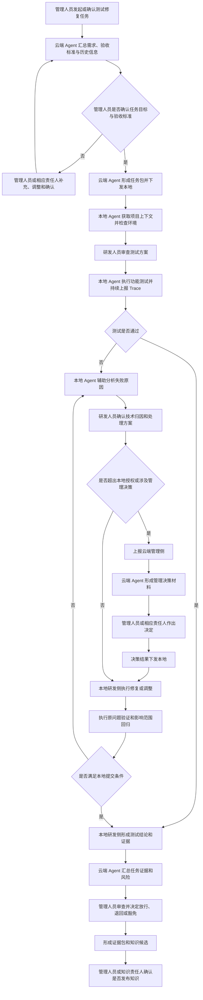

# 智能化软件功能测试与修复场景分析

版本：2.0  
日期：2026-07-10  
状态：优化稿

---

## 1. 文档目的

本文面向“智能化软件功能测试与修复”场景，重点回答以下三个问题：

1. **如何理解该场景**：明确建设目标、核心矛盾，以及云端管理侧与本地研发侧的责任边界。
2. **该场景如何运行**：说明测试任务从发起、执行、失败归因、修复、回归到审查放行的完整流程。
3. **需要建设哪些功能**：围绕任务管理、本地执行、人工审查、Trace 留痕和知识沉淀形成核心功能体系。

本文不展开具体测试框架、模型选型、接口协议、数据库表结构、调度算法和部署架构。后续进入需求设计阶段后，应进一步形成需求规格、任务模型、Trace 模型、测试资产模型、审批模型和系统集成方案。

---

# 2. 场景理解

## 2.1 场景定义

智能化软件功能测试与修复，不是简单让 AI 自动生成测试用例，也不是测试失败后直接让 AI 修改代码。

该场景面向智能研发过程中的**功能正确性验证与缺陷闭环**，由两个相互协作的人机单元共同完成：

1. **云端管理侧**：由云端 Agent 辅助管理人员，负责明确任务目标、验收标准、执行边界、审查要求和阶段结论。
2. **本地研发侧**：由本地 Agent 辅助研发人员，负责在既定目标和授权范围内完成测试设计、测试执行、问题定位、代码修复和回归验证。

云端 Agent 不具备独立决策权，其职责是汇总信息、分析证据、识别风险、提出建议、形成审查材料并记录管理人员决策；管理决策始终由管理人员或相应责任人作出。

本地 Agent 可以在研发人员监督和既定授权范围内执行测试、生成补丁、修改代码和运行回归，但工程判断和结果责任由研发人员承担。

全过程中的 Agent 交互、工具调用、测试结果、代码变更、人工意见和回归证据统一上报云端，形成可审查、可控制、可追溯、可复用的测试修复闭环。

一句话概括：

```text
云端管理侧决定“为什么做、做什么、做到什么程度、是否允许继续”；
本地研发侧决定“在既定目标和边界内具体怎么做”。
```

---

## 2.2 核心问题

本场景需要解决的不是：

```text
AI 能不能自动生成测试？
AI 能不能自动修改代码？
```

而是：

```text
系统依据什么判断功能是否正确？
测试失败究竟是需求、用例、数据、环境、契约还是代码问题？
哪些问题由本地研发侧自行处理，哪些问题必须升级到云端管理侧？
本地 Agent 可以执行到什么程度，研发人员需要承担什么责任？
云端 Agent 如何辅助管理人员审查，而不是替代管理人员决策？
修复后如何证明原问题已解决且相关功能未被破坏？
全过程如何形成可审查、可追溯、可复用的证据？
```

如果缺少明确的功能正确性依据，Agent 生成的测试可能只是基于代码结构和常见模式的合理猜测；如果缺少失败归因，Agent 可能通过修改业务代码、降低断言或绕过校验让测试变绿，但没有真正修复业务问题；如果缺少责任边界，云端管理侧可能过度干预本地工程细节，本地研发侧也可能越过管理边界自行改变任务目标和质量标准。

因此，本场景的本质不是“测试和修复自动化”，而是：

> 在管理决策与工程执行相分离的前提下，将功能正确性的判定、测试执行、失败归因、修复实施、影响回归、人工审查和知识沉淀形成受控闭环。

---

## 2.3 建设目标

本场景的建设目标包括：

1. 将需求、验收标准、业务规则和代码变更转化为可测试、可断言的测试依据。
2. 通过云端任务管理和本地 Agent 执行，提高功能测试设计与执行效率。
3. 区分管理决策与工程决策，避免云端管理侧微观干预本地技术实现。
4. 区分代码缺陷与需求、测试数据、环境、接口契约等非代码问题。
5. 在明确授权范围内辅助生成修复建议、代码补丁和测试补充。
6. 基于代码影响范围动态选择回归内容，而不是只重跑原失败用例。
7. 在涉及目标、标准、边界、风险和阶段推进时，由管理人员进行决策。
8. 对测试、修复和回归过程进行完整 Trace 留痕，支撑审查、复盘和责任追溯。
9. 将经过验证和人工确认的测试经验、缺陷模式和修复规则沉淀为项目知识。

---

## 2.4 为什么需要该场景

智能编码提高了代码生成速度，但功能验证能力不一定同步提升。

在缺少统一测试修复闭环的情况下，容易出现：

- Agent 声称任务已完成，但缺少功能验证证据。
- 代码变更速度增加，测试设计和人工验证跟不上。
- 测试人员难以及时识别本次变更涉及的高风险路径。
- 测试失败后，开发人员需要在需求、日志、接口、页面和代码之间反复定位。
- Agent 修复代码后，只验证原失败路径，导致相邻功能被破坏。
- 管理人员只能看到最终结果，无法判断任务是否按目标、标准和边界执行。
- 云端管理侧过度介入代码和测试实现细节，形成新的流程瓶颈。
- 本地研发侧未经确认自行改变测试范围、验收标准或风险边界。
- 测试与修复经验分散在会话、日志和个人经验中，无法形成项目资产。

其矛盾可以概括为：

```text
智能编码速度提升
  -> 单位时间内代码变更增多
  -> 功能行为变化增多
  -> 验证、定位和回归压力增大
  -> 如果没有正确性依据，测试会产生噪声
  -> 如果没有失败归因，修复可能偏离业务目标
  -> 如果没有责任边界，管理与执行会相互越位
  -> 如果没有审查和 Trace，过程无法管控和复盘
```

---

## 2.5 功能正确性依据

功能测试验证的是软件是否满足业务预期，而不只是接口是否连通、页面是否渲染或代码是否能够运行。

系统应综合以下事实源判断功能是否正确：

| 事实源 | 主要内容 | 作用 |
| --- | --- | --- |
| 需求事实 | 需求项、用户故事、变更任务 | 说明为什么建设该功能 |
| 验收事实 | 验收标准、通过条件、拒绝条件 | 说明什么结果可以判定为通过 |
| 业务规则 | 权限、状态流转、计算口径、校验规则 | 说明业务行为边界 |
| 接口契约 | API、数据结构、状态码、错误码 | 说明系统间交互约束 |
| 页面行为 | 路由、表单、按钮、提示、交互流程 | 说明用户操作预期 |
| 代码变更 | 分支、commit、diff、影响文件 | 说明实际修改内容 |
| 测试资产 | 用例、脚本、测试数据、历史执行记录 | 说明已有验证能力 |
| 历史缺陷 | 缺陷表现、复现步骤、根因和修复记录 | 说明已知风险 |
| 环境与版本 | 服务、配置、制品、依赖、运行环境 | 说明验证所处基线 |

当需求、测试、代码和运行结果相互冲突时，本地研发侧不得自行改变业务预期，应将冲突和证据上报云端管理侧，由管理人员或相应责任人确认正式依据。

---

# 3. 双侧人机协同模型

## 3.1 云端管理侧

云端管理侧由云端 Agent 和管理人员组成。

其中：

- **管理人员或相应责任人是决策主体**；
- **云端 Agent 是管理辅助工具，不具备独立决策权**。

云端管理侧关注的是：

- 为什么发起本次任务；
- 需要验证哪些需求和验收项；
- 什么结果才能视为完成；
- 哪些边界不得突破；
- 哪些风险必须上报；
- 是否允许继续推进；
- 是否接受剩余风险；
- 是否形成正式项目知识。

---

## 3.2 本地研发侧

本地研发侧由本地 Agent 和研发人员组成。

其中：

- **研发人员是工程决策和结果责任主体**；
- **本地 Agent 是分析、执行和生成辅助工具**。

本地研发侧直接接触：

- 项目代码和本地分支；
- 项目文档和配置；
- 测试框架和工具；
- 数据库、中间件和服务环境；
- 构建、启动和验证命令；
- 日志、截图和运行结果。

本地研发侧关注的是：

- 测试如何实现；
- 问题如何定位；
- 代码如何修改；
- 使用什么工具；
- 如何完成本地验证；
- 如何形成足够的工程证据。

---

## 3.3 双侧基本边界

```text
不改变目标、不降低标准、不扩大边界、不转移风险的工程问题，
由本地研发侧处理。

改变目标、标准、授权边界、风险承担方式或阶段状态的问题，
由本地研发侧上报云端管理侧，由管理人员或相应责任人决定。
```

---

## 3.4 双侧责任边界表

| 事项 | 云端管理侧 | 本地研发侧 |
| --- | --- | --- |
| 是否发起测试修复任务 | 管理人员决定，云端 Agent 辅助整理依据 | 可提出建议 |
| 测试目标和任务范围 | 管理人员确认 | 提供技术可行性反馈 |
| 验收标准和业务预期 | 管理人员或业务责任人确认 | 按标准实施 |
| 测试重点和质量要求 | 管理人员确认 | 转化为技术测试方案 |
| 测试实现方式 | 原则上不干预具体技术细节 | 研发人员决定 |
| 测试工具选择 | 可规定组织约束 | 在约束内选择 |
| 测试数据构造 | 规定安全、合规和使用边界 | 决定具体构造方式 |
| 失败技术归因 | 云端 Agent 汇总证据供审查 | 本地完成主要技术判断 |
| 是否属于需求或规则问题 | 管理人员或业务责任人裁决 | 提交证据和建议 |
| 代码具体如何修改 | 不作具体实现决策 | 研发人员决定 |
| 是否允许超范围修改 | 管理人员或相应责任人批准 | 提出申请 |
| 回归质量要求 | 管理人员确认 | 研发人员确定具体回归集 |
| 是否跳过必测项 | 管理人员批准或拒绝 | 无权自行跳过 |
| 修复是否达到可提交状态 | 接收结果和证据 | 研发人员判断 |
| 是否接受剩余风险 | 管理人员决定 | 说明技术风险 |
| 是否进入下一阶段 | 管理人员决定 | 无权决定 |
| 是否形成正式项目知识 | 管理人员或知识责任人批准 | 提交知识候选 |

---

# 4. 云端管理侧的责任

## 4.1 管理人员的决策责任

### 4.1.1 任务目标决策

- 确认本次需要测试和修复的功能范围。
- 确认任务优先级和关联版本。
- 决定是否追加、缩减或终止任务范围。
- 确认本次任务的完成标准。

### 4.1.2 验收标准决策

- 确认什么行为才是正确行为。
- 确认哪些场景必须通过。
- 解决需求、验收标准和业务规则之间的冲突。
- 确认测试证据是否满足审查要求。

### 4.1.3 流程控制决策

- 决定任务是否进入测试阶段。
- 决定是否允许进入智能修复。
- 决定是否暂停、退回或终止任务。
- 决定是否进入合并、交付或下一阶段。

### 4.1.4 风险与例外决策

- 确认哪些高风险修改必须人工处理。
- 决定是否接受部分测试未完成。
- 决定是否接受已知缺陷或剩余风险。
- 批准或拒绝流程豁免。

### 4.1.5 规则与知识决策

- 确认项目测试和修复规则。
- 确认本地 Agent 的执行边界。
- 批准将经验发布为项目知识。
- 决定知识的适用范围和有效版本。

---

## 4.2 云端 Agent 的辅助责任

云端 Agent 可以：

- 汇总需求、任务、测试结果、代码变更和本地 Trace。
- 检查需求、验收标准和业务规则是否缺失或冲突。
- 将复杂执行过程压缩为管理人员可理解的摘要。
- 分析测试覆盖情况、执行偏差和剩余风险。
- 对比不同管理方案的范围、成本和风险。
- 提出测试范围、流程处理和风险处置建议。
- 识别需要哪类责任人参与。
- 生成待审查事项和结构化决策材料。
- 记录管理人员的决定、意见和责任人。
- 将管理意见转化为明确任务要求并下发本地。
- 从历史任务中提取知识候选。

云端 Agent 不得：

- 自行确认需求和验收标准。
- 自行批准测试计划。
- 自行批准或拒绝修复。
- 自行决定任务放行。
- 自行接受剩余风险。
- 自行批准流程豁免。
- 自行扩大本地 Agent 的修改权限。
- 自行修改项目管理规则。
- 自行将候选经验发布为正式知识。
- 代表管理人员承担结果责任。

因此，系统应采用以下表述：

```text
云端 Agent 汇总测试、修复和回归证据，
辅助管理人员判断任务是否放行。
```

不应表述为：

```text
云端 Agent 决定任务是否放行。
```

---

# 5. 本地研发侧的责任

## 5.1 研发人员的工程责任

### 5.1.1 测试实施决策

- 选择适合的测试框架和工具。
- 确定测试场景如何落地。
- 确定测试数据如何构造。
- 确定接口、页面或端到端测试的实现方式。
- 调整测试执行顺序和本地资源。

### 5.1.2 技术归因决策

- 判断失败来自前端、后端、数据、配置还是环境。
- 判断代码问题位于哪个模块。
- 判断是否需要增加日志或补充验证。
- 审查本地 Agent 给出的归因是否可信。

### 5.1.3 修复实现决策

- 选择具体代码修复方案。
- 确定修改哪些类、方法、配置或测试。
- 判断采用局部修复还是重构。
- 审查和接受本地 Agent 生成的补丁。
- 处理 Agent 无法完成的复杂技术问题。

### 5.1.4 本地验证决策

- 确认本地环境是否具备验证条件。
- 判断哪些测试需要重跑。
- 判断是否需要扩大技术回归范围。
- 确认修复是否达到可提交状态。

---

## 5.2 本地 Agent 的辅助和执行责任

在既定任务和授权范围内，本地 Agent 可以：

- 读取项目代码、文档和配置。
- 获取任务要求和项目规则。
- 分析代码变更和影响范围。
- 生成测试场景、测试用例和测试代码。
- 调用本地测试、构建和启动工具。
- 收集日志、截图、请求响应和错误堆栈。
- 分析测试失败并提出候选根因。
- 提出修复方案。
- 生成或应用代码补丁。
- 执行直接验证和影响回归。
- 上报执行过程、判断依据和产出物。

本地 Agent 不得：

- 自行改变任务目标。
- 自行修改验收标准。
- 自行改变业务规则。
- 自行扩大任务范围。
- 自行跳过云端要求的测试。
- 自行降低质量门槛。
- 自行接受未解决风险。
- 自行宣布任务正式完成。
- 自行决定项目阶段放行。
- 将本地经验直接发布为正式项目知识。

---

# 6. 双侧协同与升级规则

## 6.1 云端管理侧不应干预的事项

以下事项原则上由本地研发侧处理，云端管理侧不应微观干预：

- 具体类和方法如何修改。
- 测试代码放在哪个文件。
- 使用何种等价断言写法。
- 本地测试命令如何组合。
- 日志应增加在哪个代码位置。
- 低风险代码如何重构。
- 测试执行的具体先后顺序。
- 在授权范围内选择哪个修复补丁。
- 如何解决普通编译、依赖和环境问题。

云端管理侧应关注结果是否满足要求，而不是远程控制每一个技术动作。

---

## 6.2 本地研发侧必须升级的事项

本地研发人员和本地 Agent 遇到以下情况时，不能继续自行决定：

1. 需求或验收标准存在歧义。
2. 测试结果表明原验收标准可能不合理。
3. 修复需要改变业务规则。
4. 修复需要修改公共接口或跨团队契约。
5. 修复范围明显超出原任务。
6. 必须跳过云端规定的测试或门禁。
7. 无法完成要求的回归验证。
8. 存在无法消除的剩余风险。
9. 修复可能影响其他任务、版本或项目。
10. 需要调整任务优先级、交付时间或资源。
11. 本地 Agent 连续多轮无法完成修复。
12. 需要将一次经验上升为项目级规则。

本地研发侧上报时，应形成结构化升级材料：

- 当前事实。
- 已执行动作。
- 技术判断。
- 支撑证据。
- 可选方案。
- 各方案技术影响。
- 需要管理侧决定的具体问题。

---

## 6.3 管理决策材料

云端 Agent 对本地上报信息进行整理后，应形成结构化管理决策材料，至少包括：

| 内容 | 说明 |
| --- | --- |
| 决策事项 | 当前需要管理人员决定什么 |
| 触发原因 | 为什么本地研发侧不能继续自行处理 |
| 已确认事实 | 有证据支持的客观信息 |
| 本地技术判断 | 研发人员与本地 Agent 的分析结果 |
| 不确定信息 | 当前仍缺少什么 |
| 可选方案 | 可执行的处理选项 |
| 影响范围 | 对需求、代码、测试、进度和交付的影响 |
| 风险比较 | 各方案的主要风险 |
| 云端 Agent 建议 | 供管理人员参考的建议和理由 |
| 建议责任人 | 应由谁作出决定 |
| 决策后动作 | 决定后本地研发侧需要执行什么 |

云端 Agent 的作用是降低管理人员理解复杂工程过程的成本，而不是替代管理人员作出决定。

---

# 7. 总体业务流程

## 7.1 总体流程图



---

## 7.2 流程一：任务发起与目标确认

### 目标

建立一次可管理、可执行、可审查的功能测试与修复任务。

### 触发方式

- 需求或开发任务进入测试阶段。
- 研发人员主动申请测试。
- PR、commit 或代码变更触发。
- 管理人员发起专项验证。
- 历史缺陷回归任务触发。
- 版本交付前触发验收测试。

### 云端 Agent 辅助内容

- 汇总项目、需求、版本和历史测试信息。
- 识别缺失的验收标准和业务规则。
- 提出测试重点和风险建议。
- 生成任务确认材料。

### 管理人员决策内容

- 是否发起任务。
- 本次测试和修复的目标。
- 任务范围和优先级。
- 关联需求和版本。
- 验收标准。
- 完成条件。

### 输出

- 经管理人员确认的测试修复任务。
- 任务目标和范围。
- 验收标准。
- 责任人。
- 代码基线。
- 初始风险要求。

---

## 7.3 流程二：任务包形成与下发

### 目标

将管理人员确认的目标和约束转化为本地研发侧可执行的任务包。

### 云端 Agent 辅助内容

- 将任务目标结构化。
- 汇总需求、验收项、业务规则和历史缺陷。
- 整理测试重点、必测项和证据要求。
- 根据既有项目规则整理修复边界。
- 标注需要升级处理的条件。

### 管理人员确认内容

- 必测范围。
- 质量要求。
- 修复授权边界。
- 禁止修改范围。
- 必须上报的风险和证据。

### 输出

- 测试修复任务包。
- 需求与验收项清单。
- 必测项。
- 修复授权边界。
- 升级条件。
- Trace 和证据要求。

---

## 7.4 流程三：本地上下文获取与执行准备

### 目标

确保本地研发侧获得完成任务所需的项目事实和可用环境。

### 本地 Agent 辅助内容

1. 获取云端任务包。
2. 读取本地代码、需求文档、项目规则和历史测试资产。
3. 识别当前分支、commit、未提交变更和依赖模块。
4. 检查启动命令、测试命令、数据库、中间件和外部依赖。
5. 初始化测试数据或模拟依赖。
6. 识别环境异常并生成处理建议。

### 研发人员决策内容

- 当前代码和环境是否可作为测试基线。
- 是否需要调整本地执行方式。
- 是否需要补充项目上下文。
- 是否具备开始测试的条件。

### 输出

- 本地项目上下文快照。
- 执行环境检查结果。
- 可执行测试命令。
- 依赖与测试数据状态。
- 环境问题清单。

环境不满足执行条件时，不得将环境失败直接判定为代码缺陷。

---

## 7.5 流程四：测试设计与执行

### 目标

根据任务包和本地项目事实设计并执行高价值功能测试。

### 测试场景范围

- 正常业务路径。
- 异常和拒绝路径。
- 权限路径。
- 状态流转路径。
- 数据校验和边界值路径。
- 接口契约路径。
- 页面交互路径。
- 历史缺陷复现路径。
- 代码变更影响路径。

### 本地 Agent 辅助内容

- 生成测试场景、用例、数据和断言。
- 关联需求、验收项和业务规则。
- 生成测试执行计划。
- 调用测试工具。
- 采集日志、截图、请求响应和错误堆栈。
- 持续上报测试过程 Trace。

### 研发人员决策内容

- 测试方案是否适合当前项目。
- 测试数据和断言是否正确。
- 是否需要补充或调整测试。
- 是否接受本地 Agent 的执行计划。

### 输出

- 测试场景清单。
- 测试用例。
- 测试数据。
- 测试执行结果。
- 测试证据。
- 执行 Trace。

---

## 7.6 流程五：失败归因与本地处理

### 目标

识别测试失败的真实原因，防止错误修复。

### 归因类型

| 类型 | 典型表现 | 推荐处理 |
| --- | --- | --- |
| 需求不清 | 缺少通过条件或异常规则 | 升级云端管理侧 |
| 验收标准冲突 | 不同验收项互相矛盾 | 升级相应责任人裁决 |
| 测试用例错误 | 断言与已确认业务规则不一致 | 本地研发侧修正 |
| 测试数据错误 | 数据状态或关联关系不满足前置条件 | 本地研发侧重建数据 |
| 环境问题 | 服务、配置、依赖不可用 | 本地研发侧处理 |
| 接口契约变化 | 前后端或服务间契约不一致 | 视影响范围决定是否升级 |
| 页面交互缺陷 | 按钮、路由、表单和提示异常 | 本地研发侧修复 |
| 业务逻辑缺陷 | 实现不符合已确认需求或规则 | 本地研发侧修复 |
| 回归缺陷 | 新修改破坏历史功能 | 本地研发侧分析并修复 |
| 非确定性失败 | 异步、时序、网络或并发导致偶发问题 | 本地研发侧重跑和隔离 |

### 本地 Agent 辅助内容

- 分析日志、截图、请求响应和环境状态。
- 对比测试断言、接口契约和代码变更。
- 提出候选根因和证据。
- 生成处理建议。

### 研发人员决策内容

- 确认技术归因。
- 确认本地可处理还是需要升级。
- 确认修复方案。
- 确认是否接受本地 Agent 生成的补丁。

### 输出

- 经研发人员确认的失败归因。
- 证据链。
- 本地处理方案或升级事项。
- 修复建议或候选补丁。

---

## 7.7 流程六：管理事项升级与决策

### 目标

对超出本地工程边界的问题进行管理决策。

### 触发条件

- 需求或验收标准歧义。
- 业务规则需要调整。
- 任务范围需要扩大。
- 需要跳过必测项或门禁。
- 修复涉及公共接口、跨团队契约或重大影响。
- 无法完成要求的回归。
- 存在剩余风险。
- 需要调整进度、优先级或资源。
- 需要形成项目级规则。

### 云端 Agent 辅助内容

- 汇总本地上报事实和证据。
- 区分事实、推断和不确定信息。
- 形成可选方案和影响比较。
- 提出建议和建议责任人。
- 记录管理人员决定。

### 管理人员或相应责任人决策内容

- 需求和标准如何调整。
- 是否扩大授权。
- 是否修改任务范围。
- 是否允许豁免或延期。
- 是否接受剩余风险。
- 是否继续、退回或终止任务。

### 输出

- 管理决策。
- 调整后的任务要求。
- 新的授权边界。
- 风险接受或拒绝记录。
- 后续执行要求。

---

## 7.8 流程七：修复与回归验证

### 目标

在确认边界内解决问题，并证明相关功能未被破坏。

### 本地 Agent 辅助内容

- 生成或应用修复补丁。
- 更新或补充测试。
- 重跑原失败用例。
- 分析代码、接口、数据模型、状态机和页面路由影响。
- 推荐并执行影响范围回归。
- 采集修复和回归证据。

### 研发人员决策内容

- 采用何种代码修复方案。
- 是否接受本地 Agent 生成的修改。
- 是否需要扩大技术回归范围。
- 是否达到本地可提交状态。

### 执行约束

- 只修改授权范围内的文件和模块。
- 优先采用最小修改。
- 不删除失败测试。
- 不降低断言强度。
- 不绕过权限、校验和业务规则。
- 不擅自改变已确认的接口和数据口径。
- 修复后补充必要测试。
- 生成修改说明和影响分析。

### 输出

- 修复代码。
- 修改说明。
- 原问题验证结果。
- 影响范围分析。
- 回归结果。
- 新增问题和未覆盖风险。
- 本地提交结论。

---

## 7.9 流程八：云端审查与阶段结论

### 目标

由云端 Agent 辅助管理人员审查任务是否满足目标、标准和边界要求。

### 云端 Agent 辅助内容

- 汇总测试、归因、修复、回归和人工干预证据。
- 检查是否覆盖必测项。
- 检查是否存在越权修改。
- 识别删除测试、降低断言和规避规则行为。
- 汇总未覆盖风险和剩余问题。
- 形成审查摘要和建议结论。

### 管理人员决策内容

- 放行。
- 退回补测。
- 退回重新修复。
- 转人工专项处理。
- 带风险豁免放行。
- 终止任务。

### 输出

- 管理审查结论。
- 阶段状态。
- 退回意见或豁免记录。
- 测试修复证据包。
- 知识候选。

---

## 7.10 流程九：知识审查与沉淀

### 目标

将经过验证的经验转化为后续任务可复用的项目知识。

### 知识形成流程

```text
本地测试与修复 Trace
  -> 云端 Agent 提取知识候选
  -> 关联需求、代码、测试和证据
  -> 管理人员或知识责任人审查
  -> 确认适用范围和有效版本
  -> 发布为项目知识
  -> 后续本地 Agent 执行时使用
```

### 云端 Agent 辅助内容

- 提取重复缺陷模式和高风险路径。
- 生成知识候选。
- 关联来源证据。
- 提示适用范围和潜在误用风险。
- 记录审查和发布过程。

### 管理人员或知识责任人决策内容

- 是否发布。
- 适用项目、模块和版本。
- 是否形成测试规则或修复规则。
- 何时失效或需要重新审查。

### 输出

- 项目知识条目。
- 测试规则。
- 修复约束。
- Agent 上下文更新。

---

# 8. 功能设计

## 8.1 云端任务与管理辅助

作为智能化软件功能测试与修复的云端管理入口，承接项目任务、需求、验收标准、本地执行结果和历史信息，辅助管理人员完成任务目标确认、范围管理、过程审查和阶段判断。

### 主要功能

- 测试修复任务创建、分派和状态管理。
- 需求、验收标准和业务规则汇总。
- 任务目标和范围确认材料生成。
- 信息缺失和事实冲突识别。
- 测试重点、风险和证据要求建议。
- 任务包生成与下发。
- 本地执行状态和风险汇总。
- 管理审查事项生成。
- 管理决策记录和下发。
- 任务退回、暂停、终止和放行管理。

### 关键输出

- 经管理人员确认的测试修复任务。
- 测试修复任务包。
- 管理审查事项。
- 管理决策记录。
- 阶段结论。

---

## 8.2 本地项目上下文与执行准备

作为本地测试与修复执行入口，获取项目代码、需求文档、测试资产、环境依赖和团队规则，完成项目状态识别、执行条件检查和测试准备。

### 主要功能

- 云端任务包接收。
- 项目代码、文档和配置读取。
- 当前分支、commit 和未提交变更识别。
- 项目 Agent 工作流和 Skill 加载。
- 测试框架、启动命令和验证命令识别。
- 数据库、中间件和外部依赖检查。
- 测试数据初始化和模拟依赖准备。
- 本地环境健康检查。
- 环境问题识别和处理建议。
- 任务中断后的断点恢复。

### 关键输出

- 项目上下文快照。
- 代码和版本基线。
- 环境检查结果。
- 可执行测试命令。
- 测试数据状态。
- 本地执行准备结论。

---

## 8.3 智能测试设计与执行

作为功能正确性验证的本地执行能力，基于任务包和项目上下文，辅助研发人员完成测试场景生成、用例生成、执行计划制定、测试执行和证据采集。

### 主要功能

- 正常、异常、权限、状态和边界测试场景生成。
- 历史缺陷复现和代码变更影响场景生成。
- 测试用例步骤、前置条件、数据和断言生成。
- 测试场景与需求、验收项和业务规则关联。
- 测试优先级排序和执行计划生成。
- 接口、页面、端到端、冒烟和回归测试调用。
- 人工辅助测试步骤生成。
- 测试执行超时、重试和阻塞控制。
- 日志、截图、视频、请求响应和错误堆栈采集。
- 测试结果汇总和实时上报。

### 关键输出

- 测试场景清单。
- 测试用例。
- 测试数据。
- 测试执行计划。
- 测试执行结果。
- 测试证据。
- 测试执行 Trace。

---

## 8.4 本地失败归因与修复辅助

作为测试失败后的本地工程处理能力，对需求、测试、数据、环境、契约和代码进行多源分析，辅助研发人员完成技术归因、修复方案选择和代码修改。

### 主要功能

- 断言差异分析。
- 日志、截图、请求响应和环境状态分析。
- 测试数据前置条件校验。
- 接口契约差异分析。
- 代码 diff 和调用关系关联。
- 历史缺陷相似性匹配。
- 失败类型分类和候选根因生成。
- 本地处理或升级建议。
- 根因解释和修复方案生成。
- 候选代码补丁生成。
- 修改文件和模块范围控制。
- 删除测试、降低断言和绕过校验行为检测。
- 修复轮次和终止条件控制。
- 修复说明、影响分析和测试补充生成。

### 关键输出

- 候选失败归因。
- 证据链。
- 修复建议。
- 候选补丁。
- 修改说明。
- 影响分析。
- 升级事项。

---

## 8.5 管理审查与升级决策支持

作为云端管理侧的人机协同能力，对本地上报的需求冲突、范围越界、剩余风险和阶段问题进行整理，辅助管理人员作出决策。

### 主要功能

- 本地升级事项接收。
- 事实、推断和不确定信息区分。
- 可选方案和影响范围生成。
- 风险比较和建议意见生成。
- 建议责任人识别。
- 管理决策记录。
- 决策结果和执行要求下发。
- 风险豁免申请和审批记录。
- 最终放行、退回和终止管理。
- 人工干预留痕。

### 关键输出

- 管理决策材料。
- 决策结论。
- 调整后的任务要求。
- 授权和豁免记录。
- 阶段结论。

---

## 8.6 Trace、证据与知识管理

作为测试与修复全过程的可追溯基础，统一记录云端与本地 Agent 交互、工具调用、测试执行、代码修改、人工意见和回归结果，形成证据包并沉淀项目知识。

### 主要功能

- 云端 Agent 会话 Trace。
- 本地 Agent 会话 Trace。
- Agent 步骤和关键判断记录。
- 工具调用记录。
- 文件读取和变更记录。
- 测试计划、执行和结果 Trace。
- 失败归因和修复过程 Trace。
- 管理决策和人工意见记录。
- 修复前后代码版本关联。
- 回归执行记录。
- 任务、需求、commit 和 PR 关联。
- Trace 本地缓存、断点续传和重复上报识别。
- 敏感信息脱敏和上报范围控制。
- 测试修复证据包生成。
- 项目知识候选提取、审查、发布和失效管理。

### 关键输出

- 完整任务 Trace。
- 测试修复证据包。
- 管理决策记录。
- 需求覆盖关系。
- 项目知识候选。
- 正式项目知识。
- 后续 Agent 上下文更新。

---

# 9. 关键业务对象

| 对象 | 说明 |
| --- | --- |
| 测试修复任务 | 一次功能测试与修复工作的管理单元 |
| 测试修复任务包 | 云端管理侧下发给本地研发侧的目标、依据、边界和证据要求 |
| 功能正确性依据 | 需求、验收标准、业务规则、接口契约和页面行为 |
| 测试场景 | 围绕业务路径形成的测试范围 |
| 测试用例 | 可自动或人工执行的步骤、数据和断言 |
| 测试执行 | 在特定代码和环境基线上的一次运行记录 |
| 失败归因 | 对失败类型、根因和证据的技术判断 |
| 升级事项 | 超出本地研发侧处理边界、需要管理决策的问题 |
| 管理决策材料 | 云端 Agent 为管理人员整理的事实、方案、影响和建议 |
| 管理决策 | 管理人员或相应责任人作出的正式决定 |
| 修复补丁 | 本地 Agent 或研发人员形成的代码修改候选 |
| 回归任务 | 对原问题和关联影响范围进行验证的任务 |
| Trace | Agent 会话、工具调用、文件变更、测试和人工意见的过程记录 |
| 证据包 | 支撑测试结论、修复结论和管理结论的材料集合 |
| 项目知识 | 经过人工审查后可被后续 Agent 复用的规则和经验 |

---

# 10. 单次任务完成标准

一次功能测试与修复任务完成，应至少满足：

1. 测试目标具有明确的需求、验收项或业务规则依据。
2. 计划执行的核心测试场景已经完成。
3. 所有失败项均完成技术归因，或已明确升级处理。
4. 代码缺陷已修复，非代码问题已形成对应处理结果。
5. 原失败用例已通过，或已形成正式风险豁免。
6. 已完成与修改影响范围匹配的回归验证。
7. 未覆盖风险已显式记录。
8. 超出本地授权的事项均已获得管理决策。
9. 测试、修复、回归和人工意见已上传云端。
10. 研发人员已确认本地达到可提交状态。
11. 管理人员已作出放行、退回、豁免或终止决定。
12. 值得复用的经验已形成知识候选，并进入审查流程。

---

# 11. 成功标准

本场景的成功不以生成测试数量或自动修复数量为主要判断标准，而应关注以下结果。

## 11.1 管理与执行边界清晰

- 管理人员不被迫参与日常工程细节。
- 研发人员不擅自改变任务目标和质量标准。
- 云端 Agent 不拥有独立决策权。
- 本地 Agent 只在授权范围内执行。
- 超出边界的问题能够及时升级。

## 11.2 功能正确性更可判断

- 功能需求能够形成明确验收项。
- 测试场景能够追溯到需求、规则或历史缺陷。
- 测试结论具备版本、环境和执行证据。

## 11.3 缺陷处理更可控

- 代码问题与需求、测试、数据和环境问题能够被区分。
- Agent 不通过删除测试或降低断言规避问题。
- 修复后能够执行合理的影响范围回归。
- 研发人员能够对技术归因和代码修改负责。

## 11.4 管理审查更有效

- 云端 Agent 能够将复杂工程过程压缩为可审查信息。
- 管理人员只对目标、范围、风险和阶段作出决定。
- 放行、退回和豁免均有明确依据。
- 测试和修复过程能够复盘和追责。

## 11.5 项目经验可复用

- 高频缺陷和高风险路径能够沉淀为测试规则。
- 有效修复经验能够形成项目知识。
- 后续本地 Agent 能够使用已审查的知识减少重复错误。
- 团队测试规范能够持续演进。

## 11.6 可度量指标

- 需求和验收项测试覆盖率。
- 本地失败归因准确率。
- 本地低风险修复自动化比例。
- 修复后回归通过率。
- 修复后缺陷复开率。
- 缺陷平均定位时间。
- 缺陷平均修复时间。
- 本地升级事项命中率。
- 管理审查平均处理时间。
- 测试证据完整率。
- 项目知识复用次数。

---

# 12. 风险与约束

## 12.1 云端 Agent 越权

### 风险

云端 Agent 被错误设计为审批、放行或风险接受主体。

### 约束措施

- 所有正式管理结论必须记录明确责任人。
- 云端 Agent 输出必须标注为分析、建议或材料。
- 放行、豁免、范围调整和知识发布必须由人员确认。
- 系统界面区分“Agent 建议”和“人工决定”。

---

## 12.2 云端管理侧过度干预本地工程

### 风险

管理人员介入代码、工具和测试实现细节，导致流程低效并削弱研发责任。

### 约束措施

- 云端只下发目标、标准、边界和证据要求。
- 不要求管理人员逐项审批普通技术动作。
- 本地授权范围内由研发人员自主处理。
- 只有目标、标准、边界和风险变化时才升级。

---

## 12.3 本地研发侧越过管理边界

### 风险

本地研发人员或本地 Agent 自行调整验收标准、跳过测试或接受风险。

### 约束措施

- 任务包中明确必测项、禁止事项和升级条件。
- 检测测试删除、断言降低和范围外修改。
- 任务放行权保留在云端管理侧。
- 所有本地偏差必须形成 Trace 并上报。

---

## 12.4 测试依据不足

### 风险

需求、验收标准和业务规则不清时，无法可靠生成测试和修复结论。

### 约束措施

- 设置可测试性检查。
- 将 Agent 推断与正式事实明确区分。
- 对缺失信息生成待澄清问题。
- 未经人员确认的推断不得作为正式验收依据。

---

## 12.5 失败归因错误

### 风险

错误归因可能导致修改正确代码、掩盖环境问题或破坏业务规则。

### 约束措施

- 保留完整证据链。
- 由研发人员确认技术归因。
- 涉及需求和规则的问题必须升级。
- 将误判案例回流到规则和知识库。

---

## 12.6 自动修复越权

### 风险

本地 Agent 可能修改未授权文件、接口、测试断言或业务规则。

### 约束措施

- 明确允许和禁止修改范围。
- 默认在独立工作分支中修改。
- 检测删除测试、降低断言和绕过校验行为。
- 超出范围时立即停止并升级。
- 代码修改由研发人员审查和确认。

---

## 12.7 回归范围不足

### 风险

只验证原失败用例，可能遗漏对相关功能的破坏。

### 约束措施

- 基于代码、接口、数据模型和状态机选择回归范围。
- 关联历史缺陷和关键业务路径。
- 显式展示未覆盖风险。
- 高风险修改触发增强回归。

---

## 12.8 Trace 上报安全风险

### 风险

本地 Agent 交互、日志和文件内容中可能包含源代码、账号、密钥和敏感数据。

### 约束措施

- 配置允许上报和禁止上报的数据范围。
- 对密钥、账号、连接串和业务数据进行脱敏。
- 支持本地缓存、审查后上报和仅上传摘要。
- 对 Trace 设置项目权限、保留周期和审计记录。

---

## 12.9 知识污染

### 风险

未经验证的 Agent 推断、临时方案和过时经验可能被错误沉淀并影响后续任务。

### 约束措施

- Trace 不直接转化为正式知识。
- 知识必须关联来源证据。
- 正式知识必须由人员审查。
- 知识条目标注适用范围、版本和失效条件。
- 支持撤销、更新和重新发布。

---

# 13. 第一阶段建设范围建议

为避免将本场景扩张为完整测试管理平台，第一阶段建议聚焦最小闭环。

## 13.1 第一阶段核心范围

1. 云端测试修复任务创建和任务包下发。
2. 需求、验收项和任务目标辅助整理。
3. 管理人员确认目标、范围、边界和证据要求。
4. 本地项目上下文获取和测试环境检查。
5. 测试场景、用例和执行计划生成。
6. 接入现有测试工具完成测试执行。
7. 测试日志、截图、结果和本地 Agent Trace 上报。
8. 本地失败分类、技术归因和修复建议生成。
9. 研发人员确认归因和候选补丁。
10. 超出本地边界的问题升级到云端。
11. 云端 Agent 形成管理决策材料。
12. 管理人员作出范围、风险和阶段决策。
13. 本地执行修复、原问题验证和基础影响回归。
14. 云端 Agent 汇总证据，管理人员完成放行、退回或豁免。
15. 测试修复证据包和知识候选生成。

## 13.2 第一阶段暂不重点建设

- 自研完整 UI、接口和性能测试引擎。
- 自研 CI/CD、代码仓库和缺陷管理平台。
- 复杂 K8s 环境自动编排。
- 无研发人员监督的全自动代码修复。
- 无管理人员确认的自动风险接受和自动放行。
- 大规模跨项目知识自动发布。
- 完整企业测试资产管理平台。

平台应优先完成“管理辅助、工程执行、双侧升级、Trace 和知识”的闭环，并通过集成现有工具完成实际测试。

---

# 14. 待确认问题

后续进入需求设计前，建议重点确认：

1. 云端管理侧中的“管理人员”具体包括哪些角色。
2. 哪些事项由项目负责人、业务负责人、测试负责人和技术负责人分别决定。
3. 测试任务主要由需求阶段、研发人员、PR 还是管理人员触发。
4. 需求、验收标准和业务规则分别由谁维护和确认。
5. 云端允许保存哪些本地代码、日志和 Agent 会话内容。
6. 本地 Agent 第一阶段允许自动执行哪些操作。
7. 哪些代码修改必须由研发人员逐项确认。
8. 哪些事项必须升级云端管理侧。
9. 管理决策是否支持会签或多角色确认。
10. 本地 Trace 上报采用实时、批量还是任务结束后汇总方式。
11. 本地断网、任务中断和重复执行如何处理。
12. 本地 Agent 自动修复的最大轮次和终止规则是什么。
13. 管理意见如何转化为本地 Agent 可执行的任务要求。
14. 测试证据需要保存多久，是否纳入项目审计或交付文档。
15. 项目知识由谁审查、如何发布以及如何处理版本失效。
16. 第一阶段以哪类项目和哪类功能作为试点。
17. 哪些指标用于证明该场景确实降低了测试和修复成本。

---

# 15. 场景总结

“智能化软件功能测试与修复”的核心，不是让云端 Agent 远程替代管理人员决策，也不是让本地 Agent 替代研发人员承担工程责任，而是形成两个边界清晰、相互协作的人机单元。

```text
管理人员决定任务目标、验收标准、执行边界、风险接受和阶段推进；
云端 Agent 负责汇总信息、分析证据、形成建议和辅助审查。

研发人员决定测试实现、技术归因、代码修复和本地验证；
本地 Agent 负责获取上下文、调用工具、执行测试、生成补丁和采集证据。
```

两侧之间通过任务包、执行 Trace、测试证据、升级事项、管理决定和审查意见进行协作：

```text
云端管理侧管目标、管标准、管边界、管风险、管结果；
本地研发侧管实现、管执行、管定位、管修复、管验证。
```

最终形成：

> 管理决策不越位、工程执行不失控、Agent 辅助不替责、任务过程可审查、测试修复可追溯、项目经验可沉淀。
