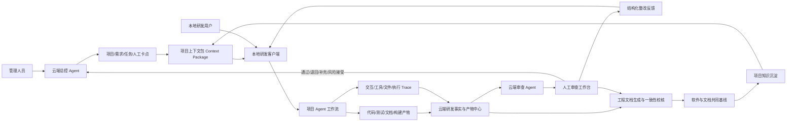
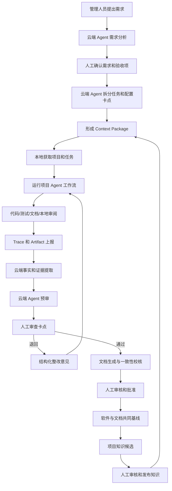

# 生成与智能编码一致的软件工程文档场景分析

**版本：** 0.3  
**日期：** 2026-07-10  
**状态：** 场景分析优化稿  
**适用范围：** 云端研发治理与本地智能编码协同场景  

---

## 1. 文档目的

本文围绕“生成与智能编码一致的软件工程文档”场景，结合“云端治理 Agent + 本地研发 Agent 工作流 + 全过程 Trace + 人工卡点 + 项目知识沉淀”的产品雏形，重点回答以下问题：

1. 该场景的本质是什么，主要解决什么问题。
2. 云端管理侧与本地研发侧分别承担什么职责。
3. 软件工程文档如何参与智能编码，而不是在编码完成后被动补写。
4. 用户与 Agent、Agent 与 Agent 的交互过程如何转化为可审查的研发事实和证据。
5. 管理人员如何通过云端 Agent 完成需求分析、任务规划、阶段审查和人工决策。
6. 软件工程文档如何随智能编码过程持续生成、校核、审核和形成基线。
7. 项目研发过程如何沉淀为可供后续 Agent 复用的项目知识。
8. 第一阶段应优先建设哪些流程和功能，如何形成可验收闭环。

本文属于场景分析和业务方案文档，重点定义场景定位、角色边界、核心对象、业务流程、功能能力和验收目标，不展开数据库表结构、接口协议、部署架构和详细实现任务拆分。

---

## 2. 场景背景

随着智能编码工具和研发 Agent 逐步进入软件研发过程，需求理解、方案生成、代码编写、测试生成、缺陷修复和代码审查的效率显著提高，但当前智能编码仍存在以下问题：

- 管理人员难以持续掌握本地 Agent 实际执行了什么。
- 云端需求、任务和规则与本地编码过程之间缺少统一上下文。
- 本地用户可能需要反复向 Agent 解释项目背景、需求和约束。
- 用户与 Agent、Agent 与 Agent 的交互过程缺少统一留痕。
- Agent 汇报“已完成”，但管理人员无法快速验证真实实现范围和测试情况。
- 代码、测试、文档和审查记录分散在不同工具中，难以形成完整证据链。
- 软件工程文档通常在阶段结束后集中补写，无法及时反映真实软件变化。
- 文档内容可能来源于 Agent 推断，而不是已确认工程事实。
- 云端审查意见无法结构化反馈给本地 Agent 继续整改。
- 项目中形成的设计决策、问题解决方法和审查经验没有持续沉淀。
- 后续 Agent 无法稳定复用已经确认的项目知识，容易重复犯错。

因此，本场景不能被简单建设为“AI 文档生成器”，也不能只是“把本地 Agent 日志上传到云端”。

需要建设的是一套贯穿项目管理、智能编码、过程采集、人工审查、文档形成和知识沉淀的云边协同研发闭环。

---

## 3. 场景定位

### 3.1 场景定义

“生成与智能编码一致的软件工程文档”，是以项目、需求和研发任务为主线，由云端 Agent 辅助管理人员完成需求分析、任务划分、工作流配置和人工审查；由本地端获取受控项目上下文并运行项目配置的 Agent 工作流，完成代码开发、测试验证和过程审阅；同时将用户与 Agent、Agent 与 Agent 的交互信息、工具调用、文件变化、代码提交、测试结果、构建结果和研发产物持续上报云端形成 Trace。

云端基于 Trace、研发产物、工程事实和人工审查结论，持续生成、更新和校核软件工程文档，并将已确认的需求、设计、实现、测试、审查和问题处置结果固化为与软件版本绑定的文档基线和项目知识，继续供后续任务和 Agent 使用。

### 3.2 一句话理解

> 云端负责规划、治理、审查和沉淀，本地负责基于受控上下文执行研发；全过程产生的交互、代码、文档和证据统一回流云端，最终形成与软件真实演进过程一致的工程文档和项目知识。

### 3.3 场景核心价值

本场景不是单纯提高文档编写速度，而是实现以下价值：

1. **管理人员能够管住智能编码过程。**  
   通过需求、任务、工作流、人工卡点和阶段状态，对本地 Agent 研发过程进行治理。

2. **本地 Agent 能够获得完整项目上下文。**  
   本地用户不需要反复描述项目，Agent 可直接使用云端下发的需求、设计、规则、知识和验证要求。

3. **研发过程能够被真实还原。**  
   用户交互、Agent 协作、工具调用、代码变化、测试结果和人工干预形成统一 Trace。

4. **研发结论能够被证据验证。**  
   “已完成、已测试、已修复、已通过”等结论必须能够追溯到代码、测试、门禁和人工确认记录。

5. **工程文档能够随编码过程同步演化。**  
   文档既是智能编码的输入约束，也是研发过程的伴生产物和最终基线。

6. **项目经验能够持续反哺后续研发。**  
   经过人工确认的设计决策、问题解决方案和审查规则沉淀为项目知识，进入后续 Agent 上下文。

### 3.4 产品定位

整体产品可定位为：

> **面向智能编码过程的云端治理与本地执行协同平台。**

其中，“生成与智能编码一致的软件工程文档”是该平台的核心应用场景之一，其定位是：

> **依托云端研发治理、本地 Agent 工作流和全过程 Trace，持续生成、校核并沉淀与软件真实演进过程一致的软件工程文档。**

---

## 4. 核心问题

本场景重点解决以下问题。

### 4.1 管理与执行脱节

云端管理人员完成需求和任务划分后，本地开发人员及 Agent 如何获得同一份权威上下文，并按既定任务和流程执行。

### 4.2 Agent 过程不可见

管理人员如何知道本地 Agent 读取了什么、修改了什么、执行了什么测试、遇到了什么问题，以及用户在哪些节点进行了干预。

### 4.3 完成状态不可信

如何避免将 Agent 的自然语言汇报直接视为任务完成事实，并通过代码、测试、构建、门禁和人工确认形成可信结论。

### 4.4 文档与代码不同步

如何让需求、设计和接口文档约束智能编码，并让代码、测试和配置变化及时驱动相关文档更新。

### 4.5 人工卡点缺少支撑

如何在需求确认、方案评审、代码审查、风险接受和阶段批准等节点，为管理人员自动汇总重点、证据、差异和风险。

### 4.6 审查反馈无法闭环

如何将云端管理人员和云端 Agent 的审查意见结构化下发到本地，由本地 Agent 继续修改、验证和回传。

### 4.7 项目知识无法沉淀

如何从大量 Trace 和产物中识别有价值的项目知识，并经过人工确认后进入后续任务上下文。

---

## 5. 总体架构关系



整体形成以下闭环：

```text
云端需求和任务规划
  -> 项目上下文下发
  -> 本地 Agent 工作流执行
  -> 全过程 Trace 和产物上报
  -> 云端 Agent 预审
  -> 管理人员人工卡点
  -> 结构化问题反馈
  -> 本地整改和重新验证
  -> 软件与文档共同形成基线
  -> 项目知识沉淀
  -> 反哺后续任务和 Agent
```

---

## 6. 云端与本地端职责边界

### 6.1 云端职责

云端负责项目级、组织级和跨阶段的研发治理，掌握项目权威状态、规则、任务、证据、审查结论和知识资产。

主要职责包括：

- 项目及阶段管理。
- 需求分析和需求确认辅助。
- 验收项生成和人工确认。
- 研发任务拆分和依赖规划。
- Agent 工作流和人工卡点配置。
- 项目上下文包生成和版本管理。
- 本地 Trace、产物和任务状态汇聚。
- 云端 Agent 预审和问题识别。
- 人工审查、通过、退回和风险接受。
- 软件工程文档生成和一致性校核。
- 软件、文档和交付版本基线管理。
- 项目知识候选提取、审核和发布。
- 项目状态、质量和风险度量。

### 6.2 本地端职责

本地端负责在真实代码、真实工具链和真实运行环境中执行研发任务，掌握代码、依赖、环境、工具和即时验证结果。

主要职责包括：

- 获取项目、任务和上下文包。
- 校验上下文版本和任务范围。
- 启动项目配置的 Agent 工作流。
- 支持用户与 Agent 协同研发。
- 支持主 Agent 与子 Agent 协作。
- 执行代码修改、测试、构建和本地审查。
- 采集用户和 Agent 交互信息。
- 采集工具调用、命令执行和文件变化。
- 形成代码、测试、文档和审查产物。
- 缓存、脱敏和上报 Trace。
- 接收云端整改意见并继续执行。
- 在网络中断时支持本地缓存和恢复补传。

### 6.3 云端不宜直接承担的工作

- 依赖开发者本地环境的编译和运行。
- 必须访问本地网络、内网服务或专用设备的验证。
- 对开发者工作区的直接文件修改。
- 全量高频读取本地代码和临时文件。
- 无法满足数据安全要求的源代码集中上传。

### 6.4 本地端不得自行决定的事项

- 修改已经确认的需求或验收项。
- 绕过项目强制工作流和质量规则。
- 将任务范围外变化直接视为合法实现。
- 自行批准高风险问题和例外放行。
- 将未经人工确认的文档变为正式基线。
- 修改云端项目权威状态和已归档记录。

---

## 7. 核心原则

### 7.1 云端治理、本地执行

云端负责全局规划、规则、状态和人工决策，本地负责真实环境中的研发执行，避免云端脱离代码环境，也避免本地脱离项目治理。

### 7.2 项目上下文统一

需求、任务、设计、规则、知识、Agent、Skill、工具权限和验证要求必须形成版本化项目上下文包，并记录每次本地运行实际使用的上下文版本。

### 7.3 文档与编码双向约束

已确认需求、设计和接口文档作为智能编码输入；代码、接口、数据和测试变化驱动文档增量更新。

### 7.4 Trace 不等于证据

Trace 用于还原“发生了什么”；Evidence 用于证明“某个结论为什么成立”。未经关联、确认和有效性判断的 Trace 不能直接作为正式证据。

### 7.5 工程事实优先

软件工程文档的关键结论必须优先来源于代码、测试、构建、门禁、评审和人工确认，不得以 Agent 自述代替真实工程事实。

### 7.6 人工卡点显式化

需求确认、任务边界确认、方案评审、高风险变化确认、代码和成果审查、风险接受、阶段批准及文档归档必须形成明确人工卡点。

### 7.7 增量生成和人工内容保护

代码变化后应定位受影响章节并生成局部修改建议。人工编写、已审核和已归档内容不得被自动静默覆盖。

### 7.8 知识沉淀需确认

Trace、Agent 总结和审查记录只能产生知识候选。项目知识必须经过适用性判断、去重、审核和发布后，才能进入后续 Agent 上下文。

### 7.9 软件与文档共同形成基线

正式文档必须与明确的软件版本、构建产物和工程证据绑定，软件和文档不能各自独立形成无法对应的基线。

### 7.10 数据最小化和受控上报

上报内容应根据项目安全策略进行裁剪、脱敏、哈希、摘要化或引用化。不是所有源代码和对话内容都必须上传全文。

---

## 8. 参与角色与职责

### 8.1 管理人员

包括项目负责人、需求负责人、技术负责人和质量负责人。

主要职责：

- 提出和确认业务需求。
- 审查需求分析和任务规划结果。
- 配置或确认人工卡点。
- 审查阶段成果和风险。
- 决定通过、退回、调整需求或接受风险。
- 审核文档基线和项目知识。

### 8.2 云端总控 Agent

作为管理人员的研发治理助手，主要负责：

- 理解原始需求和项目现状。
- 生成需求分析和验收项建议。
- 拆分研发任务和任务依赖。
- 推荐 Agent 工作流和人工卡点。
- 汇总项目、任务和质量状态。
- 生成审查重点和决策建议。
- 组织整改反馈。
- 生成文档和知识候选。
- 不替代管理人员作出正式批准决定。

### 8.3 云端审查 Agent

作为阶段成果和研发证据的预审能力，主要负责：

- 对比任务要求与实际变化。
- 分析验收项覆盖情况。
- 识别超范围修改。
- 检查代码、测试、文档和版本一致性。
- 识别证据缺失和异常过程。
- 生成问题清单、风险说明和建议结论。
- 为人工审查准备证据和重点。

云端总控 Agent和云端审查 Agent可以是同一 Agent 的不同角色，也可以根据规模拆分为独立 Agent。

### 8.4 本地研发用户

主要职责：

- 获取并确认当前任务。
- 启动和监督本地 Agent 工作流。
- 在关键节点提供技术判断和人工干预。
- 审阅 Agent 的代码和文档变化。
- 处理本地异常和环境问题。
- 提交阶段成果和说明。

### 8.5 本地主 Agent

作为本地任务执行总控，主要负责：

- 读取项目上下文包。
- 规划本地执行步骤。
- 调用分析、编码、测试、审查等子 Agent。
- 汇总阶段状态和成果。
- 触发本地验证。
- 接收云端整改意见并组织重新执行。

### 8.6 本地专业 Agent

可包括：

- 需求理解 Agent。
- 方案设计 Agent。
- 编码 Agent。
- 测试 Agent。
- 代码审查 Agent。
- 文档生成 Agent。
- 安全检查 Agent。
- 构建与验证 Agent。

专业 Agent 应在项目配置的权限和工作流范围内运行。

### 8.7 配置或档案管理人员

主要职责：

- 管理软件和文档版本基线。
- 管理模板和归档要求。
- 执行或确认正式归档。
- 保证已归档内容不可被覆盖。
- 维护版本、文档和交付物之间的关系。

---

## 9. 核心业务对象

### 9.1 Project：项目

项目是云端长期治理对象，保存：

- 项目目标和基本信息。
- 代码仓库和分支策略。
- 软件架构和技术栈。
- 研发规范和质量规则。
- Agent、Skill 和工作流配置。
- 文档体系和模板。
- 项目知识。
- 当前软件和文档基线。
- 参与角色和权限。

### 9.2 Requirement：需求

需求保存：

- 原始需求。
- 需求分析结果。
- 需求版本。
- 业务规则。
- 验收项。
- 待澄清问题。
- 人工确认记录。
- 关联任务和变更记录。

### 9.3 Task：研发任务

Task 是云端规划和下发的研发工作单元，保存：

- 任务目标。
- 输入和边界。
- 验收条件。
- 前置和后置依赖。
- 指定工作流。
- 强制验证项。
- 必须提交的产物。
- 人工卡点。
- 当前状态和责任人。

### 9.4 Context Package：项目上下文包

Context Package 是云端向本地下发的受控信息集合，包括：

- 项目基本信息。
- 当前需求和任务。
- 验收项。
- 相关设计和接口约束。
- 当前软件及文档基线。
- 研发规范和质量规则。
- 项目 Agent 和工作流配置。
- Skill 和工具权限。
- 测试、构建和验证命令。
- 必须生成的产物。
- 历史问题和已发布项目知识。
- 上下文版本和有效范围。

### 9.5 Harness Run：本地研发执行实例

Harness Run 表示本地对某个 Task 的一次实际 Agent 工作流执行，保存：

- 执行用户。
- 本地环境信息。
- 关联项目和任务。
- 使用的上下文版本。
- Agent 和工作流版本。
- 开始、暂停、恢复和结束时间。
- 当前阶段。
- 执行状态。
- 产物和 Trace 范围。
- 与其他 Run 的重试或继承关系。

### 9.6 Trace：过程轨迹

Trace 用于记录本地执行过程中发生的事件，包括：

- 用户与 Agent 消息。
- Agent 与 Agent 消息。
- Agent 决策摘要。
- 工具调用。
- 命令执行。
- 文件读取和修改。
- Git Diff 和 Commit。
- 测试和构建执行。
- 人工干预。
- 阶段状态变化。
- 异常和重试。

### 9.7 Artifact：研发产物

Artifact 是本地或云端形成的可管理成果，包括：

- 代码和 Patch。
- Commit 和合并请求。
- 测试用例和测试报告。
- 构建产物。
- 设计说明。
- 接口说明。
- 数据说明。
- 变更影响报告。
- 代码审查报告。
- 任务总结。
- 软件工程文档草案。
- 追溯矩阵和证据索引。

### 9.8 Engineering Fact：工程事实

工程事实是从 Trace、Artifact 和外部系统中提取的、可用于判断软件真实状态的客观信息，包括：

- 需求事实。
- 设计事实。
- 代码事实。
- 接口事实。
- 数据结构事实。
- 配置事实。
- 测试事实。
- 构建事实。
- 缺陷事实。
- 门禁事实。
- 审查事实。
- 人工确认事实。
- 版本事实。

### 9.9 Evidence：工程证据

Evidence 是能够证明某个结论成立的工程事实引用，例如：

```text
结论：需求 R-001 已实现并通过验证

实现证据：
- Commit abc123
- UserImportService.java 相关修改
- /users/import 接口实现

验证证据：
- 测试用例 TC-015
- 测试执行记录 RUN-230
- 构建记录 BUILD-51
- 门禁结果 GATE-18
```

Evidence 应保存：

- 支撑结论。
- 证据类型。
- 来源。
- 项目、任务和 Run。
- 软件版本。
- 有效性状态。
- 确认方式。
- 失效条件。

### 9.10 Review Task：审查任务

Review Task 是云端产生的人工卡点工作单，保存：

- 审查阶段。
- 审查对象。
- 审查标准。
- Agent 预审结论。
- 待人工判断问题。
- 证据和差异。
- 人工意见。
- 通过、退回、补充或风险接受结论。
- 后续整改要求。

### 9.11 Document Package：文档包

文档包围绕项目阶段、任务集合或软件版本组织，包括：

- 适用文档清单。
- 文档模板版本。
- 文档草案。
- 内容状态。
- 追溯矩阵。
- 证据索引。
- 一致性校核报告。
- 审核和批准记录。
- 关联软件版本。
- 归档状态和有效状态。

### 9.12 Knowledge Entry：项目知识

项目知识是经过审核后可供后续 Agent 使用的长期信息，包括：

- 项目术语。
- 架构和设计决策。
- 特殊环境约束。
- 常见问题和解决方案。
- 禁止使用的实现方式。
- 可复用代码模式。
- 测试和验证经验。
- Agent 失败经验。
- 审查规则和风险案例。
- 历史任务结论。

---

## 10. Trace、工程事实、证据和知识的关系

### 10.1 Trace 记录过程

Trace 回答：

- 谁执行了操作。
- 什么时候执行。
- 使用了哪个 Agent 和工作流。
- 读取了哪些上下文。
- 调用了什么工具。
- 修改了哪些文件。
- 得到了什么结果。
- 人工进行了什么干预。

### 10.2 工程事实描述真实状态

工程事实从 Trace 和产物中提取，例如：

- 新增了一个接口。
- 修改了三个数据库字段。
- 某测试用例执行失败。
- 某 Commit 关联当前任务。
- 人工批准了超范围修改。

### 10.3 Evidence 支撑结论

Evidence 将工程事实与具体结论建立关系，例如：

- 哪些 Commit 证明需求已实现。
- 哪些测试结果证明验收项已通过。
- 哪个审批记录证明风险已接受。
- 哪个构建产物对应正式版本。

### 10.4 Knowledge 支撑未来任务

Knowledge 从多个任务和审查结果中归纳形成，用于指导未来 Agent，例如：

- 本项目禁止直接修改公共 DTO。
- 数据库变更必须同时更新迁移脚本。
- 该模块在本地测试时需要特定环境变量。
- 某类接口变更必须通知两个调用方。

### 10.5 转化流程

```text
Trace 采集
  -> 工程事实提取
  -> 项目、任务、Run 和版本关联
  -> 证据候选识别
  -> 有效性和可信度判断
  -> 门禁或人工确认
  -> 正式 Evidence
  -> 多任务经验归纳
  -> 知识候选
  -> 去重和适用范围判断
  -> 人工审核
  -> 正式 Knowledge Entry
```

---

## 11. 软件工程文档在场景中的四种角色

### 11.1 文档是智能编码的输入约束

云端管理人员和云端 Agent 共同形成：

- 需求说明。
- 验收项。
- 方案和设计。
- 接口契约。
- 数据约束。
- 安全和质量要求。
- 任务边界。

这些内容经人工确认后进入 Context Package，约束本地 Agent 执行。

### 11.2 文档是智能编码的伴生产物

本地 Agent 工作流在研发过程中同步形成：

- 设计补充。
- 接口变更说明。
- 数据结构说明。
- 测试用例。
- 测试结果。
- 变更影响说明。
- 任务实施记录。
- 代码审查结论。

### 11.3 文档是云端审查的结构化载体

云端 Agent 和管理人员通过文档检查：

- 实际实现是否符合需求。
- 是否超出任务边界。
- 是否符合设计和接口约束。
- 测试是否覆盖验收项。
- 代码、测试和文档是否一致。
- 是否存在无证据结论。
- 是否具备进入下一阶段的条件。

### 11.4 文档是项目知识和正式基线

任务或阶段完成后，经人工审核确认的需求、设计、实现、测试、问题和审查结论形成：

- 正式软件工程文档。
- 追溯矩阵。
- 证据索引。
- 软件与文档共同基线。
- 项目知识。

---

## 12. 文档分类与生成时机

### 12.1 编码前约束型文档

典型文档：

- 软件需求规格说明。
- 概要设计说明。
- 接口契约。
- 数据设计说明。
- 验收标准。
- 安全和质量约束。

生成和使用方式：

- 由云端 Agent 辅助形成。
- 由管理人员确认。
- 纳入 Context Package。
- 作为本地 Agent 的强约束输入。
- 需要变化时进入受控变更和人工确认。

### 12.2 编码中同步型文档

典型文档：

- 详细设计说明。
- 接口说明。
- 数据结构说明。
- 配置说明。
- 开发实施说明。
- 变更影响分析。

生成和使用方式：

- 本地根据代码变化产生候选内容。
- Trace 和 Artifact 回传后由云端识别影响章节。
- 采用章节级增量更新。
- 展示自动内容和人工内容差异。
- 经人工确认后合并。

### 12.3 编码后证据型文档

典型文档：

- 软件测试报告。
- 缺陷处理报告。
- 版本说明。
- 构建和交付说明。
- 需求完成报告。
- 一致性校核报告。
- 追溯矩阵。
- 证据索引。

生成和使用方式：

- 基于测试、构建、门禁和审查事实生成。
- 关键结论必须有 Evidence 支撑。
- 未执行、失败、风险接受项必须如实标注。
- 经人工审核后进入正式文档包。

---

## 13. 对“一致”的定义

文档与智能编码一致，不是要求文档文字和代码文本相似，而是要求需求、设计、实现、测试、状态和版本在同一项目、任务、Run 和软件基线上能够相互验证。

### 13.1 需求一致性

- 代码实现是否符合已确认需求。
- 验收项是否有实现和验证证据。
- 未完成需求是否被错误标记为完成。
- 任务是否存在未经确认的范围扩张。

### 13.2 设计一致性

- 实际模块和处理流程是否符合设计。
- 关键设计约束是否被违反。
- 合法设计变化是否完成文档更新。
- 代码与设计冲突时是否完成人工裁决。

### 13.3 接口一致性

- 接口路径、参数、返回值和错误码是否一致。
- 接口变化是否同步更新文档和测试。
- 接口实现是否符合已批准契约。
- 调用方影响是否被识别。

### 13.4 数据一致性

- 实体、表结构和迁移脚本是否一致。
- 字段类型、长度、约束和默认值是否一致。
- 数据变化是否更新设计和变更说明。
- 兼容性和迁移风险是否明确。

### 13.5 测试一致性

- 测试结论是否有实际执行结果。
- 验收项是否有测试覆盖。
- 已修复缺陷是否有回归验证。
- 失败和未执行项是否被真实披露。

### 13.6 状态一致性

- “已完成、已测试、已修复、已通过”是否有证据。
- Agent 自述是否经过门禁或人工确认。
- 风险接受和例外放行是否留痕。
- 已失效证据是否仍被引用。

### 13.7 过程一致性

- 本地执行是否使用正确的 Context Package。
- 实际 Agent 和工作流是否符合项目配置。
- 强制阶段和人工卡点是否被绕过。
- 任务最终成果是否来自已记录 Run。

### 13.8 版本一致性

- 文档是否绑定明确代码和构建版本。
- 审查期间软件版本是否发生变化。
- 已归档文档是否仍适用于当前软件。
- 后续变化是否触发影响分析。

---

## 14. 端到端业务流程



---

## 15. 详细业务流程

### 15.1 流程一：项目初始化

#### 业务目标

建立项目级治理范围，明确代码、文档、Agent、规则和角色。

#### 输入

- 项目基本信息。
- 代码仓库。
- 已有软件版本。
- 已有文档和模板。
- 技术栈和环境约束。
- 项目参与角色。
- 组织级研发规范。

#### 处理逻辑

云端创建项目，关联代码仓库、文档体系、Agent 配置、工作流、质量规则和知识库，识别当前软件基线和文档基线。

#### 输出

- 项目档案。
- 当前软件和文档基线。
- Agent 和工作流配置。
- 项目规则。
- 文档适用范围。
- 参与角色和权限。

#### 人工卡点

- 项目初始化确认。
- 项目规则和角色确认。

---

### 15.2 流程二：需求分析和验收项确认

#### 业务目标

将管理人员提出的业务需求转化为可开发、可验证、可追溯的需求和验收项。

#### 输入

- 原始需求。
- 项目背景。
- 历史需求和项目知识。
- 已有软件能力。
- 相关业务规则。

#### 处理逻辑

云端总控 Agent 辅助管理人员：

- 深化业务场景。
- 识别目标用户和核心流程。
- 分析需求边界和影响范围。
- 形成细化需求。
- 生成验收项。
- 识别冲突和待确认问题。
- 引用已有项目知识和历史结论。

#### 输出

- 需求分析结果。
- 已确认需求。
- 验收项。
- 需求版本。
- 影响范围。
- 待确认问题。
- 人工确认记录。

#### 人工卡点

- 需求确认。
- 验收项确认。
- 重大需求范围确认。

---

### 15.3 流程三：任务规划和工作流配置

#### 业务目标

将已确认需求拆分为可独立执行、可审查和可验收的研发任务。

#### 输入

- 已确认需求。
- 验收项。
- 当前架构和代码状态。
- 项目 Agent 和工作流。
- 质量规则。
- 项目知识。

#### 处理逻辑

云端总控 Agent 辅助：

- 拆分任务。
- 识别任务依赖。
- 明确输入、输出和边界。
- 指定 Agent 工作流。
- 配置强制验证项。
- 配置必须提交的产物。
- 配置人工卡点。
- 识别并行和串行关系。

#### 输出

- 任务清单。
- 任务依赖。
- 任务验收条件。
- 指定工作流。
- 人工卡点。
- 产物要求。
- 阶段计划。

#### 人工卡点

- 任务划分确认。
- 工作流和阶段计划确认。
- 高风险任务方案确认。

---

### 15.4 流程四：项目上下文包形成和下发

#### 业务目标

为本地用户和 Agent 提供完整、受控、版本化的任务上下文。

#### 输入

- 项目信息。
- 当前任务。
- 已确认需求和验收项。
- 设计和接口约束。
- 软件及文档基线。
- Agent 和工作流配置。
- 项目知识。
- 验证命令和产物要求。

#### 处理逻辑

云端按任务裁剪形成 Context Package，并记录：

- 内容版本。
- 来源。
- 有效范围。
- 强制约束。
- 可参考知识。
- 数据安全和上报策略。

本地接收后校验项目、任务、上下文版本和工作区状态。

#### 输出

- Context Package。
- 上下文版本。
- 下发和接收记录。
- 本地使用确认。
- 过期和冲突提示。

---

### 15.5 流程五：本地 Agent 工作流执行

#### 业务目标

在真实代码和工具环境中按项目配置完成研发任务。

#### 输入

- Context Package。
- 本地代码工作区。
- Agent 和工作流。
- Skill 和工具权限。
- 云端历史反馈。

#### 处理逻辑

本地主 Agent：

- 读取任务和约束。
- 生成或确认执行计划。
- 调用专业 Agent。
- 完成代码、测试和文档候选内容。
- 执行本地验证。
- 组织本地审阅。
- 在关键节点请求用户确认。

本地用户可对 Agent 计划、代码变化、异常处理和阶段成果进行干预。

#### 输出

- 代码变化。
- 测试和构建结果。
- 文档候选内容。
- 本地审查报告。
- Agent 任务总结。
- 异常和待处理问题。

#### 本地人工卡点

- 执行计划确认。
- 高风险工具调用确认。
- 任务范围外修改确认。
- 提交前成果确认。

---

### 15.6 流程六：全过程 Trace 采集和上报

#### 业务目标

真实记录研发执行过程，为云端审查、事实提取和问题追溯提供基础。

#### 采集范围

- 用户与 Agent 交互。
- Agent 与 Agent 交互。
- Agent 角色和版本。
- 工作流阶段和状态。
- 工具调用。
- 命令执行。
- 文件读取和修改。
- Git Diff 和 Commit。
- 测试和构建执行。
- 人工确认和干预。
- 异常、重试和回退。
- 产物生成和提交。

#### 处理逻辑

本地 Collector 对 Trace 进行：

- 任务和 Run 关联。
- 时间排序。
- 缓存和断点续传。
- 敏感信息脱敏。
- 内容摘要化。
- 大文件和源码引用化。
- 完整性校验。
- 失败重传。

#### 输出

- Trace Event。
- Run 状态。
- Artifact 元数据。
- 文件和代码变化摘要。
- 上传状态和异常记录。

---

### 15.7 流程七：工程事实和证据提取

#### 业务目标

将大量过程记录转化为云端可审查、可校核和可用于文档生成的结构化事实与证据。

#### 输入

- Trace。
- Artifact。
- 代码仓库状态。
- 测试和构建系统记录。
- 门禁结果。
- 人工确认记录。

#### 处理逻辑

云端识别：

- 实际修改范围。
- 接口和数据结构变化。
- 测试执行情况。
- 任务计划与实际差异。
- 文档变化。
- 超范围变化。
- 完成状态候选。
- 实现和验证证据候选。

证据候选需经过规则、门禁或人工确认后成为正式 Evidence。

#### 输出

- 工程事实索引。
- 证据候选。
- 正式 Evidence。
- 缺失事实。
- 冲突事实。
- 低可信事实。
- 计划外变化。

---

### 15.8 流程八：云端 Agent 预审

#### 业务目标

在人工审查前自动汇总成果、问题和证据，降低管理人员审查成本。

#### 审查内容

- 任务目标完成情况。
- 验收项覆盖情况。
- 计划与实际修改范围。
- 代码、测试和文档变化。
- 工作流是否完整执行。
- 是否绕过强制卡点。
- 是否存在异常重试或失败。
- 是否存在缺失证据。
- 是否存在超范围修改。
- 是否存在高风险工具操作。
- 是否建议通过、退回或补充材料。

#### 输出

- 任务执行摘要。
- 变更范围摘要。
- 验收项覆盖表。
- Trace 关键路径。
- 证据索引。
- 风险和问题清单。
- Agent 预审建议。
- 待人工确认事项。

---

### 15.9 流程九：人工审查和阶段决策

#### 业务目标

由管理人员基于 Agent 预审、关键 Trace、产物和证据作出正式阶段决策。

#### 决策类型

- 通过并进入下一阶段。
- 退回本地修改。
- 要求补充测试或证据。
- 要求调整设计或需求。
- 接受风险并继续。
- 暂停任务。
- 终止任务。

#### 处理逻辑

系统应向管理人员优先展示：

- 本次任务做了什么。
- 与要求相比缺少什么。
- 关键代码和文档差异。
- 主要风险。
- Agent 建议及其依据。
- 需要人工作出的决策。

#### 输出

- 人工审查结论。
- 审查意见。
- 风险接受记录。
- 阶段状态。
- 结构化整改要求。
- 责任人和期限。

---

### 15.10 流程十：整改反馈和本地重新执行

#### 业务目标

将云端审查问题转换为本地 Agent 可执行的整改任务。

#### 输入

- 审查意见。
- 问题描述。
- 证据位置。
- 影响范围。
- 整改要求。
- 通过条件。

#### 处理逻辑

云端形成结构化反馈并更新 Context Package 或 Task。  
本地主 Agent 根据问题类型执行：

- 修改代码。
- 修改测试。
- 补充文档。
- 补充证据。
- 说明差异。
- 发起需求或设计变更。
- 重新运行验证。

整改应形成新的 Harness Run 或原 Run 的明确续接记录。

#### 输出

- 整改 Run。
- 新增 Trace。
- 修订产物。
- 重新验证结果。
- 问题关闭申请。

---

### 15.11 流程十一：文档影响分析和增量生成

#### 业务目标

根据已确认工程事实，识别受影响文档和章节，并生成可审查的增量修改建议。

#### 触发条件

- 需求变化。
- 设计变化。
- 代码变化。
- 接口变化。
- 数据结构变化。
- 配置变化。
- 测试结论变化。
- 风险接受和人工审查结论变化。
- 软件版本变化。

#### 处理逻辑

系统结合追溯关系、规则和 AI 语义分析：

- 识别受影响文档。
- 定位受影响章节。
- 生成新增、修改或删除建议。
- 标注事实来源和 Evidence。
- 区分自动内容、AI 推断和人工内容。
- 展示修改前后差异。
- 保护已审核和人工锁定内容。

#### 输出

- 文档影响范围。
- 章节级修改建议。
- 内容来源和状态。
- 文档差异。
- 待补充和待确认内容。
- 冲突内容。
- 可能失效内容。

---

### 15.12 流程十二：双向一致性校核

#### 业务目标

检查代码是否符合已确认文档，也检查文档是否真实反映当前软件和研发过程。

#### 文档约束代码校核

- 代码是否实现已确认需求。
- 代码是否符合设计和接口契约。
- 数据变化是否符合已批准约束。
- 实际修改是否超出任务范围。
- 测试是否覆盖必要验收项。
- 本地执行是否遵循指定工作流。

#### 代码驱动文档校核

- 接口和数据变化是否进入文档。
- 文档结论是否有有效 Evidence。
- 测试报告是否与真实执行一致。
- 文档是否绑定正确软件版本。
- 审查和风险接受结论是否同步。
- 后续代码变化是否导致文档失效。

#### 输出

- 规则型校核问题。
- AI 语义建议。
- 严重级别。
- 影响范围。
- 证据来源。
- 建议处置方式。
- 待人工确认问题。

---

### 15.13 流程十三：文档审核、批准和共同基线形成

#### 业务目标

将已通过研发审查的软件版本和已确认文档统一固化为正式基线。

#### 处理逻辑

管理人员、研发人员、测试人员和质量人员按职责完成：

- 内容校对。
- 技术审核。
- 测试审核。
- 质量审核。
- 风险确认。
- 正式批准。

系统绑定：

- 软件版本。
- Commit 范围。
- 构建产物。
- 文档包。
- 追溯矩阵。
- 证据索引。
- 校核报告。
- 审查和批准记录。

#### 输出

- 软件版本基线。
- 文档版本基线。
- 软件与文档绑定关系。
- 正式文档包。
- 归档记录。
- 基线有效状态。

---

### 15.14 流程十四：项目知识提取和沉淀

#### 业务目标

从已确认研发过程和审查结果中提取可供后续 Agent 复用的项目知识。

#### 知识候选来源

- 管理人员确认的需求解释。
- 设计决策及其原因。
- 代码实现约束。
- 常见问题和解决方案。
- 失败和回退经验。
- 审查意见。
- 风险案例。
- 测试和环境经验。
- 高频人工纠正内容。

#### 处理逻辑

云端 Agent 生成知识候选，系统执行：

- 去重。
- 主题分类。
- 适用范围判断。
- 时效性判断。
- 来源和证据关联。
- 与现有知识冲突检测。
- 人工审核和发布。

#### 输出

- 知识候选。
- 审核意见。
- 正式 Knowledge Entry。
- 适用项目和模块。
- 知识版本。
- 后续 Context Package 引用关系。

---

### 15.15 流程十五：后续变更和基线偏离检测

#### 业务目标

在需求、代码、测试、文档或知识发生后续变化时，识别已归档基线是否仍然有效。

#### 处理逻辑

系统持续比较当前状态与共同基线，识别：

- 可能失效的文档。
- 可能失效的章节。
- 可能失效的证据。
- 需要重新验证的测试结论。
- 需要更新的项目知识。
- 是否需要形成新版本和新基线。

#### 输出

- 基线偏离报告。
- 文档失效提示。
- 知识失效提示。
- 重新校核任务。
- 新版本建议。

---

## 16. 人工卡点设计

人工卡点不是流程结束后的统一审批，而应分布在研发全过程。

| 卡点 | 人工主要判断 | Agent 辅助内容 |
|---|---|---|
| 需求确认 | 需求目标和边界是否准确 | 需求深化、冲突、待确认问题 |
| 验收项确认 | 是否可测试、可验收 | 验收项建议和覆盖分析 |
| 任务规划确认 | 拆分是否合理、依赖是否正确 | 任务建议、风险和工作流建议 |
| 方案评审 | 设计是否可行、边界是否合理 | 方案摘要、影响范围和替代方案 |
| 高风险变更确认 | 是否允许超范围或关键结构变化 | 差异、风险和影响分析 |
| 本地提交确认 | 是否提交当前 Agent 成果 | 代码和测试摘要 |
| 云端阶段审查 | 是否进入下一阶段 | Trace 摘要、证据和预审结论 |
| 风险接受 | 是否允许问题暂不处理 | 风险影响、有效期限和补偿措施 |
| 文档审核 | 文档是否真实、完整、可批准 | 一致性报告和证据索引 |
| 基线批准 | 是否形成正式软件与文档基线 | 交付就绪度和未决问题 |
| 知识发布 | 是否可作为后续 Agent 依据 | 来源、适用范围和冲突分析 |

---

## 17. 功能设计

## 17.1 云端项目总控与需求任务规划

作为管理人员与智能研发过程的统一交互入口，承接原始需求、项目现状和历史知识，完成需求分析、验收项确认、任务拆分、依赖编排、人工卡点配置和项目阶段推进。

提供：

- 项目总览。
- 云端总控 Agent 对话。
- 需求分析和需求版本管理。
- 验收项生成、编辑和确认。
- 任务拆分和依赖管理。
- Agent 工作流推荐和配置。
- 必须产物和验证项配置。
- 人工卡点设置。
- 项目阶段和任务状态管理。
- 任务暂停、退回、重开和终止。
- 风险和待决事项管理。

验收要求：

- 原始需求能够形成已确认需求和验收项。
- 每个任务具有目标、边界、输入、输出和验收条件。
- 任务能够绑定工作流、产物要求和人工卡点。
- 阶段状态变化必须具备 Agent 建议或人工决策记录。
- 云端 Agent 不得代替人工完成正式批准。

---

## 17.2 项目上下文与 Agent 工作流供给

作为云端向本地提供权威项目信息和研发约束的能力，承接需求、设计、规则、知识、Agent 和工具配置，形成可版本化、可裁剪和可追踪的 Context Package。

提供：

- 项目上下文管理。
- Context Package 生成。
- 需求和设计裁剪。
- 软件和文档基线引用。
- Agent 配置。
- 多 Agent 工作流配置。
- Skill 配置。
- MCP 和工具权限配置。
- 编码、测试和安全规则。
- 验证命令配置。
- 必须提交产物配置。
- 项目知识引用。
- 上下文版本和变更提示。
- 本地接收和使用记录。

验收要求：

- 每次 Harness Run 能够定位到唯一上下文版本。
- 上下文包含任务执行所需的需求、约束、规则和知识。
- 上下文变更能够提示对正在执行任务的影响。
- 已批准约束不得被本地 Agent 静默修改。
- 本地能够识别上下文过期、冲突和缺失。

---

## 17.3 本地智能研发与过程审阅

作为项目任务的真实执行端，承接云端任务和 Context Package，完成用户与 Agent 协同、多 Agent 工作流执行、代码实现、测试验证、本地审阅和整改。

提供：

- 项目和任务同步。
- 本地工作区校验。
- Harness Run 创建和恢复。
- 主 Agent 和子 Agent 协作。
- 工作流阶段执行。
- 用户人工干预。
- 代码修改和 Diff 查看。
- 测试、构建和验证命令执行。
- 本地代码和成果审查。
- 任务范围外变化提示。
- 高风险工具调用确认。
- 阶段成果预览。
- 云端整改意见接收。
- 失败重试和回退。
- 离线缓存和断点恢复。

验收要求：

- 本地只能在项目授权的 Agent、Skill 和工具范围内执行。
- 用户能够查看 Agent 当前阶段、计划和主要产出。
- 任务范围外修改必须提示并形成确认记录。
- 本地验证结果能够关联到任务、Run 和代码版本。
- 整改执行能够与原审查问题建立关联。

---

## 17.4 全过程 Trace 与研发证据管理

作为云端掌握真实研发过程的基础能力，承接本地交互、Agent 协作、工具调用、文件变化和执行结果，完成 Trace 汇聚、工程事实提取和 Evidence 组织。

提供：

- Harness Run 管理。
- 用户与 Agent 交互采集。
- Agent 与 Agent 交互采集。
- Agent、模型和工作流版本记录。
- 工具和 MCP 调用记录。
- 命令执行记录。
- 文件读取和修改记录。
- Git Diff、Commit 和分支记录。
- 测试和构建记录。
- 人工干预记录。
- Artifact 管理。
- Trace 检索和关键路径回放。
- 工程事实提取。
- Evidence 候选生成。
- Evidence 确认和失效。
- 脱敏、摘要、引用和数据保留策略。
- 缓存、补传和完整性校验。

验收要求：

- 能够按项目、任务、Run、Agent 和时间检索 Trace。
- 能够还原关键研发过程和人工干预点。
- 能够区分 Trace、工程事实、证据候选和正式 Evidence。
- 关键完成结论必须具有可访问 Evidence。
- 上报失败不得造成已采集 Trace 静默丢失。
- 敏感内容能够按项目策略脱敏或禁止上传。

---

## 17.5 云端智能审查与人机协同卡点

作为研发阶段推进和质量治理核心，承接任务要求、Trace、Artifact 和 Evidence，完成 Agent 预审、人工复核、阶段决策和整改闭环。

提供：

- 任务完成度分析。
- 验收项覆盖分析。
- 计划与实际范围对比。
- 超范围变更分析。
- 工作流完整性检查。
- 代码、测试和文档综合预审。
- 异常 Trace 和高风险操作识别。
- 缺失证据检查。
- Agent 预审报告。
- 人工审查工作台。
- 关键 Trace 和差异快速定位。
- 通过、退回、补充、暂停和风险接受。
- 结构化整改意见。
- 整改责任人和期限。
- 复审和问题关闭。
- 阶段门禁和状态推进。

验收要求：

- 管理人员能够在一个审查视图中看到任务要求、实际变化、证据和问题。
- Agent 建议必须显示依据，不得作为人工决定的替代。
- 每次阶段通过、退回和风险接受必须留痕。
- 退回问题能够形成可由本地 Agent 读取的结构化整改要求。
- 未闭环高风险问题不得进入下一阶段，除非完成显式风险接受。

---

## 17.6 工程文档生成与一致性校核

作为软件工程事实转化为正式文档的核心能力，承接需求、设计、代码、测试、Trace、Evidence 和审查结论，完成文档影响分析、增量生成、追溯关系和双向一致性校核。

提供：

- 文档类型和模板管理。
- 文档适用性裁剪。
- 文档内容结构化管理。
- 文档影响分析。
- 受影响章节定位。
- 章节级增量生成。
- 内容来源和状态标注。
- 人工内容保护。
- 自动内容与人工内容差异合并。
- 需求、设计、代码和测试追溯矩阵。
- 文档章节证据索引。
- 需求一致性校核。
- 设计一致性校核。
- 接口和数据一致性校核。
- 测试和状态一致性校核。
- 过程和版本一致性校核。
- 规则型问题和 AI 语义建议。
- 文档完整性和可信度分析。
- Markdown 预览。
- Word 和 PDF 输出扩展。

验收要求：

- 文档关键结论证据关联率达到 100%。
- 未通过必要门禁的任务不得写成确定性“已完成”结论。
- 所有 AI 推断内容必须明确标注。
- 未受影响章节不得无故重新生成。
- 人工修改内容不得被静默覆盖。
- 已审核和已归档内容只能通过受控变更修改。
- 规则型问题和 AI 语义建议必须明确区分。
- 每个校核问题必须具有来源、影响范围和处理状态。

---

## 17.7 软件、文档与交付基线管理

作为正式成果固化能力，承接已通过审查的软件版本、文档包和证据，完成共同基线、审核批准、归档和后续偏离检测。

提供：

- 软件版本基线管理。
- 文档版本基线管理。
- 构建和制品绑定。
- 软件与文档共同基线。
- 文档校对、技术审核和质量审核。
- 批准和归档流程。
- 基线锁定。
- 基线差异对比。
- 文档失效检测。
- Evidence 失效检测。
- 重新校核任务。
- 新版本和新基线建议。

验收要求：

- 每个正式文档包必须绑定明确软件版本和构建产物。
- 正式文档基线必须经过人工批准。
- 已归档基线不得被静默覆盖。
- 任一基线能够还原当时的代码、文档、证据和审查状态。
- 后续关键变化能够提示相关文档和证据可能失效。

---

## 17.8 项目知识沉淀与复用

作为研发经验长期积累和 Agent 持续优化能力，承接已确认需求、设计决策、审查意见、问题处置和运行经验，完成知识候选提取、审核、发布和上下文复用。

提供：

- 知识候选自动提取。
- 项目术语提取。
- 设计决策整理。
- 问题和解决方案整理。
- Agent 失败经验整理。
- 审查规则候选。
- 知识去重和合并。
- 适用范围和时效性管理。
- 来源和 Evidence 关联。
- 知识冲突检测。
- 人工审核和发布。
- 知识版本管理。
- Context Package 自动引用。
- 知识使用情况和反馈记录。
- 失效知识提示。

验收要求：

- 未审核知识不得作为强制项目约束。
- 每条正式知识具有来源、适用范围和版本。
- 知识冲突必须进入人工审核。
- Context Package 能够引用当前有效项目知识。
- 后续人工纠正能够反馈到知识更新流程。

---

## 18. 状态模型

### 18.1 Task 状态

- 待规划。
- 待确认。
- 待下发。
- 待执行。
- 执行中。
- 待本地审阅。
- 待云端预审。
- 待人工审查。
- 整改中。
- 待复审。
- 已通过。
- 已接受风险。
- 已暂停。
- 已终止。

### 18.2 Harness Run 状态

- 已创建。
- 上下文同步中。
- 就绪。
- 运行中。
- 等待用户确认。
- 暂停。
- 上报中。
- 上报失败。
- 已完成。
- 已失败。
- 已取消。
- 已被后续 Run 替代。

### 18.3 文档内容状态

- 已确认。
- 待补充。
- 待人工确认。
- AI 推断。
- 存在冲突。
- 缺少证据。
- 可能已失效。
- 无法生成。
- 已锁定。

### 18.4 Evidence 状态

- 候选。
- 待确认。
- 有效。
- 缺失。
- 冲突。
- 已驳回。
- 已失效。

### 18.5 Review Task 状态

- 待预审。
- 预审中。
- 待人工审查。
- 已退回。
- 待补充。
- 已通过。
- 已接受风险。
- 已关闭。

### 18.6 Knowledge Entry 状态

- 候选。
- 待审核。
- 已发布。
- 已驳回。
- 已替代。
- 已失效。

---

## 19. 数据上报与安全边界

### 19.1 上报原则

- 按项目策略决定上报内容。
- 优先上报结构化事件、摘要、哈希和引用。
- 仅在审查需要且安全策略允许时上传正文或源码片段。
- 大文件、构建产物和完整仓库采用引用或制品地址。
- 敏感字段在本地完成脱敏后再上报。
- 保留上报策略、脱敏规则和处理记录。

### 19.2 可配置上报级别

#### 基础级

- 任务和 Run 状态。
- Agent 和工作流信息。
- 工具调用类型。
- 文件路径和变更摘要。
- 测试、构建和门禁结果。
- Artifact 元数据。

#### 审查级

- 关键用户和 Agent 交互。
- Git Diff。
- 关键命令输出。
- 代码和文档片段。
- Agent 决策摘要。
- 审查证据。

#### 全量级

- 完整交互。
- 完整工具参数和结果。
- 完整文件变化。
- 详细运行日志。

全量级仅适用于明确允许的项目，不应作为默认策略。

### 19.3 本地缓存和补传

- Trace 应先写入本地可靠缓存。
- 网络中断不影响本地 Agent 执行。
- 恢复网络后按顺序补传。
- 云端应支持幂等接收和重复事件去重。
- 超出保留期限的本地数据应按策略清理。
- 上报失败和数据丢失风险必须可见。

---

## 20. 第一阶段建设范围

### 20.1 试点场景

建议选择一个已有代码仓库中的中等复杂度需求变更，由管理人员在云端提出需求并完成人工确认，本地用户通过配置好的 Agent 工作流完成代码修改、测试和审阅，云端完成预审、人工卡点、文档更新和知识沉淀。

### 20.2 第一阶段流程闭环

第一阶段至少贯通：

```text
云端需求分析
  -> 人工确认需求
  -> 云端任务拆分
  -> Context Package 下发
  -> 本地 Agent 工作流执行
  -> Trace 和 Artifact 上报
  -> 云端 Agent 预审
  -> 人工通过或退回
  -> 本地整改
  -> 文档增量生成和一致性校核
  -> 软件与文档版本绑定
  -> 项目知识候选沉淀
```

### 20.3 第一阶段优先文档

优先支持与代码和测试关系最直接的三类文档：

1. 详细设计或变更设计说明。
2. 接口说明。
3. 测试及版本说明。

第一阶段不建议同时建设完整 GJB 文档包和全部通用软件工程文档。

### 20.4 第一阶段优先 Agent

- 云端总控 Agent。
- 云端审查 Agent。
- 本地主 Agent。
- 本地编码 Agent。
- 本地测试 Agent。
- 本地代码审查 Agent。
- 文档生成与校核 Agent。

### 20.5 第一阶段必备能力

- 项目和任务管理。
- 需求分析与验收项确认。
- 任务拆分和人工卡点。
- Context Package 生成和同步。
- Agent 工作流配置和执行。
- 用户与 Agent 交互采集。
- 工具调用和文件变化采集。
- Git Diff、测试和构建结果上报。
- Trace 按任务和 Run 汇聚。
- 云端任务摘要和预审报告。
- 人工通过、退回和风险接受。
- 结构化整改意见下发。
- 文档影响分析和章节级增量生成。
- Evidence 索引。
- 软件与文档一致性校核。
- 软件版本和文档版本绑定。
- 知识候选提取和人工审核。

### 20.6 第一阶段暂不优先

- 复杂跨项目多 Agent 调度。
- 全自动阶段推进。
- 完整组织级知识图谱。
- 全量源代码云端存储。
- 全部 GJB 文档自动生成。
- 复杂多级会签和档案系统替代。
- 自动接受风险或自动批准文档。
- 基于历史数据自动优化所有 Agent。

---

## 21. 成功标准

### 21.1 云边协同标准

- 管理人员能够在云端完成需求分析、任务规划和人工审查。
- 本地能够获取任务所需 Context Package。
- 每次 Harness Run 能够关联项目、任务和上下文版本。
- 云端整改意见能够下发本地并触发后续 Run。
- 云端和本地任务状态能够保持可解释同步。

### 21.2 过程可见标准

- 用户与 Agent、Agent 与 Agent 的关键交互可追溯。
- 工具调用、文件变化、测试和构建结果可查询。
- 管理人员能够查看关键 Trace，而不是只能阅读 Agent 总结。
- 上报失败能够告警并支持补传。
- 任务阶段能够还原对应 Run 和产物。

### 21.3 可信完成标准

- 关键完成结论 Evidence 关联率达到 100%。
- Agent 自述不得直接成为正式完成事实。
- 必要验收项必须具有实现和验证证据。
- 超范围变化必须经过人工确认。
- 高风险问题未处理时不得进入正式通过状态，除非显式接受风险。

### 21.4 文档一致性标准

- 代码变化能够定位受影响文档和章节。
- 未受影响章节不得无故重新生成。
- 人工修改内容不得被静默覆盖。
- AI 推断内容必须明确标注。
- 文档关键结论必须关联 Evidence。
- 正式文档必须绑定明确软件版本。
- 后续关键变化能够触发文档失效提示。

### 21.5 人工审查效率标准

试点项目应观测：

- 管理人员审查准备时间。
- 单个任务平均审查时长。
- Agent 预审发现问题数量。
- 人工新增发现问题数量。
- 退回问题平均关闭时长。
- 人工需要阅读的原始 Trace 比例。
- 一次审查通过率。

### 21.6 知识沉淀标准

- 已完成任务能够生成知识候选。
- 正式知识均经过人工审核。
- 每条知识具有来源、适用范围和版本。
- 后续 Context Package 能够引用已发布知识。
- 过期或冲突知识能够被识别和更新。

---

## 22. 风险与约束

### 22.1 云端 Agent 成为新的信息孤岛

风险：

云端 Agent 只读取任务状态和 Agent 总结，没有真实 Trace 和 Evidence，仍然无法判断研发质量。

建议：

云端预审必须基于任务要求、关键 Trace、Artifact 和 Evidence，不得只依赖本地 Agent 总结。

### 22.2 Trace 数据量过大

风险：

完整上报全部交互、命令和文件内容会产生高存储和网络成本，也增加审查噪声。

建议：

采用事件分级、摘要、引用、关键路径、冷热分层和生命周期管理，默认不上传所有正文。

### 22.3 敏感代码和对话泄露

风险：

源码、凭据、内部地址和业务数据随 Trace 上传。

建议：

在本地进行敏感检测和脱敏，配置项目级上报策略，支持仅上报哈希、摘要和证据引用。

### 22.4 Trace 被误当成证据

风险：

某条命令执行过或某个 Agent 说过，并不能证明需求已经实现或测试已经通过。

建议：

建立 Trace、工程事实、Evidence 的分层模型，并要求 Evidence 与具体结论和版本绑定。

### 22.5 云端与本地状态不一致

风险：

网络异常、任务重试或本地离线导致云端显示状态与真实执行状态不一致。

建议：

采用 Harness Run、事件序列、幂等同步和补传机制，云端状态应标识最后同步时间和完整性。

### 22.6 本地 Agent 绕过项目约束

风险：

用户或 Agent 使用未授权工具、修改任务范围外代码或跳过强制验证。

建议：

在本地执行端实施权限和工作流约束，同时将绕过行为记录为 Trace 并在云端审查中提示。

### 22.7 管理人员被大量 Trace 淹没

风险：

过程虽然可见，但人工难以从海量信息中找到重点。

建议：

云端 Agent 应生成任务摘要、关键路径、差异、风险和证据索引，人工按需下钻原始 Trace。

### 22.8 AI 预审误报或漏报

风险：

AI 语义审查可能产生不准确判断。

建议：

规则型问题和 AI 建议明确区分，AI 建议需显示依据和置信度，并通过人工反馈持续校准。

### 22.9 代码错误被反向写入文档

风险：

如果系统只根据代码生成文档，可能将错误实现包装为正式设计。

建议：

实施双向一致性校核。代码与已批准需求或设计冲突时，必须人工判断修改代码、修改文档或发起变更。

### 22.10 人工内容被自动覆盖

风险：

管理人员或工程人员修改文档后，再次生成导致内容丢失。

建议：

采用章节级版本、内容来源、锁定、差异合并和受控变更，不允许静默覆盖。

### 22.11 知识错误扩散

风险：

从单次 Agent 失败总结出的错误经验进入知识库，并影响后续任务。

建议：

知识必须经过来源检查、适用范围判断和人工审核，未审核候选不得作为强制约束。

### 22.12 第一阶段范围失控

风险：

同时建设完整云端治理、复杂多 Agent、本地沙箱、全部 Trace、GJB 文档和组织知识平台，难以形成闭环。

建议：

第一阶段聚焦一个项目、一类需求变更、一套本地工作流、三个文档类型和一条人工审查闭环。

---

## 23. 与代码完成门禁的关系

代码完成门禁是本场景中的可信状态判断能力，负责判断某个 Task 或 Harness Run 是否达到“需求实现已验证”状态。

它可以使用：

- 已确认需求和验收项。
- 实现 Evidence。
- 验证 Evidence。
- 测试和构建结果。
- 新增硬门禁失败。
- 软门禁告警。
- 超范围修改。
- 人工确认和风险接受。

代码完成门禁不是所有文档生成的前置条件：

- 编码前约束型文档在编码前形成。
- 编码中同步型文档随 Harness Run 增量更新。
- 编码后证据型文档在测试、构建和门禁后形成正式结论。

---

## 24. 与 GJB 文档场景的关系

GJB 文档是本场景在军工高约束研发和交付环境下的应用形态。

本场景提供通用底座：

- 云端项目治理。
- 本地 Agent 工作流。
- Context Package。
- 全过程 Trace。
- 工程事实和 Evidence。
- 人工审查卡点。
- 文档增量生成。
- 双向一致性校核。
- 软件与文档共同基线。
- 项目知识沉淀。

GJB 场景在此基础上增加：

- GJB 文档体系。
- 文档适用性裁剪。
- 单位模板。
- 强制追溯关系。
- 合规和完整性规则。
- 审签流程。
- 交付文档包要求。
- 配置管理和归档规范。
- 特定数据安全和保密策略。

因此：

> “生成与智能编码一致的软件工程文档”是上位通用场景；代码完成门禁是可信状态判定能力；GJB 文档是高约束行业应用。

---

## 25. 待进一步确认事项

进入详细需求和技术设计前，需要进一步确认：

- 云端总控 Agent 和审查 Agent 是同一 Agent 的不同模式，还是独立 Agent。
- 本地端基于 OpenCode、其他 Agent Runtime 或自研 Runtime 实现。
- 项目 Agent 工作流的配置格式和执行控制能力。
- 用户与 Agent、Agent 与 Agent 交互的采集范围。
- 文件读取内容是否上报全文、摘要还是仅记录引用。
- 源代码、Diff 和构建产物的云端存储策略。
- Trace 保留周期和冷热数据分层。
- 本地离线缓存和补传要求。
- Context Package 的结构、版本和更新策略。
- Task 与 Harness Run 的一对多关系和重试规则。
- 云端审查卡点的首批阶段。
- 第一阶段优先接入的代码、测试和构建工具。
- 第一阶段三类文档的最终选择。
- 文档模板和 Word 输出要求。
- 项目知识的审核角色和发布规则。
- 软件版本和文档基线的具体口径。
- GJB 文档能力是否作为独立二阶段建设。

---

## 26. 结论

“生成与智能编码一致的软件工程文档”不是独立的文档生成动作，而是云端研发治理、本地智能执行、全过程 Trace、人工审查和项目知识沉淀共同作用的结果。

该场景的核心闭环是：

```text
管理人员和云端 Agent 形成需求、任务和研发约束
  -> 云端将项目上下文和 Agent 工作流下发本地
  -> 本地用户与 Agent 在真实环境中完成研发
  -> 全过程 Trace 和产物上报云端
  -> 云端 Agent 基于事实和证据执行预审
  -> 管理人员在关键节点作出人工决策
  -> 审查问题反馈本地继续整改
  -> 软件和文档共同形成受控基线
  -> 已确认经验沉淀为项目知识
  -> 项目知识继续反哺后续 Agent 研发
```

最终形成的不是几份由 AI 编写的文档，而是一套能够证明以下事实的研发治理能力：

- 本地 Agent 使用的是经过确认的项目需求和约束。
- 管理人员能够看到研发任务真实发生的过程。
- 每个关键完成结论都有代码、测试、门禁或人工确认依据。
- 软件工程文档能够真实反映当前软件版本。
- 云端审查问题能够反馈本地形成整改闭环。
- 软件、文档和审查记录能够共同形成正式基线。
- 项目经验能够经过审核后持续反哺后续智能研发。

这才是“生成与智能编码一致的软件工程文档”场景的完整内涵。
